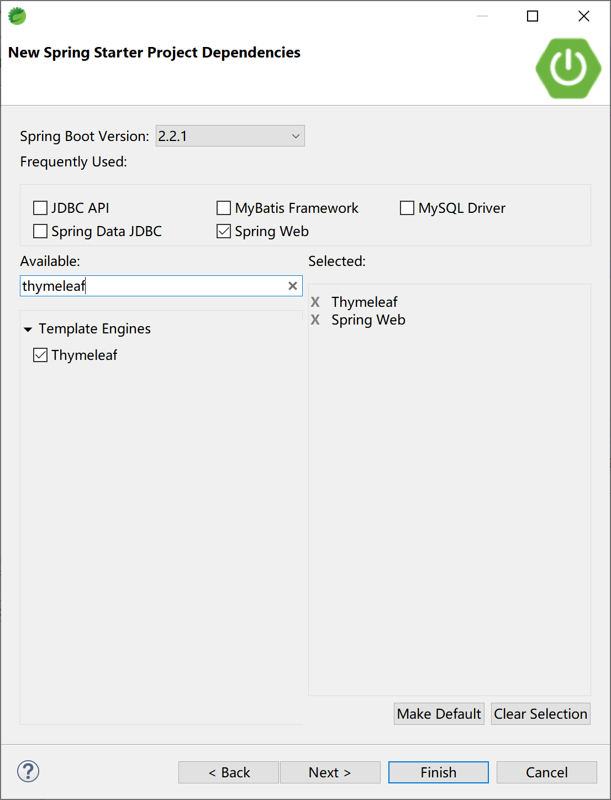

## 4.2 Thymeleaf 介绍

开发传统 Java Web 应用时，如上一小节所介绍的，我们可以使用 JSP 页面模板语言。但是由于 JSP 的众多缺点，在 Spring Boot 中已经不推荐使用了。

Spring Boot 官方推荐使用 Thymeleaf 模板语言。

> Thymeleaf 是一种用于 Web 和独立环境的现代服务器端的 Java 模板引擎。
>
> Thymeleaf 的主要目标是将优雅的自然模板带到开发工作流程中，并将 HTML 在浏览器中正确显示，并且可以作为静态原型，让开发团队能更容易地协作。
>
> Thymeleaf 能够处理 HTML，XML，JavaScript，CSS 甚至纯文本。 

当前，在实际工作中，一般都是通过 Spring Boot 使用 Spring MVC，为前端（如 vue 页面，或手机 app）提供服务调用接口。Spring Boot的 `spring-boot-starter-web` 启动器为开发者提供了大量的**基于约定的**配置。

在添加 `spring-boot-starter-thymeleaf` 启动器的情况下，Spring Boot 使用 Thymeleaf 作为前端模板。

下面我们结合项目代码来学习如何在 Spring Boot 中使用 Thymeleaf 这个模板引擎。

首先创建一个 web+thymeleaf 的 Spring Boot 应用。



pom 文件中最重要的两个 starter 依赖如下：

```xml
<dependency>
    <groupId>org.springframework.boot</groupId>
    <artifactId>spring-boot-starter-thymeleaf</artifactId>
</dependency>
<dependency>
    <groupId>org.springframework.boot</groupId>
    <artifactId>spring-boot-starter-web</artifactId>
</dependency>
```

创建一个 Controller，复用上一小节中的 HelloController 代码。

```java
package com.example.thymeleaf.controller;

import org.springframework.stereotype.Controller;
import org.springframework.web.bind.annotation.RequestMapping;
import org.springframework.web.servlet.ModelAndView;

@Controller
public class HelloController {
	
	@RequestMapping("/sayHello")
	public ModelAndView sayHello(String who) {
		ModelAndView mv = new ModelAndView();
		//模拟调用Service方法，返回问候语sayHello
		String sayHello = "Greeting! Hello ";
		mv.addObject("sayHello", sayHello + who + ".");
		mv.setViewName("/hello");
		return mv;
	}

}
```

将一张图片（例如 RoyElephant.png）拷贝到项目的 `src/main/resources/static/images` 目录下（需要在 static 下先创建 images 目录）。

在 `/src/main/resources/templates` 目录下创建一个 hello.html 文件，其使用了 Thymeleaf 模板语法。

```html
<!DOCTYPE html>
<html xmlns:th="http://www.thymeleaf.org">
<head>
<title>Say Hello to WHO.</title>
<meta http-equiv="Content-Type" content="text/html;charset=UTF-8"/>
</head>
<body>
	
	<p th:text="${sayHello}"/>
</body>
</html>
```

`<html xmlns:th="http://www.thymeleaf.org">` 是 Thymeleaf 的命名空间，通过引入该命名空间就可以在 html 中使用 Thymeleaf 标签语言。在 html 中用 `th` 关键字来标注。

注意上面代码中的 `th:src` 和 `th:text`，这些 `th` 标签会使这个页面在服务器端使用 Thymeleaf 模板技术进行最后的 html 内容输出。

打开浏览器，访问 [ http://localhost:8080/sayHello?who=Kevin ]( http://localhost:8080/sayHello?who=Kevin ) ，可以看到，Thymeleaf 能够正常工作。


Spring Boot 在使用 Spring MVC 的时候约定了如下两位目录位置：

- 静态资源位置：`src/main/resources/static`，其下存放图片、css、js等内容；
- 模板文件位置：`/src/main/resources/templates`，其下存放使用 th（thymeleaf）标签的 html 文件。

由于在实际工作中，前后端分离架构的广泛使用，Thymeleaf 作为 Spring MVC 的一种服务端模板技术，能用到的机会还是比较少的。所以我们在这里仅仅是简单地介绍 Spring Boot 如何使用这个模板技术，更多 Thymeleaf 的用法，请在需要的时候查阅[官方文档](https://www.thymeleaf.org/doc/tutorials/3.0/usingthymeleaf.html)了解（拷贝官方示例中的代码，供你的项目使用）。

> 本小节示例项目代码：
>
> [https://github.com/gyzhang/SpringBootCourseCode/tree/master/spring-boot-thymeleaf](https://github.com/gyzhang/SpringBootCourseCode/tree/master/spring-boot-thymeleaf)
