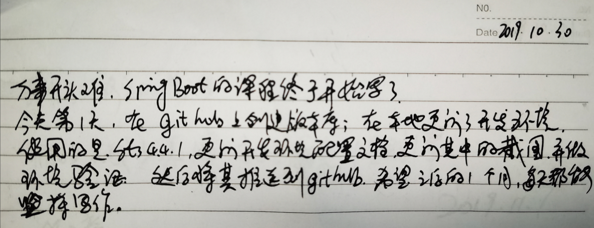

# 后记

谨以此书与**Roy.大象**共勉。

> 我和大象约定，2019年11月我坚持每天写作，他坚持每天写日记。
>
> 我做到了，他也做到了。
>
> 12月，我们也做到了坚持。
>
> 希望将来他能有一个爱好写作、爱好分享的好习惯，做知识的贡献者，做知识的传播者。
>
> --Kevin & Roy

由于时间关系，删除了计划中的“**第16章 综合示例**”，后续版本一定会补上。

> 2020年2月12日，完成第16章，标记 tag 为 1.0.1.RELEASE 版本号。

另外，在写作后期，还计划在本书的下一版本中添加两个专题：“**规则引擎**”和“**流程引擎**”。

恭喜各位，一路学习到这里，你了解了 Spring Boot 的生态，可以在实际工作中实战啦！

能冠以“编程思想”的书，都是相当有分量的（参考**Java编程思想**），小马哥的这本**Spring Boot编程思想（核心篇）**值得你认真仔细的阅读/操练（代码）3遍。

当然，万变不离其宗，你最应该看的是 [Spring Boot官方文档](https://docs.spring.io/spring-boot/docs/current/reference/html/) 和其源码。只有到了这一步，才能自豪地说：我掌握了Spring Boot（还谈不上精通）。

> 所以，你的简历上尽量不要写**精通Spring Boot**。

推荐大家继续学习我的下一份教程：Spring Cloud 培训教程。

最后的感慨：

- 坚持写作101天，跨过大年三十，走过正月初一；在火车站写过，在机场休息室写过，在火车上写过，在飞机上也写过；家里写过，酒店也写过。绝大部分内容都是在忙完白天的事儿晚上抽时间写的，周末和放假就多花些时间多写点儿，总体来看，平均每天有2小时，整本书写完应该超过200小时；
- 从第一天开始，这本书就在 [github](https://github.com/gyzhang/SpringBootCourse) 上开源，欢迎你传播，但是不能据为己有，后面修改的版本，我还想找个出版社出版呢；
- 至少第1版是一本 Open Book，附加的示例项目，都可以供你在工作中 CTRL+C，快速开始；
- 为啥？兴趣使然。

------

张光勇，2020年2月7日22点，成都。
