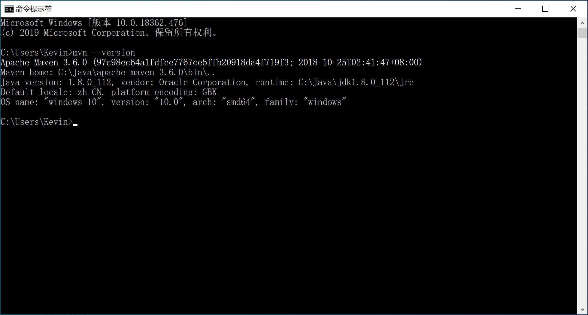

## 2.2 安装配置Maven

Maven是Apache下的一个开源项目，它基于项目对象模型(POM project object model)，可以通过一小段描述信息（配置）来管理项目的构建，报告和文档，是一个优秀的、被广泛使用的软件项目管理工具软件。

> 基本上，国内所有的规模以上软件公司，使用Java语言开发的软件，都是用Maven进行项目管理。

Maven 除了以程序构建能力为特色之外，还提供许多高级项目管理工具。由于 Maven 的缺省构建规则有较高的可重用性，所以常常用两三行 Maven 构建脚本就可以构建简单的项目。

使用Maven可以很方便的对项目的依赖进行管理，并支持脚本的继承。对于一个由多个子项目组成的项目来说，子项目可以继承父项目的构建脚本，从而方便统一管理并有效地减少了构建脚本的冗余。

首先到Apache Maven官网下载[apache-maven-3.6.0-bin.zip](http://mirrors.shu.edu.cn/apache/maven/maven-3/3.6.0/binaries/apache-maven-3.6.0-bin.zip)。

将下载回来的zip文件，解压。例如解压到**C:\\Java\apache-maven-3.6.0**目录下。

为Windows配置环境变量M2_HOME，指向C:\Java\apache-maven-3.6.0目录。

编辑Windows的path环境变量，添加%M2_HOME%\bin配置项，方便后续通过命令行窗口执行mvn命令。



由于使用maven创建的项目默认使用jdk5，不能满足开发需求。我们需要对maven做统一配置，以避免每次新建项目时都需要重复设置一次。

在maven主目录的conf目录下打开配置文件settings.xml，找到profiles段（大约在182行），在其内添加一个profile段，代码如下：

```xml
<profile>
    <id>jdk-1.8</id>
    <activation>
        <activeByDefault>true</activeByDefault>
        <jdk>1.8</jdk>
    </activation>
    <properties>
        <maven.compiler.source>1.8</maven.compiler.source>
        <maven.compiler.target>1.8</maven.compiler.target>
        <maven.compiler.compilerVersion>1.8</maven.compiler.compilerVersion>
    </properties>
</profile>
```

由于maven中央仓库在国外，网络访问速度很慢，为了加快依赖包下载，强烈建议为maven设置国内仓库镜像，比较快的国内镜像仓库推荐阿里云。

在配置文件settings.xml文件中找到mirrors段（大约在146行），在其内添加一段mirror，代码如下：

```xml
<mirror>
    <id>nexus-aliyun</id>
    <mirrorOf>*</mirrorOf>
    <name>Nexus aliyun</name>
    <url>http://maven.aliyun.com/nexus/content/groups/public</url>
</mirror>
```
