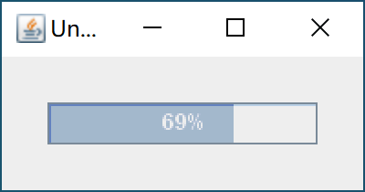
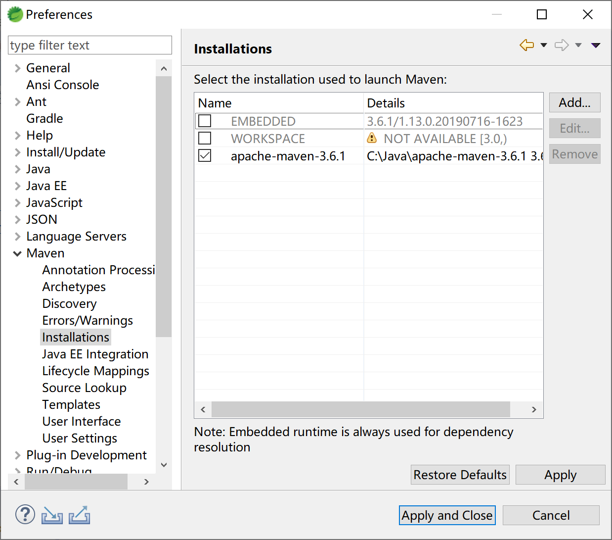

## 2.3 安装配置STS

STS是Spring官方在Eclipse IDE for Enterprise Java Developers的基础上整合了Spring开发插件后的开发工具发行版，使用这个发行版进行Spring相关应用开发非常方便，强烈推荐。

首先去Spring官网，下载Spring整合开发工具[Spring Tools 4 for （Eclipse STS Spring Tool Suite）](https://download.springsource.com/release/STS4/4.4.1.RELEASE/dist/e4.13/spring-tool-suite-4-4.4.1.RELEASE-e4.13.0-win32.win32.x86_64.self-extracting.jar)。

将下载回来的jar文件存放到例如C:\，然后在命令行窗口（如果解压安装在C:\，需要“以管理员身份运行”命令窗口）执行安装命令：

```
java -jar spring-tool-suite-4-4.4.1.RELEASE-e4.13.0-win32.win32.x86_64.self-extracting.jar
```

将STS解压到当前目录



为STS创建工作空间目录，例如**C:\sts-4.4.1.RELEASE\workspace**，然后启动STS集成开发工具。


由于Windows系统的默认字符集是GBK，我们需要为工作空间指定UTF-8字符集。


在STS中配置外部maven，以保持开发环境内外配置及调用一致。



为STS指定Maven配置文件，以使用前面设置的JDK8及阿里云仓库镜像。


