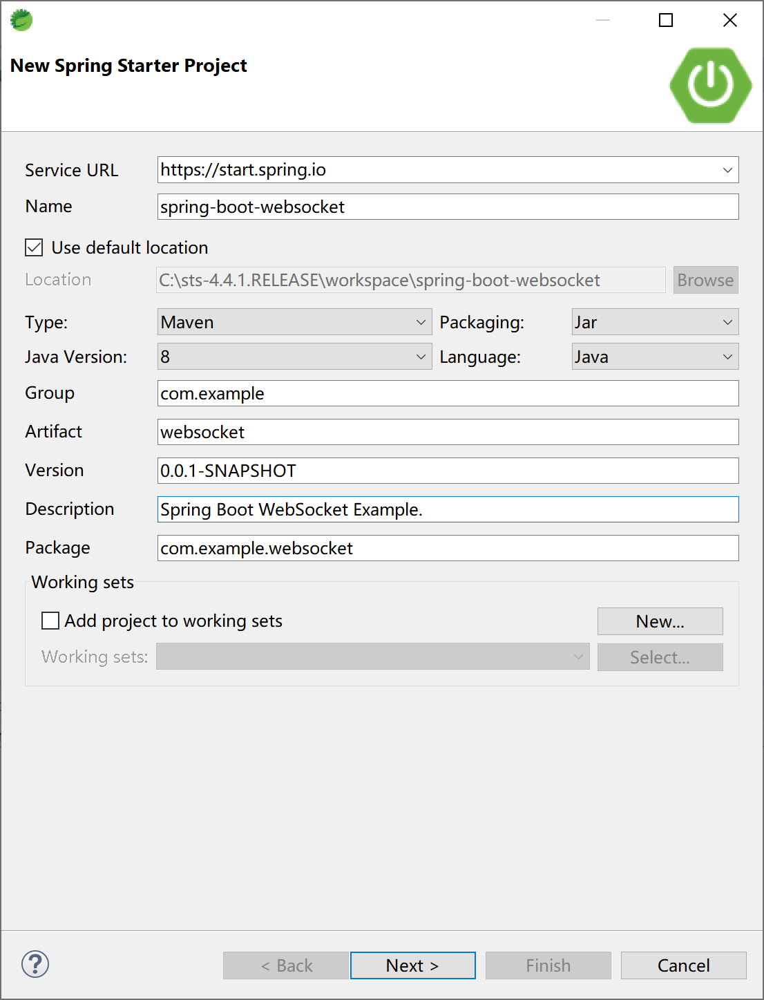
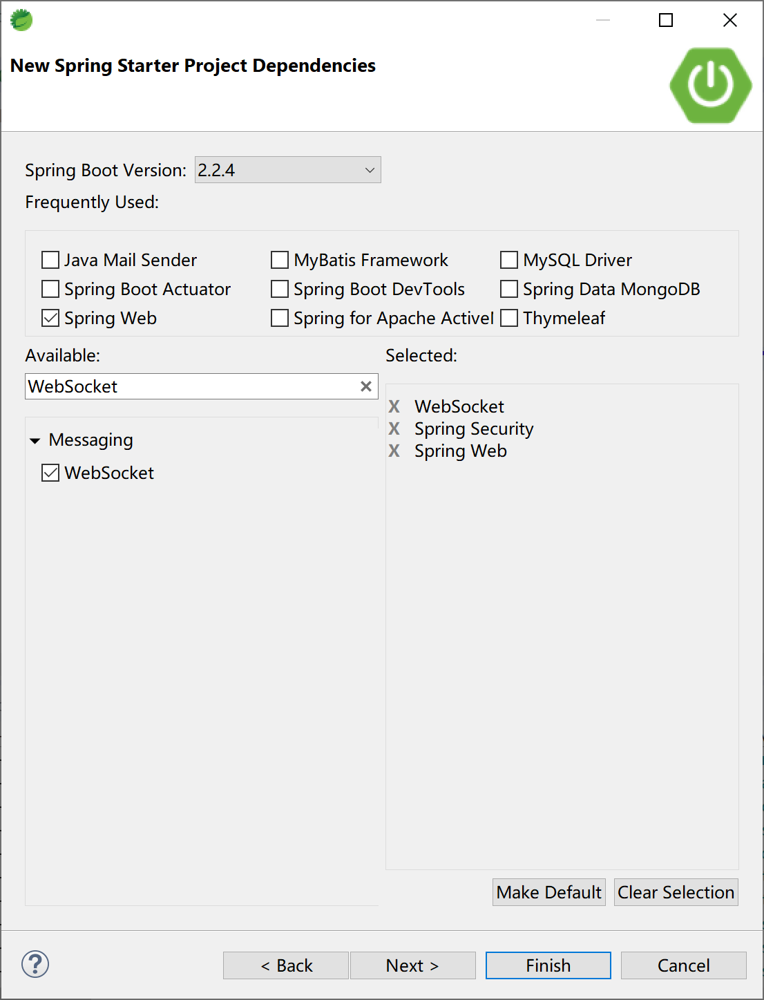
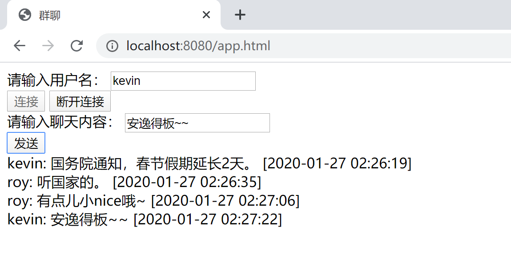
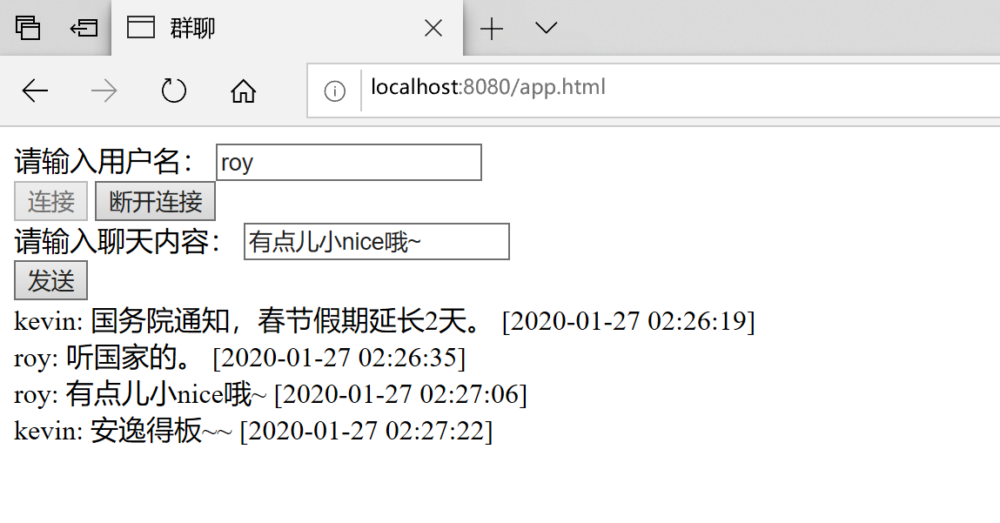

## 14.5 WebSocket

在某些内部管理系统中，有些服务端消息需要及时通知到当前用户，比如审批工作流中的审批任务，或某种公告要通知到一批人（某些角色/岗位的用户），又或是系统内置的聊天系统。在这些场景下，可以使用 WebSocket 技术。

### 14.5.1 介绍

以前，很多网站为了实现推送技术，所用的技术都是 Ajax 轮询。轮询是在特定的的时间间隔（如每 1 秒），由浏览器对服务器发出 HTTP 请求，然后由服务器返回最新的数据给客户端的浏览器。这种传统的模式带来很明显的缺点，即浏览器需要不断的向服务器发出请求，然而 HTTP 请求可能包含较长的头部，其中真正有效的数据可能只是很小的一部分，显然这样会浪费很多的带宽等资源。

WebSocket 是 HTML5 开始提供的一种在单个 TCP 连接上进行全双工通讯的协议。

WebSocket 使得客户端和服务器之间的数据交换变得更加简单，允许服务端主动向客户端推送数据。在 WebSocket API 中，浏览器和服务器只需要完成一次握手，两者之间就直接可以创建持久性的连接，并进行双向数据传输。

HTML5 定义的 WebSocket 协议，能更好的节省服务器资源和带宽，并且能够更实时地进行通讯。


浏览器通过 JavaScript 向服务器发出建立 WebSocket 连接的请求，连接建立以后，客户端和服务器端就可以通过 TCP 连接直接交换数据。

当你获取 Web Socket 连接后，你可以通过 **send()** 方法来向服务器发送数据，并通过 **onmessage** 事件来接收服务器返回的数据。

你可以用`var Socket = new WebSocket(url, [protocol] );`创建 WebSocket 对象，第一个参数 url, 指定连接的 URL，第二个参数 protocol 是可选的，指定可接受的子协议。。

> WebSocket 与 Socket 的区别：
>
> 软件通信有七层结构，下三层结构偏向与数据通信，上三层更偏向于数据处理，中间的传输层则是连接上三层与下三层之间的桥梁，每一层都做不同的工作，上层协议依赖与下层协议。
>
> 基于这个通信结构的概念。Socket 其实并不是一个协议，是应用层与 TCP/IP 协议族通信的中间软件抽象层，它是一组接口。当两台主机通信时，让 Socket 去组织数据，以符合指定的协议。TCP 连接则更依靠于底层的 IP 协议，IP 协议的连接则依赖于链路层等更低层次。
>
> WebSocket 则是一个典型的应用层协议。
>
> 总的来说：Socket 是传输控制层协议，WebSocket 是应用层协议。

WebSocket 具有如下特点：

1. WebSocket 使用时需要先创建连接，这使得 WebSocket 成为一种有状态的协议，在之后的通行过程中可以省略部分状态信息（例如身份认证等）；

2. WebSocket 连接在端口 80（ws）或者 443（wss）上连接，与 HTTP 使用的端口相同，这样基本所有的防火墙都不会阻止 WebSocket 的连接；

3. WebSocket 使用 HTTP 协议进行握手，因此可以直接集成到网络浏览器和 HTTP 服务器中，不需要额外的成本；

4. 心跳消息（ping 和 pong）将被反复推送，保持 WebSocket 一致处于活跃状态；

5. 使用该协议，当消息启动或者到达时，服务端和客户端都可以知道；

6. Websocket 连接关闭时将发送一个特殊的关闭消息；

7. WebSocket 支持跨域，可以避免 Ajax 的限制；

8. HTTP 规范要求浏览器将并发连接限制为每个主机名两个连接，但是当我们使用 WebSocket 的时候，当握手完成后，该限制就不存在了，因为此时的连接已经不再是 HTTP 连接了；

9. WebSocket 协议支持扩展，用户可以扩展协议，实现部分自定义的子协议；

10. 更好的二进制支持以及更好的压缩效果。

### 14.5.2 集成

Spring Boot 一如既往地提供了 WebSocket 的启动器依赖来支持方便地集成。

我们通过聊天室及点对点聊天来示例如何使用 WebSocket 技术。

创建一个 Spring Boot 应用。



添加 WebSocket 等必要的启动器依赖。项目中添加 Spring Security 是为了方便地使用不同的用户，以演示用户之间的聊天功能。



项目 pom 文件中添加了一些前端依赖库方便前端页面引用，依赖配置信息如下。

```xml
<dependency>
    <groupId>org.springframework.boot</groupId>
    <artifactId>spring-boot-starter-security</artifactId>
</dependency>
<dependency>
    <groupId>org.springframework.boot</groupId>
    <artifactId>spring-boot-starter-web</artifactId>
</dependency>
<dependency>
    <groupId>org.springframework.boot</groupId>
    <artifactId>spring-boot-starter-websocket</artifactId>
</dependency>
<!-- 前端依赖库 -->
<dependency>
    <groupId>org.webjars</groupId>
    <artifactId>webjars-locator-core</artifactId>
</dependency>
<dependency>
    <groupId>org.webjars</groupId>
    <artifactId>sockjs-client</artifactId>
    <version>1.1.2</version>
</dependency>
<dependency>
    <groupId>org.webjars</groupId>
    <artifactId>stomp-websocket</artifactId>
    <version>2.3.3</version>
</dependency>
<dependency>
    <groupId>org.webjars</groupId>
    <artifactId>jquery</artifactId>
    <version>3.3.1</version>
</dependency>
```

例如上面的 stomp-websocket 依赖，打开 stomp-websocket-2.3.3.jar 可以看到其内部包含了 stomp.min.js 文件，可以在页面上引用，而不用再单独提供，这样方便统一依赖版本管理。


#### 14.5.2.1 聊天室

首先创建 WebSocketConfig 配置类，配置

```java
@Configuration
@EnableWebSocketMessageBroker
public class WebSocketConfig implements WebSocketMessageBrokerConfigurer {
	@Override
	public void configureMessageBroker(MessageBrokerRegistry registry) {
		registry.enableSimpleBroker("/topic");
		registry.setApplicationDestinationPrefixes("/app");
	}

	@Override
	public void registerStompEndpoints(StompEndpointRegistry registry) {
		registry.addEndpoint("/chat").withSockJS();
	}

}
```

- 自定义 WebSocketConfig 继承自 WebSocketMessageBrokerConfigurer 进行 WebSocket 配置，然后通过 @EnableWebSocketMessageBroker 注解开启了 WebSocket 消息代理；
- registry.enableSimpleBroker("/topic") 表示设置消息代理的前缀，即如果消息的前缀是”/topic”，就会将消息转发给代理（broker），再由消息代理将消息广播给当前连接的客户端（通俗的讲就后台向前台发送消息的地址要加上/topic前缀）；

- registry.setApplicationDestinationPrefixes("/app") 表示配置一个或多个前缀，通过这些前缀过滤出需要被注解方法处理的消息（通俗的讲就前台向后台发送消息的地址要加上 /app 前缀）；

- registry.addEndpoint("/chat").withSockJS() 表示定义一个前缀为”/chat”的 endPoint，并开启 sockjs 支持，sockjs 可以解决浏览器对 WebSocket 的兼容性问题，客户端将通过这里配置的 URL 来建立 WebSocket 连接（确切的说就是通过 /chat 连接后台）。

创建消息类 Message，添加需要的属性。

```java
public class Message {
	private String name;
	private String content;
    private String time;
...
}
```

定义一个 Controller 来处理消息。

```java
@Controller
public class GreetingController {
	
	@MessageMapping("/hello")
	@SendTo("/topic/greetings")
	public Message greeting(Message message) throws Exception {
		Calendar calendar = Calendar.getInstance();
		DateFormat df = new SimpleDateFormat("yyyy-MM-dd hh:mm:ss");
		Date date = calendar.getTime();
		
		message.setTime(df.format(date));//添加发送时间
		
		return message;
	}

}
```

根据前面配置类中的配置，上面 Controller 中 @MessageMapping("/hello")  注解的方法用来接收“/app/hello”路径发送过来的消息，在对消息进行处理后，再将消息转发到 @SendTo("/topic/greetings") 定义的路径上，这个路径上有“/topic”前缀，所以由消息代理进行广播。

构建聊天室页面 app.html，存放到到项目的 resources/static 路径下。

```html
<html lang="en">
<head>
<meta charset="UTF-8">
<title>群聊</title>
<script src="/webjars/jquery/jquery.min.js"></script>
<script src="/webjars/sockjs-client/sockjs.min.js"></script>
<script src="/webjars/stomp-websocket/stomp.min.js"></script>
<script src="/app.js"></script>
</head>
<body>
	<div>
		<label for="name">请输入用户名：</label> 
		<input type="text" id="name" placeholder="用户名">
	</div>
	<div>
		<button id="connect" type="button">连接</button>
		<button id="disconnect" type="button" disabled="disabled">断开连接</button>
	</div>
	<div id="chat" style="display: none;">
		<div>
			<label for="name">请输入聊天内容：</label>
			<input type="text" id="content" placeholder="聊天内容">
		</div>
		<button id="send" type="button">发送</button>
		<div id="greetings">
			<div id="conversation" style="display: none">群聊进行中...</div>
		</div>
	</div>
</body>
</html>
```

创建聊天室用的前端 js 文件 app.js，存放到到项目的 resources/static 路径下。

```javascript
var stompClient = null;

function setConnected(connected) {
	$("#connect").prop("disabled", connected);
	$("#disconnect").prop("disabled", !connected);
	if (connected) {
		$("#conversation").show();
		$("#chat").show();
	} else {
		$("#conversation").hide();
		$("#chat").hide();
	}
	$("#greetings").html("");
}

function connect() {
	if (!$("#name").val()) {
		return;
	}
	var socket = new SockJS('/chat');
	stompClient = Stomp.over(socket);
	stompClient.connect({}, function(frame) {
		setConnected(true);
		stompClient.subscribe('/topic/greetings', function(greeting) {
			showGreeting(JSON.parse(greeting.body));
		});
	});
}

function disconnect() {
	if (stompClient !== null) {
		stompClient.disconnect();
	}
	setConnected(false);
}

function sendName() {
	stompClient.send("/app/hello", {}, JSON.stringify({
			'name' : $("#name").val(),
			'content' : $("#content").val()
	}));
}

function showGreeting(message) {
	$("#greetings")
		.append("<div>" + message.name + ": " + message.content + " [" + message.time + "] </div>");
}

$(function() {
	$("#connect").click(function() {
		connect();
	});
	
	$("#disconnect").click(function() {
		disconnect();
	});
	
	$("#send").click(function() {
		sendName();
	});
});
```

- connect 方法表示建立一个 WebSocket 连接，在建立 WebSocket 连接时，用户必须先输入用户名，然后才能建立连接；

- 方法体中的意思：使用 SockJS 建立连接，然后创建一个 STOMP 实例发起请求，在连接成功回调方法中，首先调用 setConnected(true)；方法进行页面设置，然后调用 STOPM 中的 subscribe 方法订阅服务端发送回来的消息，并将服务端发送来的消息展示出来（使用 showGreeting 方法）；

- 调用 STOMP 中的 disconnect 方法可以断开一个 WebScoket 连接。

运行聊天室应用，通过两个浏览器来模拟两个人在聊天室中的聊天。

在 Chrome 浏览器中输入[http://localhost:8080/app.html](http://localhost:8080/app.html)， 使用 kevin 用户名连接后，参与聊天。



在 Edge 浏览器中输入[http://localhost:8080/app.html](http://localhost:8080/app.html)， 使用 roy 用户名连接后，参与聊天。



经测试，可以看到 WebSocket 聊天室功能正常。

#### 14.5.2.2 点对点聊天

由于点对点聊天涉及具体的用户，所以，添加 Spring Security 配置类。

```java
@Configuration
@EnableWebSecurity
public class SecurityConfiguration extends WebSecurityConfigurerAdapter {
	
	@Override
	protected void configure(AuthenticationManagerBuilder auth) throws Exception {
		auth.inMemoryAuthentication()
		.passwordEncoder(new BCryptPasswordEncoder())
		.withUser("admin").password(new BCryptPasswordEncoder().encode("admin")).roles("ADMIN", "USER")
		.and()
		.withUser("kevin").password(new BCryptPasswordEncoder().encode("6998")).roles("USER")
		.and()
		.withUser("roy").password(new BCryptPasswordEncoder().encode("3525")).roles("OTHER");
	}
	
	@Override
	protected void configure(HttpSecurity http) throws Exception {
		http.formLogin()
			.permitAll()
		.and().authorizeRequests()
			.anyRequest()
			.authenticated();
	}
	
}
```

以上代码只是最简单的 Spring Security 配置，目的是支持用户登录，并让登录的用户具有用户身份。

改造 WebSocketConfig 配置类，添加 "/queue" 代理（broker）。

```java
@Configuration
@EnableWebSocketMessageBroker
public class WebSocketConfig implements WebSocketMessageBrokerConfigurer {
	@Override
	public void configureMessageBroker(MessageBrokerRegistry registry) {
		registry.enableSimpleBroker("/topic", "/queue");
		registry.setApplicationDestinationPrefixes("/app");
	}

	@Override
	public void registerStompEndpoints(StompEndpointRegistry registry) {
		registry.addEndpoint("/chat").withSockJS();
	}

}
```

创建消息类，用来封装消息发送者，接收者，消息内容和消息发送时间。

```java
public class ChatMsg {
	private String from;
	private String to;
	private String content;
	private String time;
...
}
```

创造一个 ChatController 控制器，用来处理点对点的聊天消息，

```java
@Controller
public class ChatController {
	@Autowired
	SimpMessagingTemplate template;
	
	@MessageMapping("/chat")
    public void chat(Principal principal, ChatMsg msg) throws Exception {
        String from=principal.getName();
        msg.setFrom(from);
        
		Calendar calendar = Calendar.getInstance();
		DateFormat df = new SimpleDateFormat("yyyy-MM-dd hh:mm:ss");
		Date date = calendar.getTime();
		
		msg.setTime(df.format(date));//添加发送时间

        template.convertAndSendToUser(msg.getTo(), "/queue/chat", msg);;
    }

}
```

- @MessageMapping("/chat") 表示来自”/app/chat”路径的消息（客户端 chat.js 中的 sendMsg 方法代码`stompClient.send("/app/chat"...`）将被 chat 方法处理，chat 方法的第一个参数 Principal 可以用来获取当前登录用户的信息，第二个参数则是客户端发送来的消息；

- 在 chat 方法中，首先获取当前登录用户的用户名，设置给 msg 对象的 from 属性，然后设置消息的发送时间，再将消息发送出去，发送的目标就是 msg 的 to 属性；

- 消息发送使用的方法是 convertAndSendToUser，该方法内部调用了 convertAndSend 方法，并对消息路径做了处理（SimpMessagingTemplate 类中`private String destinationPrefix = "/user/"`，所以后续客户端订阅消息中需要添加 user 前缀，即`/user/queue/chat`）。

	> convertAndSend(this.destinationPrefix + user + destination, payload, headers, postProcessor);

创建一个聊天页面 chat.html 文件，存放到到项目的 resources/static 路径下。

```html
<!DOCTYPE html>
<html lang="en">
<head>
<meta charset="UTF-8">
<title>单聊</title>
<script src="/webjars/jquery/jquery.min.js"></script>
<script src="/webjars/sockjs-client/sockjs.min.js"></script>
<script src="/webjars/stomp-websocket/stomp.min.js"></script>
<script src="/chat.js"></script>
</head>
<body>
	<div id="chat">
		<div id="chatsContent"></div>
		<div>
			请输入聊天内容： <input type="text" id="content" placeholder="聊天内容">
			目标用户： <input type="text" id="to" placeholder="目标用户">
			<button id="send" type="button">发送</button>
		</div>
	</div>
</body>
</html>
```

创建 chat.js，存放到到项目的 resources/static 路径下，处理连接 WebSocket、发送和接收聊天信息。

```javascript
var stompClient = null;
function connect() {
	var socket = new SockJS('/chat');
	stompClient = Stomp.over(socket);
	stompClient.connect({}, function(frame) {
		stompClient.subscribe('/user/queue/chat', function(chat) {
			showChatMsg(JSON.parse(chat.body));
		});
	});
}

function sendMsg() {
	stompClient.send("/app/chat", {}, JSON.stringify({
		'to' : $("#to").val(),
		'content' : $("#content").val()
	}));
}

function showChatMsg(message) {
	$("#chatsContent")
	.append("<div>" + message.from + ": " + message.content + " [" + message.time + "] </div>");
}

$(function() {
	connect();
	$("#send").click(function() {
		sendMsg();
	});
});
```

- 连接成功后，订阅地址为”/user/queue/chat”，该地址比服务端配置的地址多了”/user”前缀，这是因为，SimpMessagingTemplate 类中自动添加了路径前缀；

- 聊天消息发送路径为”/app/chat”；

- 发送的消息内容中有一个 to 字段，该字段用来描述消息发送的目标用户。

启动项目运行聊天程序，通过两个浏览器来模拟两个人点对点聊天。

在 Chrome 浏览器中输入[http://localhost:8080/chat.html](http://localhost:8080/chat.html)， 使用kevin用户名密码6998登录后（自动连接），在 roy 用户登录后向其发送聊天信息。


在 Edge 浏览器中输入[http://localhost:8080/chat.html](http://localhost:8080/chat.html)， 使用 roy 用户名密码 3525 登录后（自动连接），在接收到 kevin 用户发送的消息后回复信息。


经测试，可以看到 kevin 和 roy 两个用户可以完成点对点的聊天。

在我们实际工作中，上面的聊天室功能和企业管理类系统中的通知类似，点对点聊天功能就是一种小型的即时通讯功能。

> 本小节示例项目代码：
> 
> [https://github.com/gyzhang/SpringBootCourseCode/tree/master/spring-boot-websocket](https://github.com/gyzhang/SpringBootCourseCode/tree/master/spring-boot-websocket)
