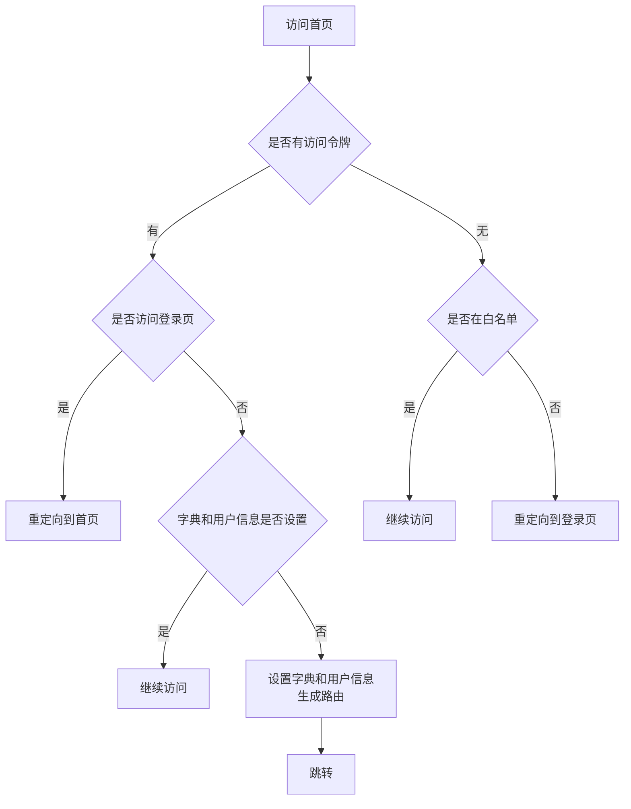

# 第3章 框架初探

本章，我们详细描述[芋道]开发平台中代码生成器生成的代码是如何集成到[芋道]开发平台中的。

## 3.1 前端集成

前端是如何和后端集成到一起的呢？

下面我们通过浏览器访问前端服务地址，如 [http://localhost/](http://localhost/) 来分析前端项目是如何加载，并和后端服务对接上的。

考虑到后端程序员对前端 vue 的不了解，我们会从 vue 组件的加载开始解读。

### 3.1.1 前端说明

当我们通过浏览器访问前端服务 [http://localhost/](http://localhost/) 时，Nginx 服务器配置文件 nginx.conf 中的 `location /` 片段将使用 `index.html` 文件提供服务：

```nginx
server {
    listen       80;
    server_name  localhost;
    ...
        location / {
        root   html;
        index  index.html index.htm;
    }
    ...
```

#### 3.1.1.1 index.html

在项目 `yudao-ui-admin-vue3/index.html` 文件中 `<script type="module" src="/src/main.ts"></script>` 代码片段加载了 vue 组件。

这个 vue 前端项目，所有的“魔法”，都通过`main.ts` 开始加载。

#### 3.1.1.2 main.ts

在 `main.ts` 文件开头部分，引入了路由相关的模块：

```typescript
// 引入路由
import router, { setupRouter } from '@/router
...
// 加载路由
setupRouter(app)
...
// 等待路由准备就绪
await router.isReady()
...
```

这个代码片段引入了 `router` 对象和 `setupRouter` 函数（都在 `/src/router/index.ts` 这里定义），`router` 对象包含了路由的配置信息，`setupRouter` 函数用于对应用进行路由的安装和配置。

`main.ts` 文件通过引入路由模块、创建应用实例、配置路由、等待路由准备就绪和挂载应用等步骤，完成了路由的加载和配置。

#### 3.1.1.3 router

在 `/src/router/index.ts` 文件中引入项目固定路由定义文件 `/src/router/modules/remaining.ts`：

```typescript
import remainingRouter from './modules/remaining'
...
  routes: remainingRouter as RouteRecordRaw[],
...
```

在创建路由实例的 `createRouter` 函数中加载了 `remainingRouter`。

#### 3.1.1.4 静态路由配置

在静态路由文件 `remaining.ts` 中配置了像“登录”、“404”、“500”等页面路由信息。例如下面的代码片段定义了路径 `/login` 到 `/views/Login/Login.vue` 的关系：

```typescript
  {
    path: '/login',
    component: () => import('@/views/Login/Login.vue'),
    name: 'Login',
    meta: {
      hidden: true,
      title: t('router.login'),
      noTagsView: true
    }
  },
```

后续我们访问或跳转到 [http://localhost/login](http://localhost/login) 地址时，vue 应用就返回 `/views/Login/Login.vue` 这个文件来向浏览器提响应。

#### 3.1.1.5 导航权限守卫

在 `main.ts` 文件中，通过 `import './permission'` 加载了导航权限守卫文件。

其中定义了“路由不重定向白名单” `whiteList`，如登录、注册等路径：

```typescript
const whiteList = [
  '/login',
  '/social-login',
  '/auth-redirect',
  '/bind',
  '/register',
  '/oauthLogin/gitee'
]
```

路由导航守卫（beforeEach），拦截所有的路由，判断是否登录。

在没有登录的情况根据白名单确定是否放行，否则全部重定向到登录页。

```typescript
// 路由加载前
router.beforeEach(async (to, from, next) => {
  start()
  loadStart()
  if (getAccessToken()) { // 已经登录
    if (to.path === '/login') {
      next({ path: '/' })
    } else {
      // 获取所有字典
      const dictStore = useDictStoreWithOut()
      const userStore = useUserStoreWithOut()
      const permissionStore = usePermissionStoreWithOut()
      if (!dictStore.getIsSetDict) {
        await dictStore.setDictMap()
      }
      if (!userStore.getIsSetUser) {
        isRelogin.show = true
        await userStore.setUserInfoAction()
        isRelogin.show = false
        // 后端过滤菜单
        await permissionStore.generateRoutes()
        permissionStore.getAddRouters.forEach((route) => {
          router.addRoute(route as unknown as RouteRecordRaw) // 动态添加可访问路由表
        })
        const redirectPath = from.query.redirect || to.path
        // 修复跳转时不带参数的问题
        const redirect = decodeURIComponent(redirectPath as string)
        const { paramsObject: query } = parseURL(redirect)
        const nextData = to.path === redirect ? { ...to, replace: true } : { path: redirect, query }
        next(nextData)
      } else {
        next()
      }
    }
  } else {// 没有登录
    if (whiteList.indexOf(to.path) !== -1) {
      next()
    } else {
      next(`/login?redirect=${to.fullPath}`) // 否则全部重定向到登录页
    }
  }
})
```

- 当用户已登录（`getAccessToken()` 存在）且要访问登录页时，重定向到根路径。
- 如果用户信息未设置，会先获取用户信息和生成路由，然后动态添加路由。
- 如果用户未登录且访问的路径不在白名单中，会重定向到登录页。

### 3.1.2 登录过程

当浏览器访问前端应用时，`/src/permission.ts` 文件中的路由导航守卫（router.beforeEach 钩子函数）拦截访问请求，通过判断是否有访问令牌来判断用户是否登录过系统：

- 没有登录过系统则跳转到登录页，或放行白名单中的地址；
- 登录过则进一步判断并加载该用户权限内的菜单（`/src/store/modules/permission.ts`），最终跳转到首页。



#### 3.1.2.1 用户登录

访问 Nginx 中的前端服务地址的时候，如果用户没有登录且访问地址不在白名单中，则直接跳转到登录页 `/src/views/Login/Login.vue`，使用 `/src/views/Login/components/LoginForm.vue` 输入用户名和密码后点击“登录”按钮后，通过 `handleLogin` 方法，最终调用 `/src/api/login/index.ts` 中的 `login` 方法，访问后端服务：

```typescript
// 登录
export const login = (data: UserLoginVO) => {
  return request.post({ url: '/system/auth/login', data })
}
```

后端提供服务的文件是：`yudao-module-system/yudao-module-system-biz/src/main/java/cn/iocoder/yudao/module/system/controller/admin/auth/AuthController.java`，使用其中的 `login` 方法完成登录。

#### 3.1.2.2 加载用户菜单

在 `/src/permission.ts` 文件中的路由导航守卫（router.beforeEach 钩子函数）中加载用户菜单的代码片段如下：

```typescript
// 后端过滤菜单
await permissionStore.generateRoutes()
permissionStore.getAddRouters.forEach((route) => {
    router.addRoute(route as unknown as RouteRecordRaw) // 动态添加可访问路由表
})
```
