# 第1章 [芋道](https://gitee.com/zhijiantianya/ruoyi-vue-pro) QuickStart

RuoYi-Vue 全新 Pro 版本，优化重构所有功能。

[芋道源码](https://gitee.com/yudaocode)出品，以开发者为中心，打造中国第一流的快速开发平台，全部开源，个人与企业可 100% 免费使用。其功能强大，包括 SaaS 多租户、工作流、大屏报表、商城、支付、微信公众号、RBAC 动态权限、数据权限等功能。

项目使用的主要技术组件：

- Spring Boot 3.3.1
- MyBatis Plus 3.5.16
- Vue 3.4.21
- Element Plus 2.8.0

> 本开发手册的前端项目选择 [yudao-ui-admin-vue3](https://gitee.com/yudaocode/yudao-ui-admin-vue3) 版本，后端项目为了聚焦选择的是只有开发平台的 [yudao-boot-mini](https://gitee.com/yudaocode/yudao-boot-mini) 版本。
>
> 开发工具使用最新版本：IDEA 2024.2.0.2 和 VS Code 1.92.2。

## 1.1 准备开发环境

作为一个全栈开发工程师，在掌握后端的同时，能够读懂和修改前端那是一个必选项：只专注于后端开发，总不能不知道自己开发的软件长啥样吧。

### 1.1.1 后端项目

从 [https://gitee.com/yudaocode/yudao-boot-mini](https://gitee.com/yudaocode/yudao-boot-mini) 获取最新的代码库后，在安装完成后的 IDEA中打开项目：

> 选择 yudao-boot-mini 是为了在撰写手册的过程中方便截图，避免图片中出现过多不涉及到的模块占用空间，混淆视线。

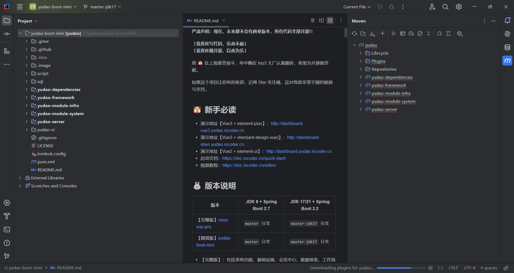

方便后续截图阅读或打印，在 IDEA 中选择白底主题：

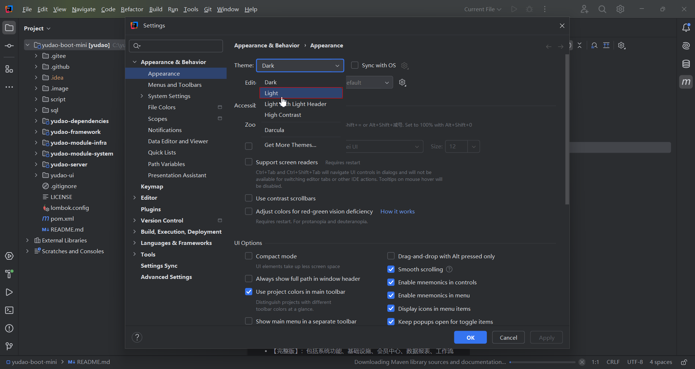

在 `Project Structure...` 设置中为项目选择 `JDK 17`，才可以编译项目，进行后续的开发工作：

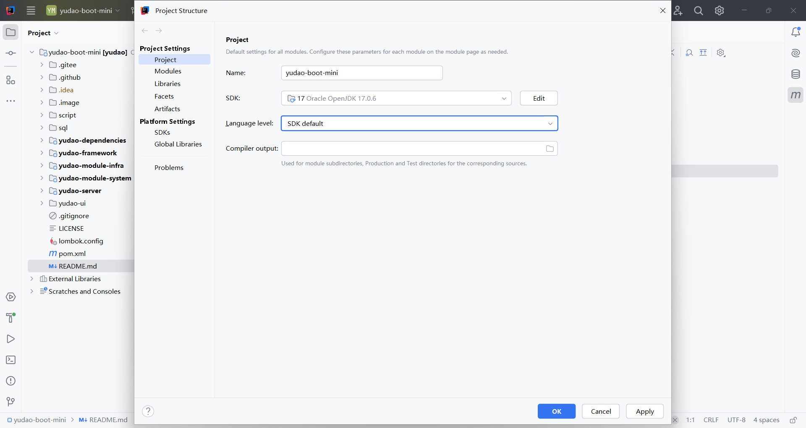

刷新 maven 依赖后，编译安装一次（可以跳过单元测试），保证代码是可以完全编译的：

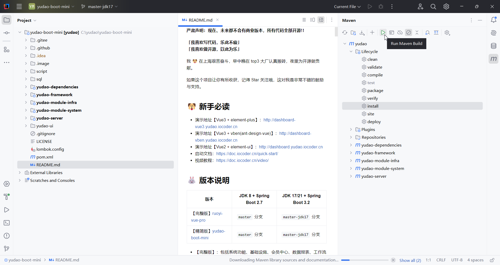

找到 `yudao-server` 模块中的 `YudaoServerApplication` 类，运行这个项目主类：

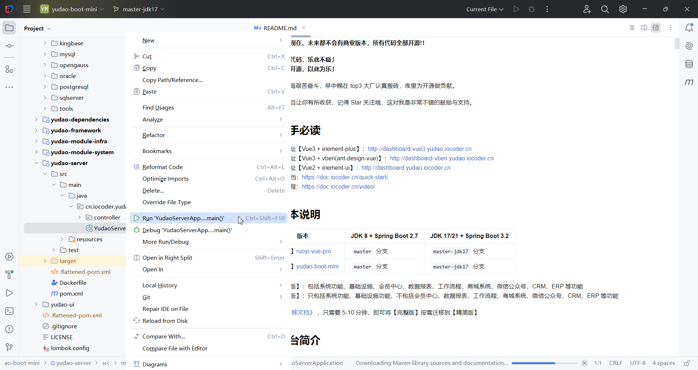

稍后，在项目启动的日中检查项目是否启动成功：

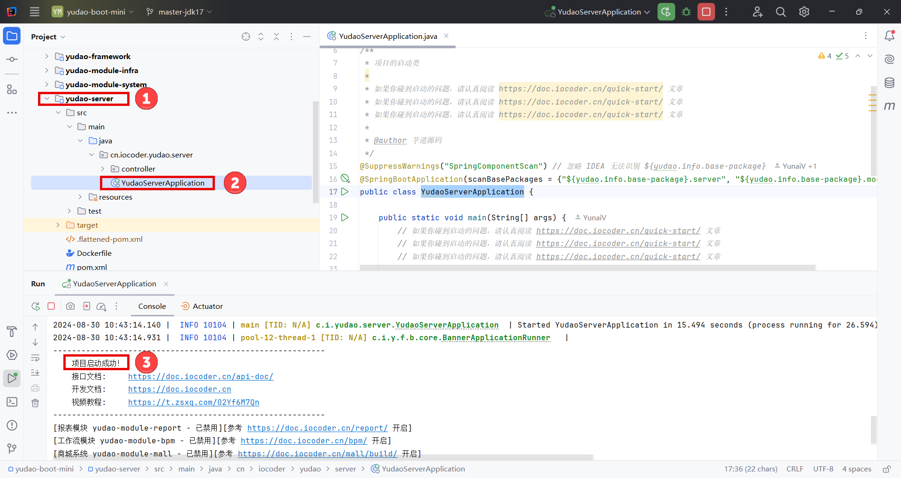

> 后端项目依赖数据库，建议使用 MySQL（初始脚本：`sql/mysql/ruoyi-vue-pro.sql`）；
>
> 项目还依赖 Redis，建议到 https://github.com/redis-windows/redis-windows/releases 下载最新的 `Redis-7.4.1-Windows-x64-msys2-with-Service.zip` 安装包，解压后安装为本机服务，随操作系统启动而自启动。

### 1.1.2 前端项目

开发机器上应提前安装 [Node.js LTS v20.17.0](https://npmmirror.com/mirrors/node/v20.17.0/node-v20.17.0-x64.msi) 版本。

从 [https://gitee.com/yudaocode/yudao-ui-admin-vue3](https://gitee.com/yudaocode/yudao-ui-admin-vue3) 获取前端项目代码库后，在项目目录中执行如下命令，下载依赖包并第一次运行前端项目。

```bash
# 安装 pnpm，提升依赖的安装速度
npm config set registry https://registry.npmjs.org
npm install -g pnpm
# 下载并安装依赖
pnpm install

# 启动服务
npm run dev
```

在启动后端项目的情况下，可自动打开浏览器，并跳转到登录页面：

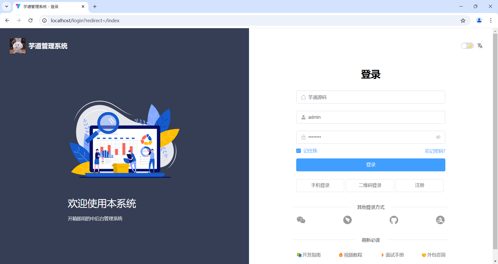

后续，在开发过程中，可以使用 VS Code 来完成前端项目的开发、调试工作。

### 1.1.3 前后端联调

后端项目在 IDEA 中调试一直都是非常顺畅的，前端项目通常会在 Chrome 中通过 F12 的开发者工具来完成调试。

但是更好的方式是使用 VS Code 中以 Debug 的模式，在源码中设置断点，可以用与后端一样的体验来完成前端调试工作。

首先使用终端（独立的终端或 VS Code 中打开的终端窗口都可以）执行 `npm run dev` 命令启动前端项目后：

1. 在 VS Code 中选择左侧栏中的“运行和调试”（下图①）；
2. 单击工具栏中的“启动调试”按钮（下图②）；
3. 选择你要调试的代码（登录系统的方法 login），设置断点；
4. 在浏览器（Edge）中登录系统；
5. VS Code 捕捉到断点，可正常调试前端代码。

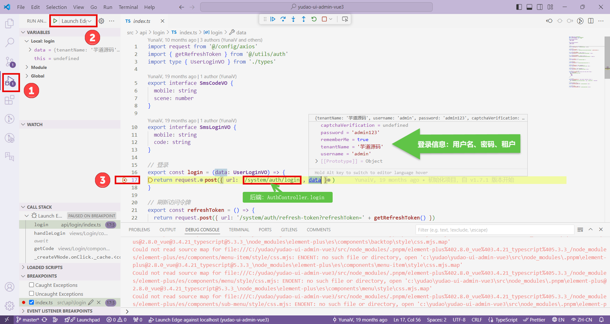

后端项目以 Debug 的方式启动后：

1. 在代码中设置断点（AuthController 中的登录系统的方法 login）；
2. 前端 ajax 访问后端 REST 服务接口；
3. 可正常断点调试查看到前端传递到后端的数据（下图⑤）。

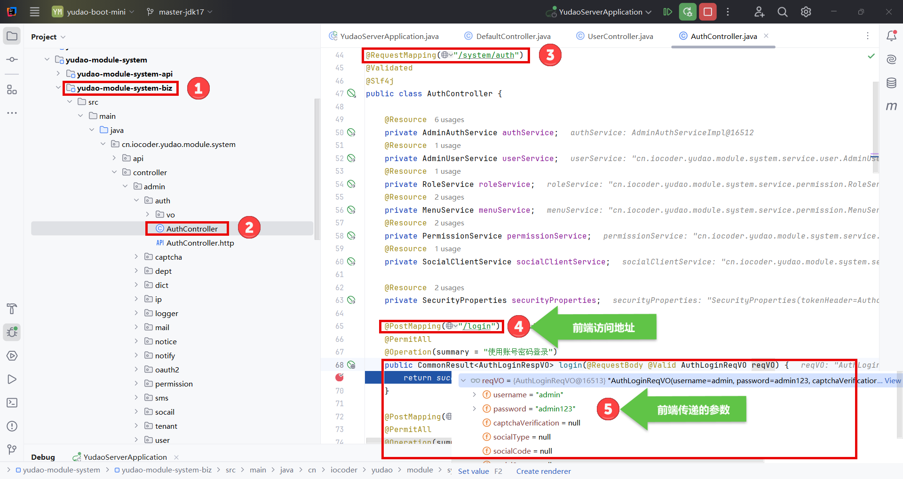

## 1.2 HelloWorld

阅读官方文档 [https://doc.iocoder.cn/module-new/](https://doc.iocoder.cn/module-new/)，新建一个模块 yudao-module-test，然后使用代码生成器来完成你的第一个芋道源码项目的功能。

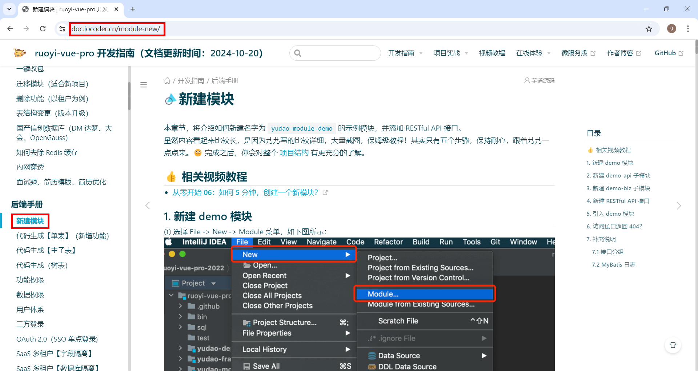

### 1.2.1 安装插件

当然，更加方便的是使用插件“YuDao IDE”来创建模块，并根据其提供的简要指示文档，在模块中创建第一个“Hello World”的完整 CRUD 功能。

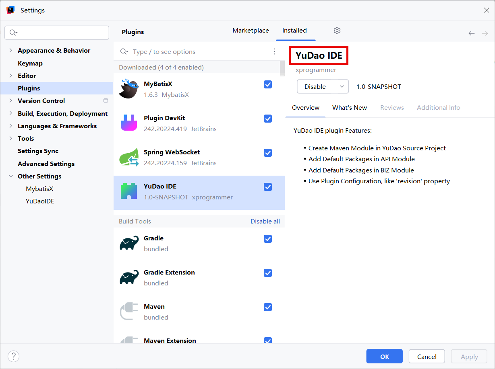

> YuDao IDE 插件，是本文作者为了方便后续开发、写作，抽空借助 ChatGPT 写的一个“创建芋道模块”的插件（完全不会 Kotlin 语言，插件开发几乎不懂，感谢 AI），并根据创建的模块，在模块根目录下提供了简要的后续指导手册 `readme.md`，帮助初学者大声向芋道的 World Say Hello，快速上手建立信心。
>
> 当前是本地安装，后续择机上到 IDEA 的插件市场（因为当前我还不会）。

安装完插件后，请按你的需要在配置页设置要创建的子模块的包名称，用半角逗号分隔：

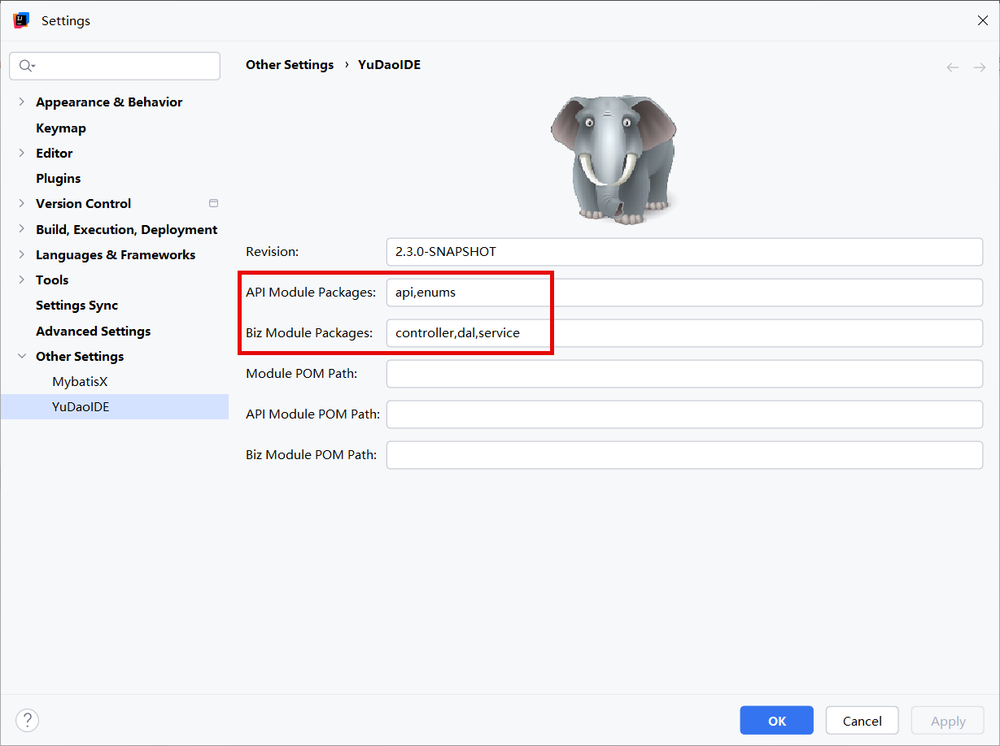

> 上图中红色方框内的包名称，是需要的最小配置，已经包含在插件的默认值中。

### 1.2.2 创建模块

在 IDEA 中打开  `yudao-boot-mini` 项目，右键单击项目根目录，选择“创建[芋道]Maven模块”菜单：

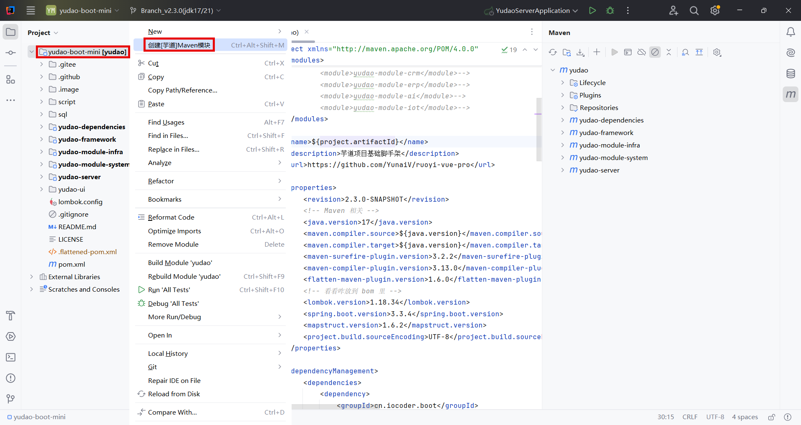

输入你要创建的模块名称，需要注意的是不需要输入“yudao-module-”前缀，插件会自动帮你添加：

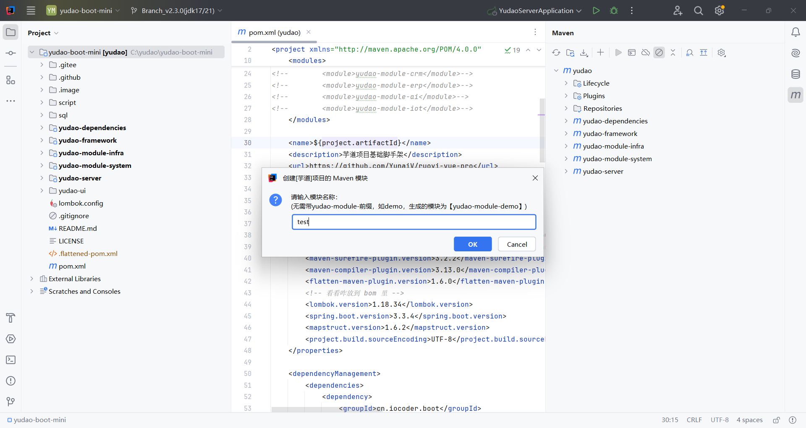

创建模块成功后，会有提示信息以及信息提示框：

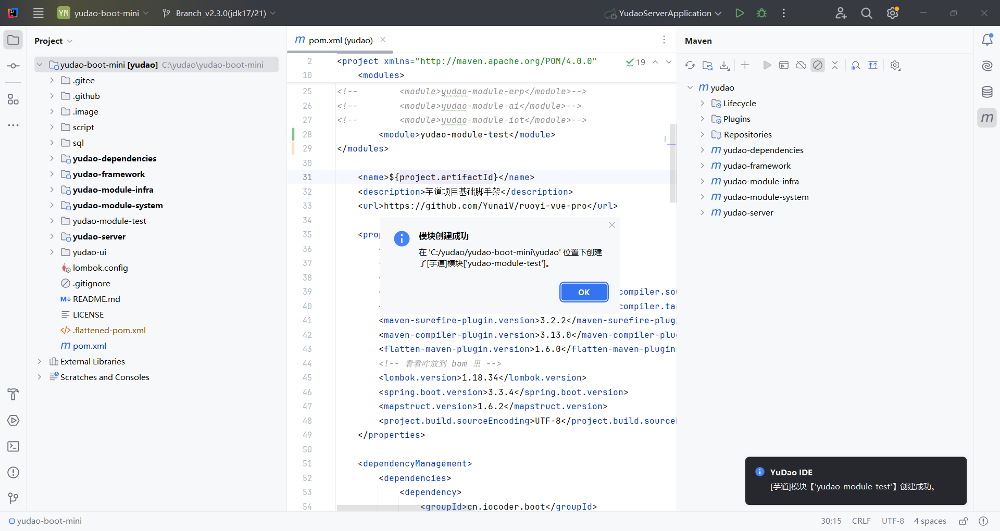

稍后，插件会自动扫描 Maven 项目并将创建好的模块添加到 `yudao-boot-mini` 项目中。

### 1.2.3 模块初始化

插件会在生成的模块根目录下生成一个指导文件 `readme.md`，该文件提供了模块初始化及为模块添加第一个功能的指引。

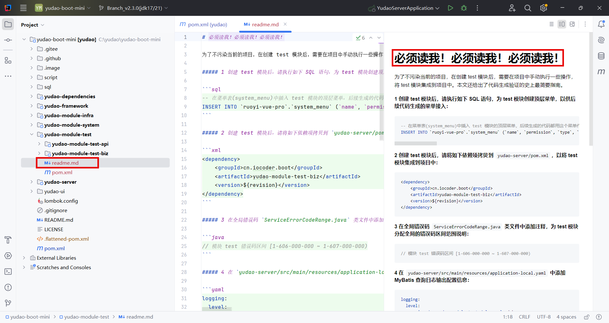

请阅读 `readme.md` 文件，并按照文档的 1~5 步骤完成模块的初始化。

完成模块初始化后，启动项目的前后端，即可通过项目提供的“基础设施>代码生成”功能生成基本的 CRUD 功能骨架代码。

### 1.2.4 生成代码

按照 `readme.md` 文件中的指引，执行第 6 步，创建 test_hello_world 数据库表。

使用“基础设施>代码生成”菜单中的“导入”按钮，导入 test_hello_world 数据库表：

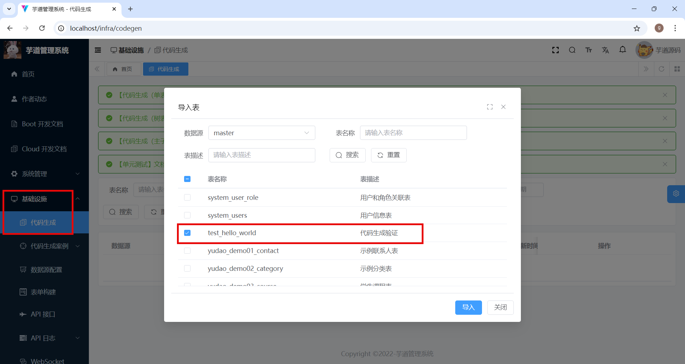

在“修改生成配置”的“生成信息”页签的“上级菜单”下拉框中，为生成代码的功能选择上级菜单（本文第1步的 insert 语句创建的上级菜单），以将本功能添加到 test 模块菜单中：

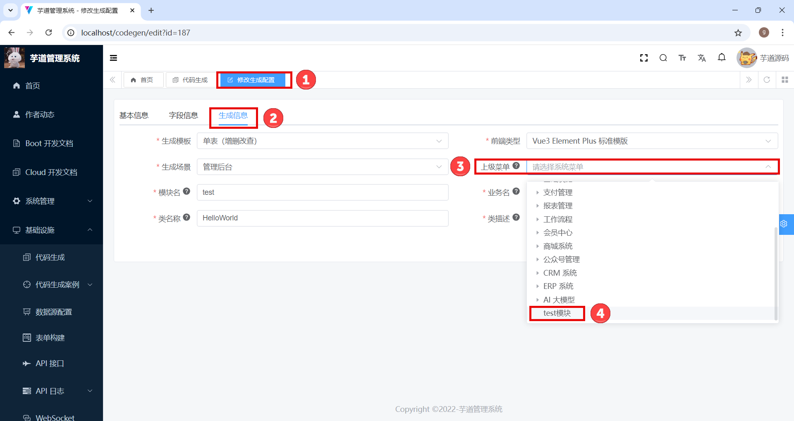

在“修改生成配置”的“字段信息”页签中，为使用字典选项的字段（如 status）选择当前项目中已经存在的字典类型（如“系统状态”，如没有你需要的字典类型，则需要在代码生成前添加后选择）：

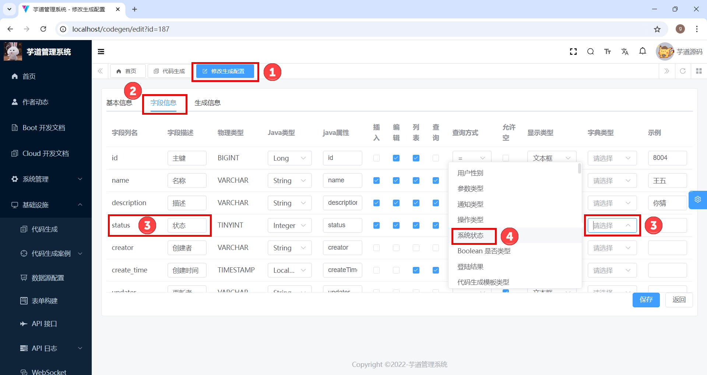

最后，生成代码：

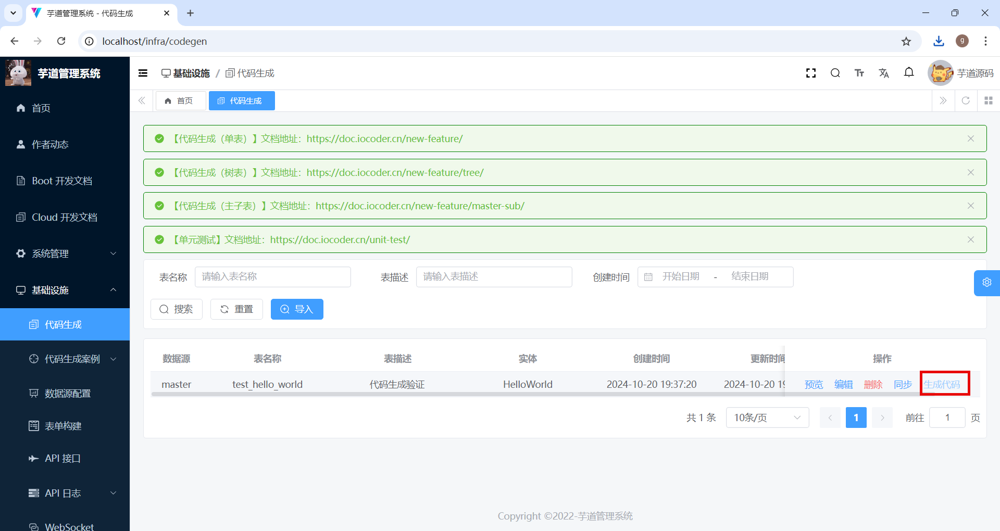

生成的代码会自动下载到本地的“下载”目录中。

### 1.2.5 拷贝代码

解压生成的代码。执行 sql 目录下的 `sql.sql` 文件，将菜单配置信息添加到数据库中。

拷贝 `yudao-module-test` 到后端项目中，注意 `ErrorCodeConstants_手动操作.java` 文件中的错误码示例，并需要自行编码并添加到 ErrorCodeConstants 文件中。

删除 `ErrorCodeConstants_手动操作.java` 提示信息文件。

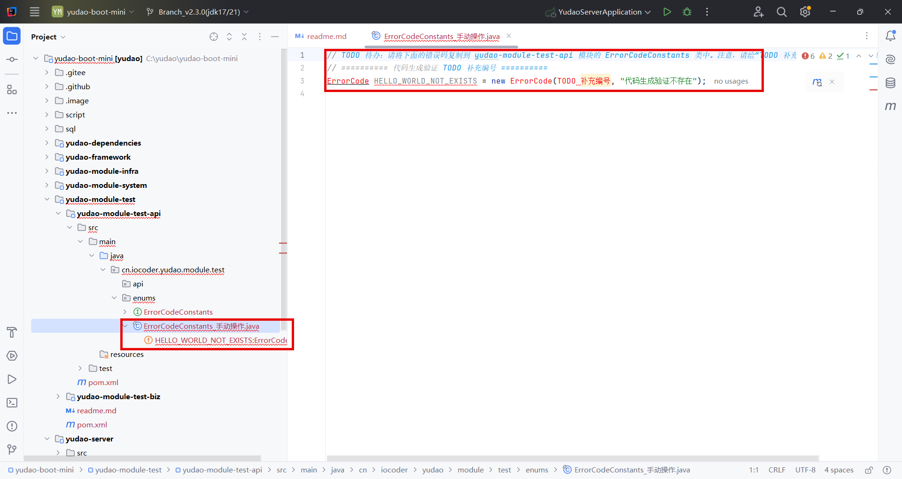

拷贝 `yudao-ui-admin-vue3` 中的 `src` 目录到前端项目中。

### 1.2.6 运行验证

重新启动前后端项目，开始你的[芋道]编程之旅。

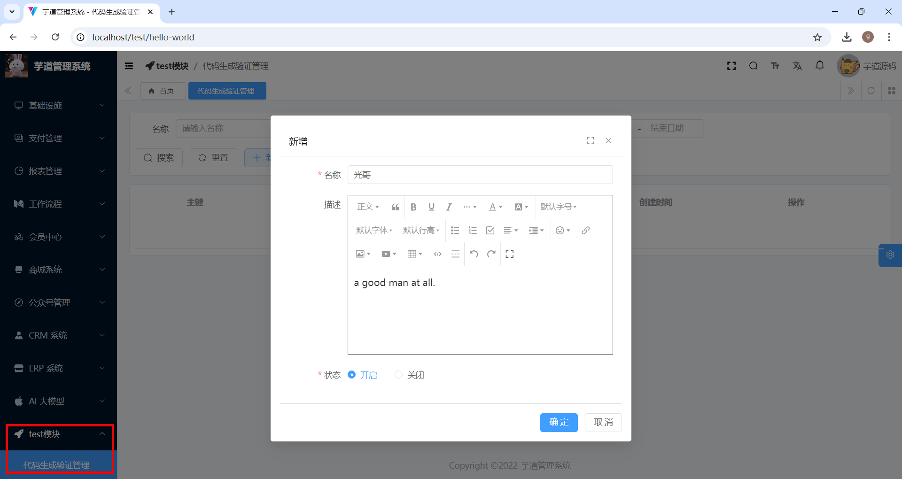