# 第1章 安装虚拟机软件

本手册选择了 Windows 版的开源免费的 VirtualBox 虚拟机软件。

本章首先给出了安装 VirtualBox 所有的 3 个软件的下载地址，建议使用迅雷软件下载。然后给出了安装步骤。最后对 VirtualBox 进行设置，支持 Host-Only 网卡设置模式的公网访问。

## 1.1 下载

VirtualBox 下载地址：[https://download.virtualbox.org/virtualbox/7.0.10/VirtualBox-7.0.10-158379-Win.exe](https://download.virtualbox.org/virtualbox/7.0.10/VirtualBox-7.0.10-158379-Win.exe)

扩展包下载地址：[https://download.virtualbox.org/virtualbox/7.0.10/Oracle_VM_VirtualBox_Extension_Pack-7.0.10.vbox-extpack](https://download.virtualbox.org/virtualbox/7.0.10/Oracle_VM_VirtualBox_Extension_Pack-7.0.10.vbox-extpack)

Microsoft Visual C++ 2019 Redistributable Package：[https://aka.ms/vs/17/release/vc_redist.x64.exe](https://aka.ms/vs/17/release/vc_redist.x64.exe)

> VirtualBox 需要 Microsoft Visual C++ 2019 Redistributable Package，到微软官网下载 Microsoft Visual C++ 2015-2022 Redistributable Package（含 VC++ 2019）。

## 1.2 安装

VirtualBox 依赖于 Microsoft Visual C++ 2019 Redistributable Package 所以需要先安装这个 VC++ 2019 包。双击 `vc_redist.x64.exe` 安装，然后重启机器。

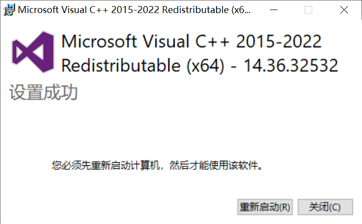

双击下载回来的 `VirtualBox-7.0.10-158379-Win.exe` 安装虚拟机软件：

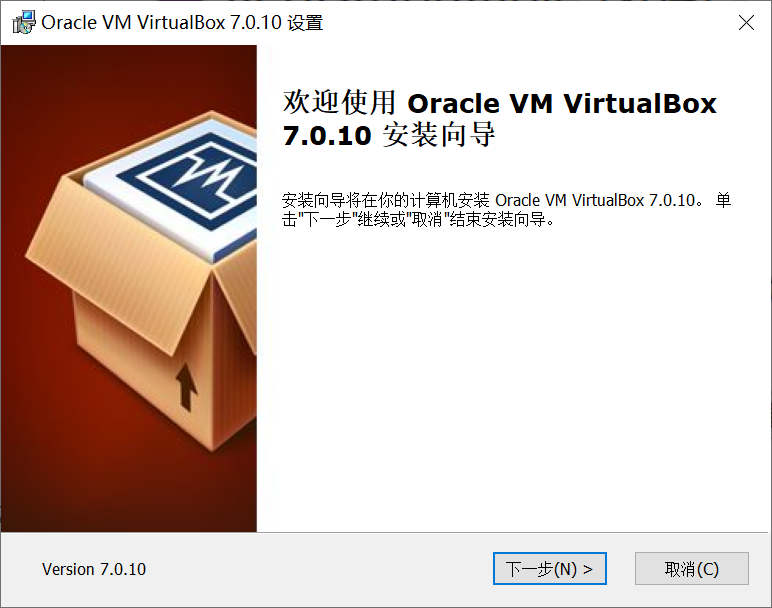

安装过程中选择不安装“VirtualBox 的 Python”支持：

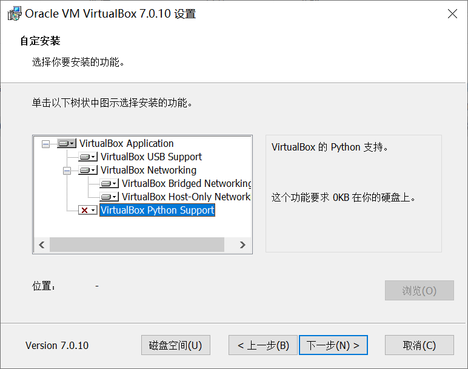

安装完 `VirtualBox-7.0.10-158379-Win.exe` 后双击 `Oracle_VM_VirtualBox_Extension_Pack-7.0.10.vbox-extpack` 安装 VirtualBox_Extension_Pack 扩展包：

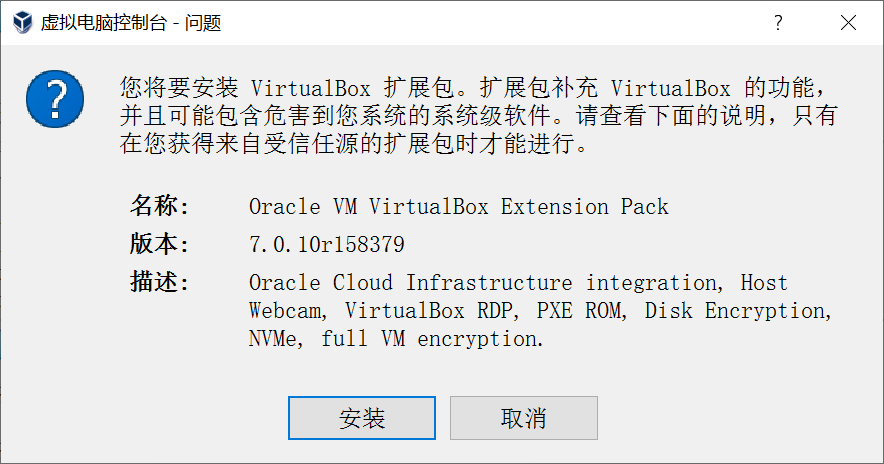

启动 VirtualBox 检查验证完成扩展包的安装：


## 1.3 设置

按键盘的 Windows 键（或单击屏幕左下角 Windows 图标）在“设置”中选择“网络和Internet”项：

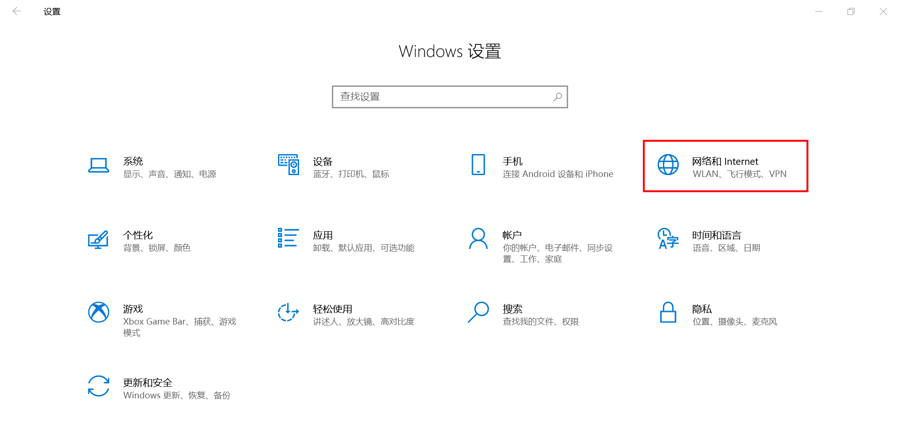

单击“更改适配器选项”：

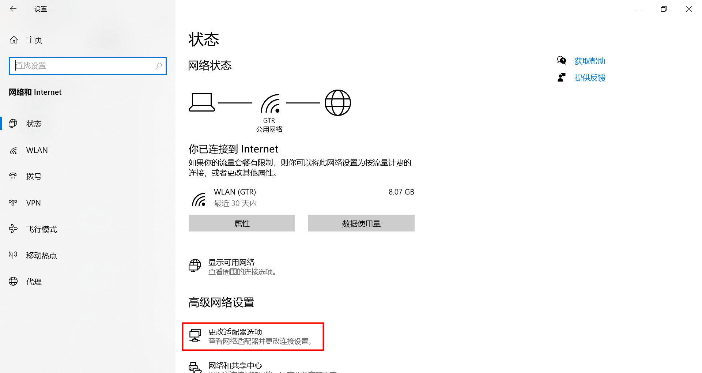

右键单击当前联网的网卡（使用笔记本时很多时候都是“WLAN”这个无线网卡，如果你使用网线，则可能是“以太网”），选择“属性”菜单：


在“Internet 连接共享”中选择“VirtualBox Host-Only Ethernet Adapter”对应的“以太网 3”：

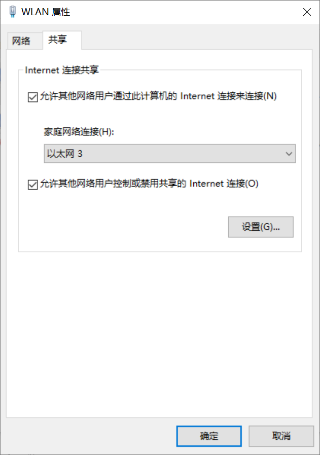

系统提示共享的“VirtualBox Host-Only Ethernet Adapter”适配器将被设置为 192.168.137.1 地址：

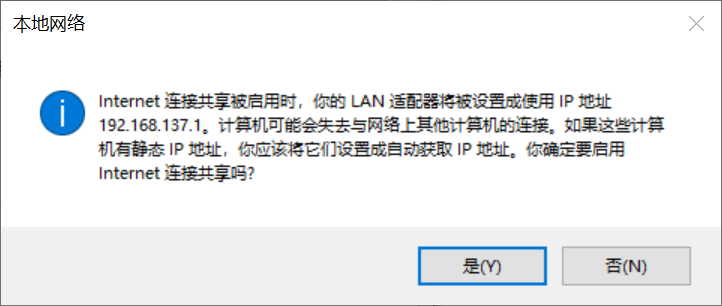

所以，需要在 VirtualBox 的“网络管理器”中的“仅主机(Host-Only)网络”的网卡地址手动配置为 192.168.137.1 地址：

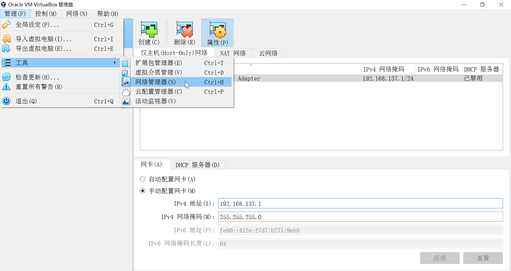

## 1.4 Windows11特殊设置

Windows 11 中由于启用了一些安全机制，导致 VirtualBox 客户机（CentOS虚拟机）中的 VT-x/AMD-V 虚拟化失效，在虚拟机中 CPU 不支持 avx/avx2 指令，使 MongoDB 无法运行。

请遵循以下步骤打开 VT-x/AMD-V 虚拟化机制。

### 1.4.1 关闭 Credential Guard

在 Windows 宿主机中以管理员身份打开 cmd，执行如下两段命令：

```bash
# 第1段命令
mountvol X: /s
copy %WINDIR%\System32\SecConfig.efi X:\EFI\Microsoft\Boot\SecConfig.efi /Y
bcdedit /create {0cb3b571-2f2e-4343-a879-d86a476d7215} /d "DebugTool" /application osloader
bcdedit /set {0cb3b571-2f2e-4343-a879-d86a476d7215} path "\EFI\Microsoft\Boot\SecConfig.efi"
bcdedit /set {bootmgr} bootsequence {0cb3b571-2f2e-4343-a879-d86a476d7215}
bcdedit /set {0cb3b571-2f2e-4343-a879-d86a476d7215} loadoptions DISABLE-LSA-ISO
bcdedit /set {0cb3b571-2f2e-4343-a879-d86a476d7215} device partition=X:
mountvol X: /d

# 第2段命令
bcdedit /set {0cb3b571-2f2e-4343-a879-d86a476d7215} loadoptions DISABLE-LSA-ISO,DISABLE-VBS
bcdedit /set vsmlaunchtype off
```

> 从 **Windows 11 版本 22H2** 开始，默认情况下，Credential Guard 在[满足要求的](https://learn.microsoft.com/zh-cn/windows/security/identity-protection/credential-guard/#hardware-and-software-requirements)设备上处于打开状态。 默认启用 **没有 UEFI 锁定**，它允许管理员在需要时远程禁用 Credential Guard。参考：[https://learn.microsoft.com/zh-cn/windows/security/identity-protection/credential-guard/configure?tabs=intune](https://learn.microsoft.com/zh-cn/windows/security/identity-protection/credential-guard/configure?tabs=intune)

执行上面的两段命令后，需要重启机器，在重启机器后的提示信息中按两次 F3 快捷键。

> 重启机器后，VirtualBox 虚拟机窗口下的绿色小乌龟消失不见了，表示“全速虚拟化”开启中。

### 1.4.2 关闭 Hyper-V

在 Windows 宿主机中以管理员身份打开 cmd，执行如下命令：

```bash
#====以下为关闭Hyper-V命令，VirtualBox需要====
bcdedit /set hypervisorlaunchtype off #关闭Hyper-V
dism /Online /Disable-Feature:Microsoft-Hyper-V-All #禁用Microsoft Hyper-V
#====以下为打开Hyper-V命令，Docker容器需要====
bcdedit /set hypervisorlaunchtype auto #打开Hyper-V
dism /Online /Enable-Feature:Microsoft-Hyper-V-All #启用Microsoft Hyper-V
```

执行完上述命令后，重启机器，然后在 Windows 宿主机中以管理员身份打开 cmd 执行命令 `systeminfo`，查看 `Hyper-V 要求` 的信息：

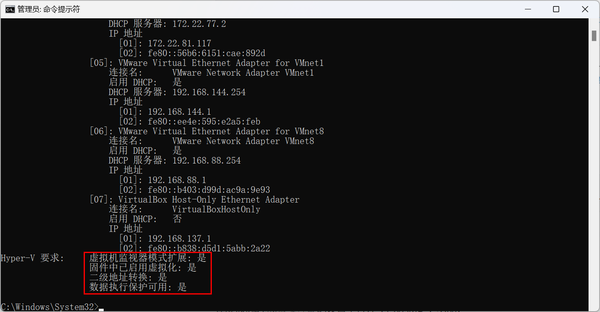

### 1.4.3 虚拟机打开 VT-x/AMD-V

在虚拟机的`系统>处理器`的设置中打开“VT-x/AMD-V”功能：

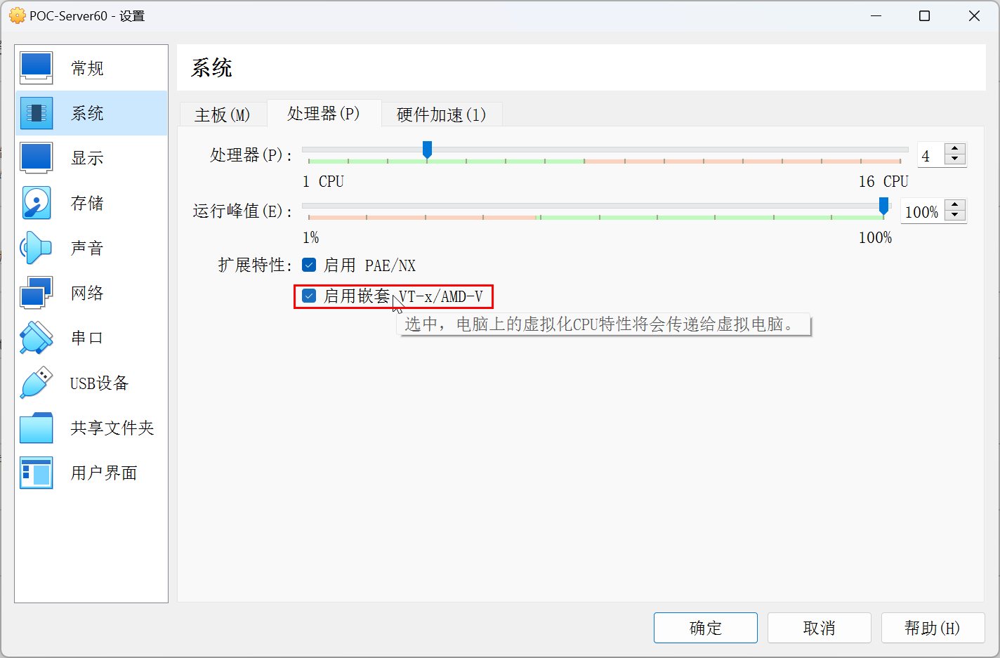

如果界面上这个选项是灰的，可以执行如下代码设置：

```bash
"C:\Program Files\Oracle\VirtualBox\VBoxManage.exe" modifyvm "POC-Server60" --nested-hw-virt on
```

### 1.4.4 检查虚拟机中 CPU 的指令集

启动虚拟机后，输入如下命令，检查 avx/avx2 指令集：

```bash
grep avx /proc/cpuinfo
```

查找到 avx/avx2 指令集支持，如下图：

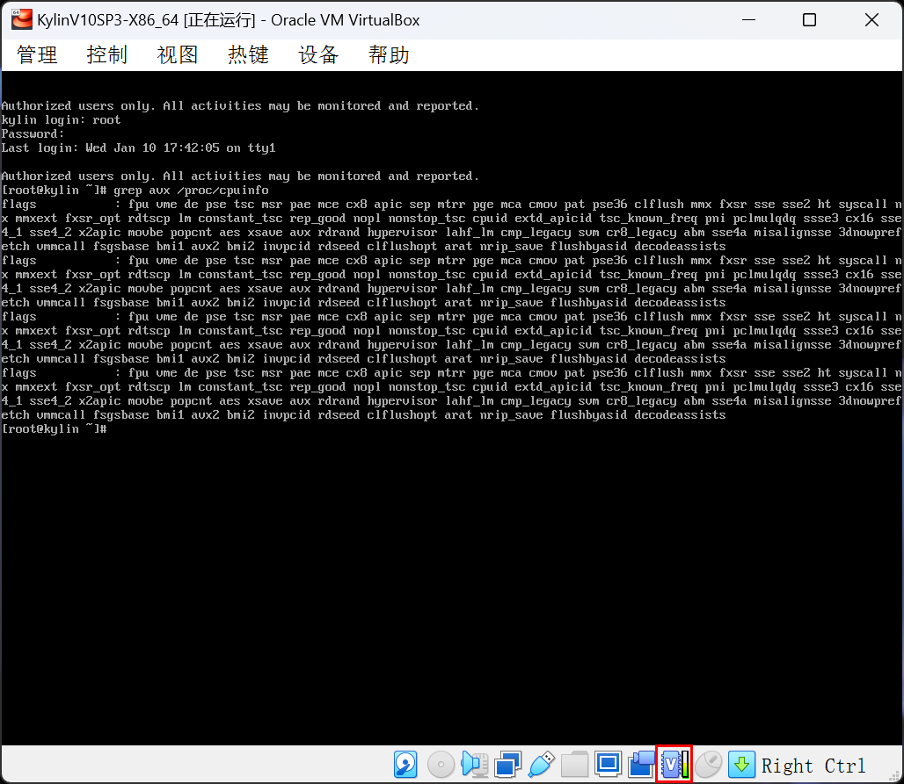

<div STYLE="page-break-after: always;"></div>