# 第2章 安装Linux服务器

Linux 服务器选择当前客户使用最为广泛的 CentOS 7.9 版本。

## 2.1 下载

在国内阿里云镜像网站下载 CentOS 7.9，速度较快。

CentOS 下载地址：[http://mirrors.aliyun.com/centos/7.9.2009/isos/x86_64/CentOS-7-x86_64-DVD-2009.iso](http://mirrors.aliyun.com/centos/7.9.2009/isos/x86_64/CentOS-7-x86_64-DVD-2009.iso)

也可选择最小安装安装光盘镜像：[http://mirrors.aliyun.com/centos/7.9.2009/isos/x86_64/CentOS-7-x86_64-Minimal-2009.iso](http://mirrors.aliyun.com/centos/7.9.2009/isos/x86_64/CentOS-7-x86_64-Minimal-2009.iso)，其等效于 CentOS-7-x86_64-DVD-2009.iso 镜像的“Minimal Install”。

## 2.2 安装

创建新的 VirtualBox 虚拟机，虚拟光盘选择下载回来的 CentOS-7-x86_64-DVD-2009.iso 文件，注意勾选上“跳过自动安装”：

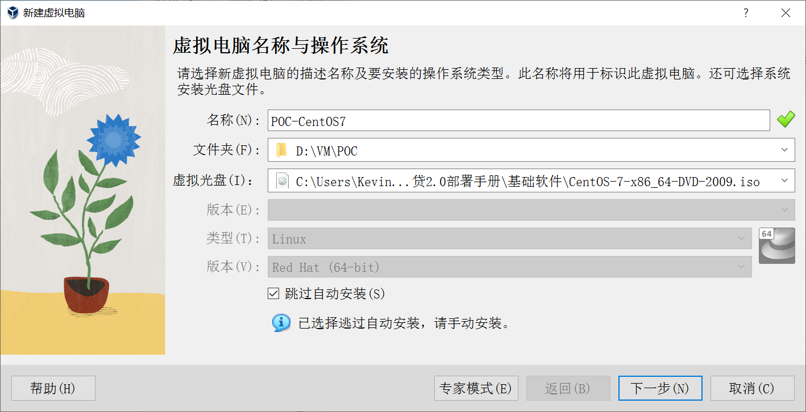

设置虚拟机内存大小为 8320 M（8G+128M），CPU 设置为 1 即可：

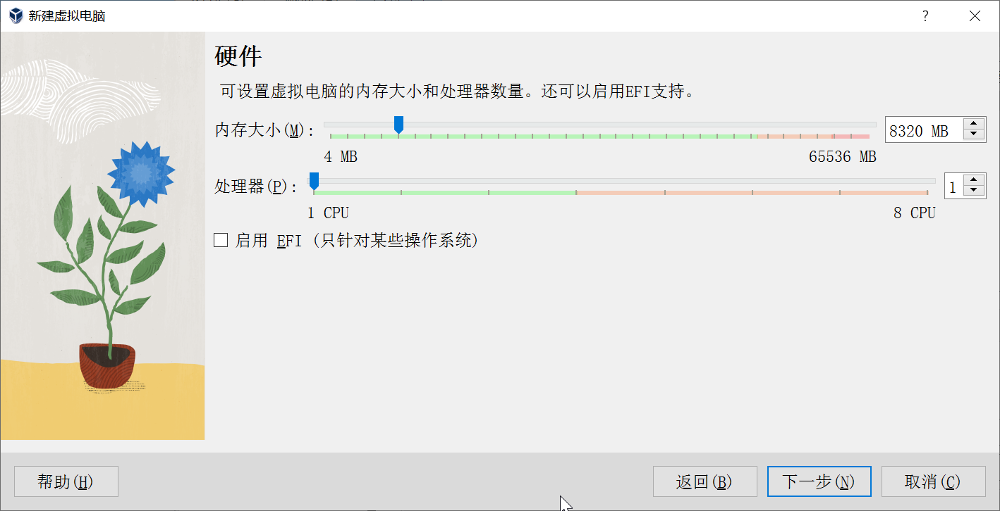

虚拟硬盘设置为 128G，虚拟机会在使用过程中按需分配空间：

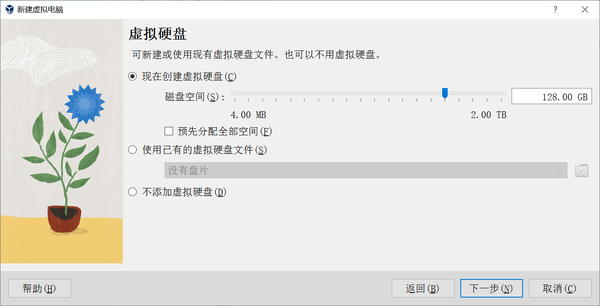

单击“完成”按钮，创建虚拟机：


右键选择“正常启动”，启动虚拟机：

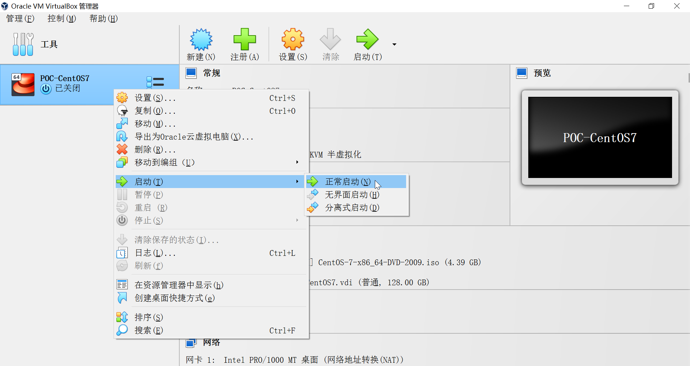

在启动的虚拟机中选择“Install CentOS 7”：

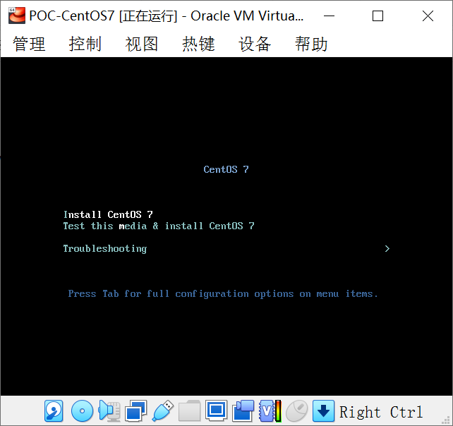

> 在安装过程中，如果发现鼠标无法移动到宿主机（host，安装 VirtualBox 软件的 Windows），请按键盘上的右边“ctrl”键。

在安装向导中保持“English”语言即可：


保持“Minimal Install”最小化安装服务器，单击“INSTALLATION DESTINATION”，初始化硬盘：

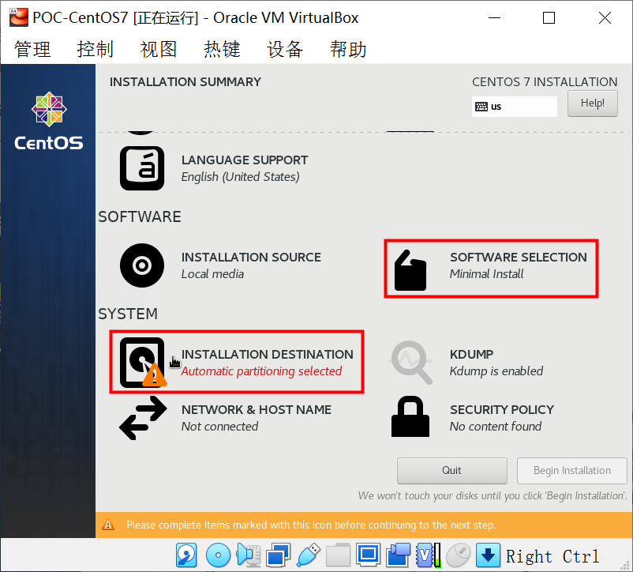

单击“Done”按钮

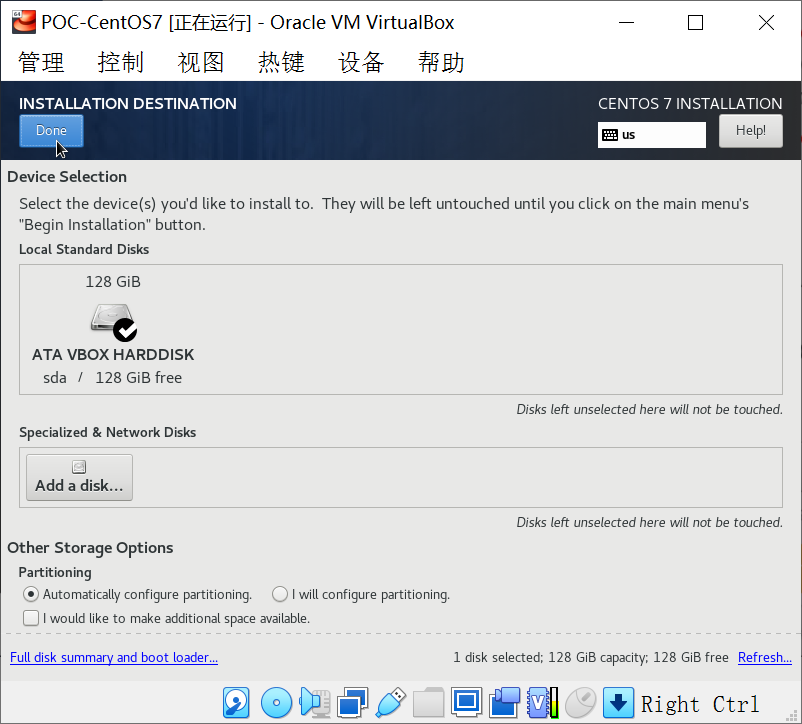

设置“时区”：

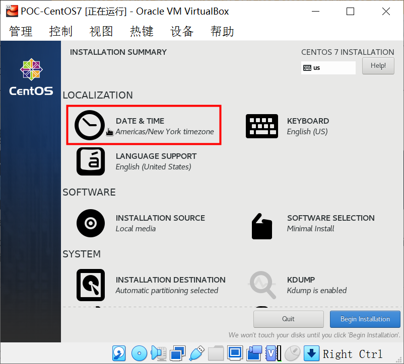

选择“Asia Shanghai”时区（+8，北京时间），与主机时区保持一致，方便查阅后续日志中的时间：

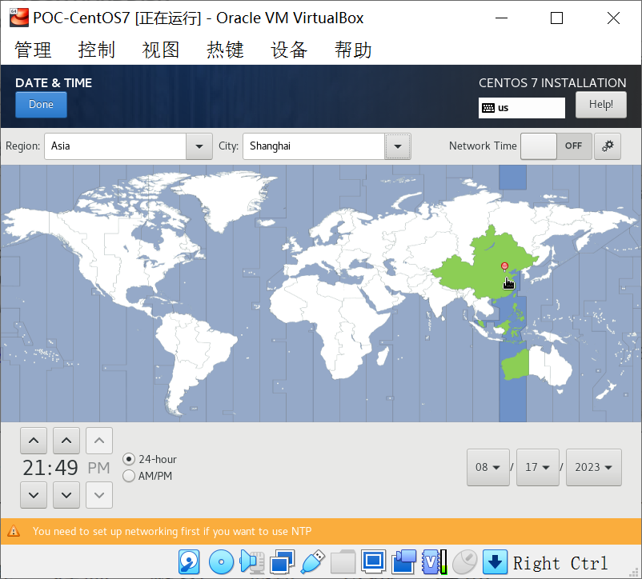

设置网络地址为 192.168.137.20：

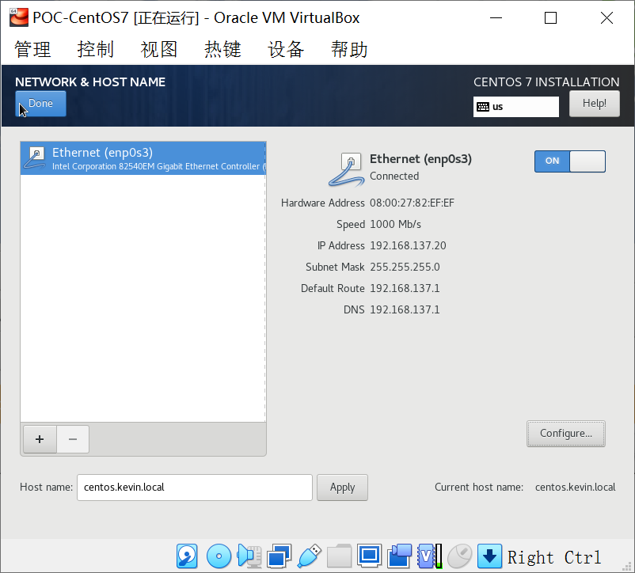

然后单击“Begin Installation”开始安装：

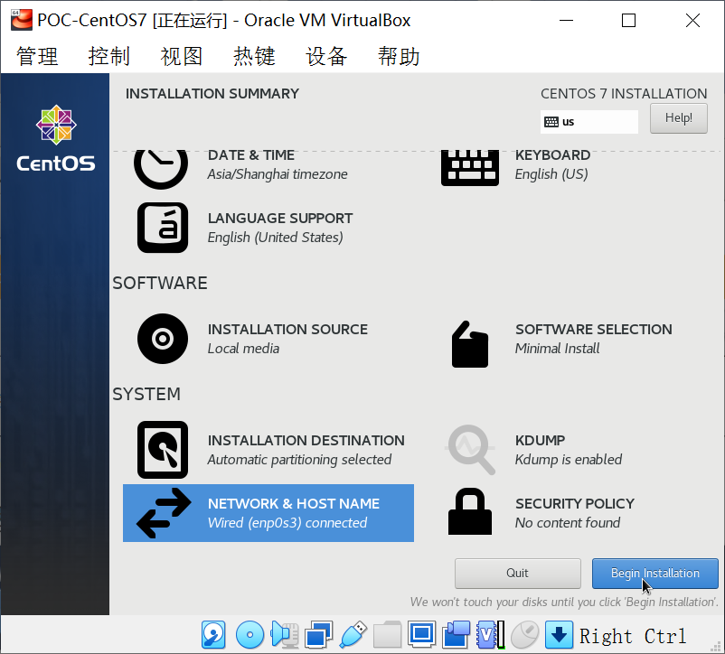

安装完成后单击“Reboot”重启虚拟机：

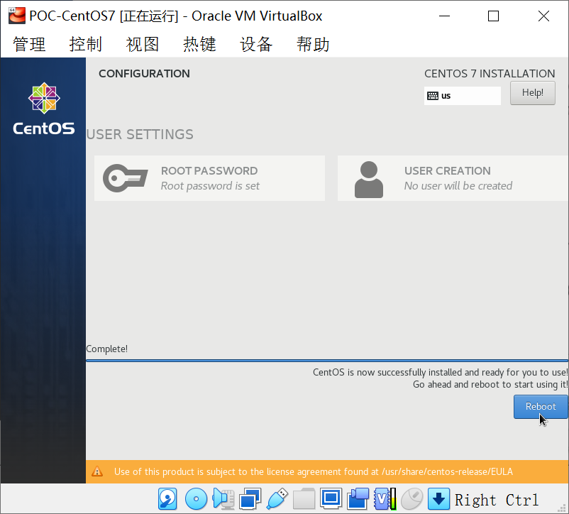

重启后，使用 root 用户，密码 123456 登录系统：

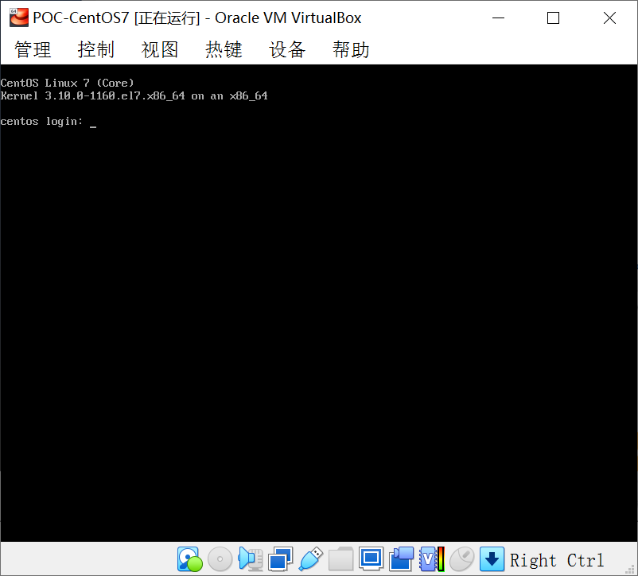

输入 `ip address` 命令查看 IP 地址：

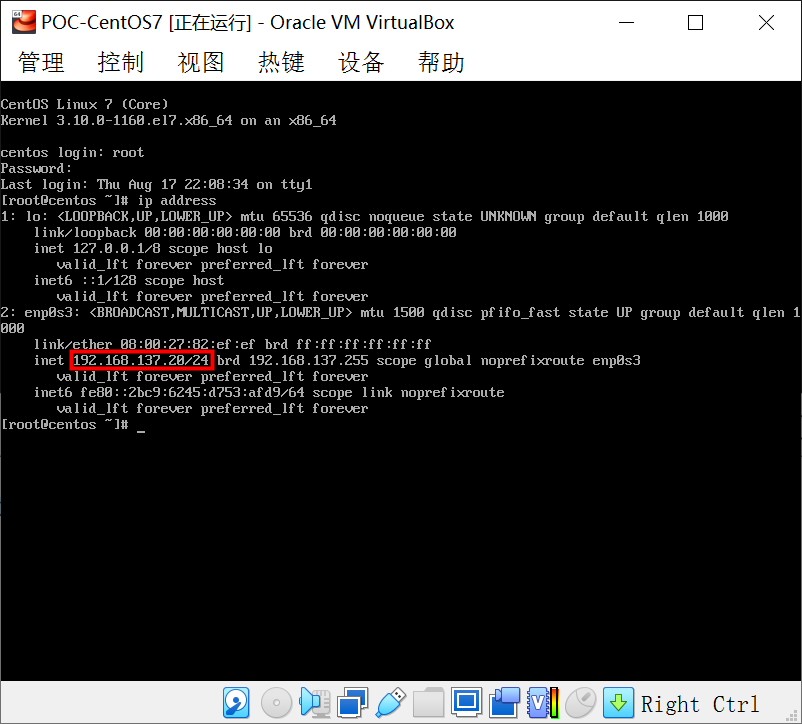

输入 `ping www.baidu.com` 命令，检查是否可以连接到公网：

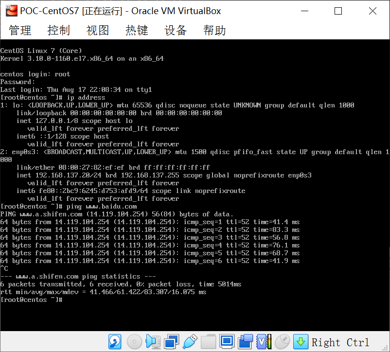

> 本小节练习安装时间参考：20 分钟。

## 2.3 设置

在后续的部署过程中，分布式组件基础服务及信贷微服务对服务器有特定的要求，我们需要先对服务器进行设置。

为了方便起见，供 POC 使用的服务器不考虑安全性，可以直接关闭 SELinux 和 防火墙。

在部署过程中，有些服务对 Linux 内核参数有要求，需要修改对应的 Linux 操作系统内核参数。

如果 SSH 终端连接服务器很慢，可以 `vi /etc/ssh/sshd_config` 取消 115 行的注释，并修改为“UseDNS no”（禁用DNS反查域名），然后重启 SSH 服务 `systemctl restart sshd`，之后使用 SSH 客户端连接就会快很多。

### 2.3.1 关闭防火墙

CentOS 7 使用的防火墙是 `firewalld`，它是一个动态的管理工具，用于配置和管理 Linux 防火墙规则。Firewalld 为系统管理员提供了一种简单且灵活的方法来管理网络连接，并保护服务器免受未经授权的访问和恶意攻击。通常在测试验证环境下，为了减少配置防火墙规则的工作，我们可以直接关闭防火墙。但是，**在生产环境或公网部署等对安全性有要求的场景下，千万不能关闭防火墙**。

```bash
systemctl stop firewalld
systemctl disable firewalld
```

### 2.3.2 禁用 SELinux

SELinux (Security-Enhanced Linux)  是一种 Linux 操作系统的安全机制，它提供了强大的安全性增强功能，用于强化操作系统的安全性。SELinux 最初由美国国家安全局（NSA）开发，并在许多主流 Linux 发行版中得到广泛支持，包括 Red Hat Enterprise Linux（RHEL）、CentOS、Fedora 等。

传统的 UNIX 权限模型依赖于用户、组和权限位（读、写、执行）来控制对文件和资源的访问。然而，这种权限模型有时过于宽松，存在潜在的漏洞，特别是当恶意用户或攻击者试图利用系统漏洞时。SELinux 解决了这个问题，引入了更细粒度的访问控制，基于规则和策略来限制进程和用户对资源的访问。

通常在 POC 测试验证环境下，为了减少配置安全策略的工作，我们可以直接禁用 SELinux。但是，**在生产环境或公网部署等对安全性有要求的场景下，千万不能禁用 SELinux**。

```bash
vi /etc/sysconfig/selinux
=======================================================
SELINUX=disabled #禁用selinux
=======================================================
# 重启linux服务器后“禁用selinux”生效
```

### 2.3.3 设置主机名

在 Linux 操作系统中，`hostname` 是指计算机或服务器的设备名称。它用来标识网络中的特定主机，并在本地系统中作为标识符。`hostname` 在网络通信中具有重要作用，它通常用作本地主机名和网络上的主机名，以便其他设备可以识别和访问该主机。

在一个典型的基于 Spring Cloud 微服务架构中，微服务在启动过程中可能需要 IP 地址和主机名的映射关系，否则会导致服务启动非常慢从而导致启动失败。

本手册中，需要为服务器（192.168.137.20）设定一个主机名，并添加 hostname 映射：

```bash
# 虚拟机设置hostname
hostnamectl set-hostname centos.kevin.local
# 添加hostname映射
vi /etc/hosts
=======================================================
192.168.137.20 centos.kevin.local localhost localhost.localdomain localhost4 localhost4.localdomain
=======================================================
systemctl restart network
```

> 微服务在启动过程中很卡，启动日志提示：INFO  org.springframework.cloud.commons.util.InetUtils - Cannot determine local hostname，可以通过添加 hosts 映射来解决这个问题。

### 2.3.4 添加 net-tools

`net-tools` 包是 CentOS 7 及更早版本中的网络工具包，提供了一些旧式的网络管理工具。然而，随着时间的推移，新的网络管理工具如 `iproute2` 包中的 `ip` 命令取代了许多 `net-tools` 的功能。在最新版本的 CentOS 中，默认情况下已经不再安装 `net-tools`，而应优先考虑使用现代的 `ip` 命令来进行网络管理。

在我们的微服务中是使用了 `/sbin/ifconfig` 来获取 mac 地址，供雪花算法用。然而，最小化安装的 CentOS 7 并没有带这个命令，需要安装 net-tools 工具包。

上传 `POC基础环境安装包\VM\NetTools-2.0\net-tools-2.0-0.25.20131004git.el7.x86_64.rpm` 到目标服务器 `/root/` 目录下，然后通过 `yum` 命令安装：


```bash
cd /root/
yum -y localinstall net-tools-2.0-0.25.20131004git.el7.x86_64.rpm
ifconfig
rm -f /root/net-tools-2.0-0.25.20131004git.el7.x86_64.rpm
```

### 2.3.5 设置时区

在 Linux 系统中，时区是一个重要的概念，用于表示系统所在的地理区域的本地时间偏移。它允许系统根据地理位置和季节更改本地时间，以便在不同的地区正确显示时间。正确设置时区对于确保时间同步和日志记录非常重要，尤其在跨时区的系统和服务器上。

不正确的时区，会导致系统日志等信息的混乱。请检查操作系统的时区，如不正确，修改成“Asia/Shanghai”时区：

```bash
timedatectl status
timedatectl set-timezone Asia/Shanghai
```

### 2.3.6 修改内核参数

Linux 内核参数是用于调整和配置 Linux 内核行为的设置。内核参数允许系统管理员根据需要对内核的各种方面进行微调，以满足特定的硬件和应用需求，或优化系统性能和稳定性。例如：

- `net.core.somaxconn` 参数：指定套接字监听队列的最大长度，适用于高并发网络应用；
- `fs.file-max`：限制系统可以打开的文件描述符（句柄数）的最大数量。对于高并发系统，可能需要增加该值。

修改内核参数以消除 Redis 启动时的警告：

```bash
vi /etc/sysctl.conf
=======================================================
net.core.somaxconn = 1024
vm.overcommit_memory = 1
=======================================================
sysctl -p
```

### 2.3.7 修改打开句柄数

适当设置 `* soft nofile` 和 `* hard nofile` 这两个参数对于确保系统的稳定性、性能和安全性都是非常重要的。它们通常可以在高并发或资源密集型应用程序中特别有用，以确保系统能够适应用户的需求并保持稳健运行。

增加操作系统打开的句柄数：

```bash
# 添加两行，增大文件句柄数
vi /etc/security/limits.conf
=======================================================
* soft nofile 2048
* hard nofile 32768
=======================================================
# 修改完成后重启系统，查看限制数
ulimit -n
```

### 2.3.8 安装解压工具

CentOS 7 最小化安装并没有携带 zip/unzip 工具，需要安装 zip/unzip 工具包来解压 zip 包。

上传 `POC基础环境安装包\VM\ZipUnzip\zip-3.0.11-rpm.tar.gz` 到目标服务器 `/root/` 目录下：

```bash
cd /root/
# 解压缩zip/unzip安装包
tar -xzvf zip-3.0.11-rpm.tar.gz
cd zip
yum -y localinstall *.rpm
# 清除上传的安装文件
cd /root/
rm -rf zip*
```

### 2.3.9 重启服务器

上面对操作系统的调整或补充（安装的一些支持工具）需要重启服务器才能生效。

完成上述修改后，重启服务器使设置生效。

```bash
reboot
```

服务器重启后，可以安装分布式基础组件服务或信贷 NCPm2.0 的服务。

> 本小节练习安装时间参考：15 分钟。

## 2.4 复制

在对最小化安装的 CentOS 完成设置后，可通过 VirtualBox 的复制虚拟机的方式快速创建后续信贷系统安装需要的 4 台虚拟机。

> 在复制虚拟机之前，可以选择将这个虚拟机（192.168.137.20）打包备份（如 `POC-CentOS7-完成服务器设置，可供复制.zip` 文件），供后续练习过程中重复使用。

在关闭的虚拟机上右键，选择“复制(<u>O</u>)...”菜单：

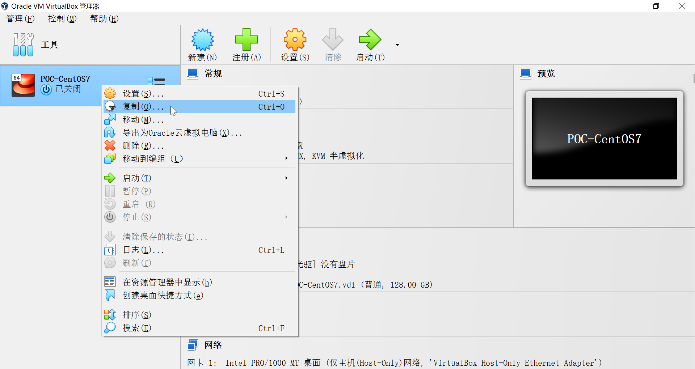

对复制的虚拟机命名为“POC-Server60”，指定虚拟机位置，并选择“为所有网卡重新生成 MAC 地址”：

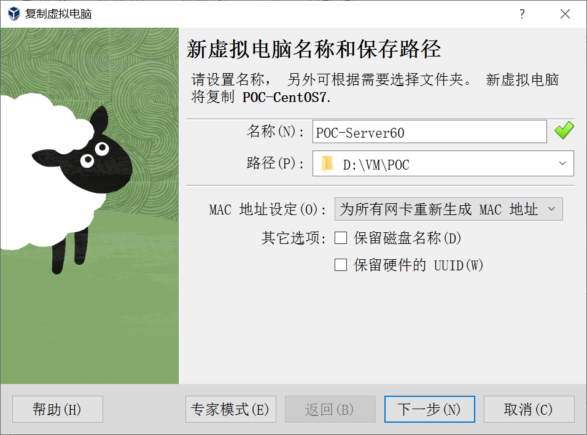

在下一步的“副本类型”中选择“完全复制(<u>F</u>)”，然后点击“完成”按钮：

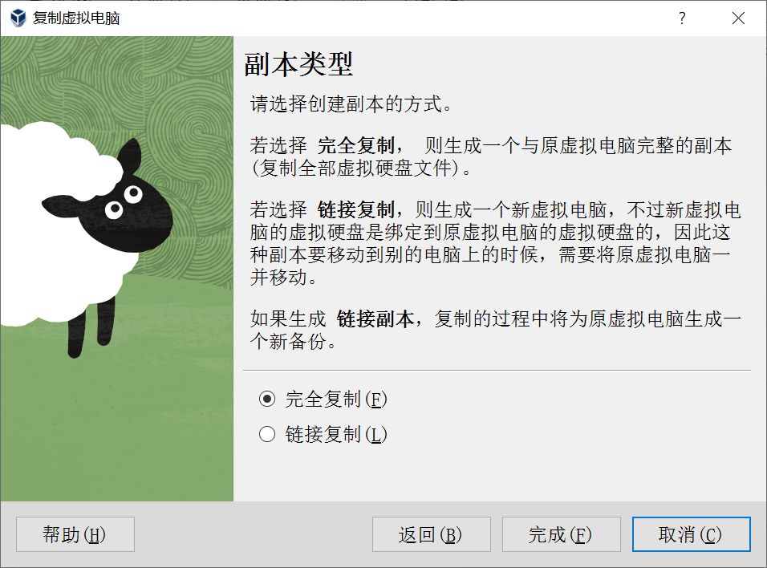

重复上述步骤，复制出“POC-Server70”、“POC-Server80”和“POC-Server90”虚拟机。

为了方便后续描述，删除“POC-CentOS7”虚拟机（之前已经 zip 打包备份过了，可以安全删除），存放虚拟的文件目录如下图所示，当前有 4 台供后续使用的虚拟机：

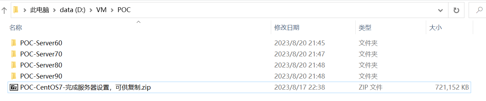

使用“无界面启动”每一台服务，然后对其进行 IP 地址、主机名和主机映射的设置：

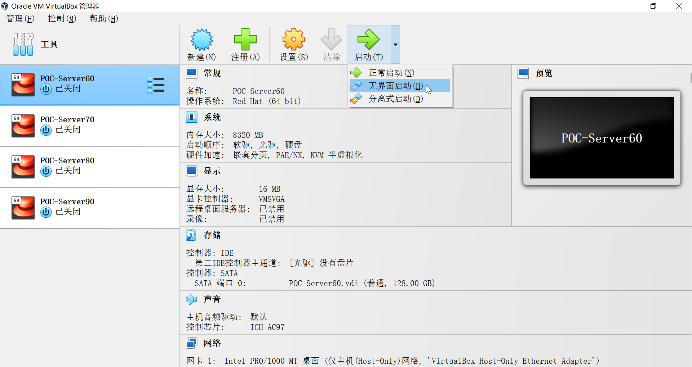

打开 MobaXterm 终端 ssh 连接到 192.168.137.20 地址：

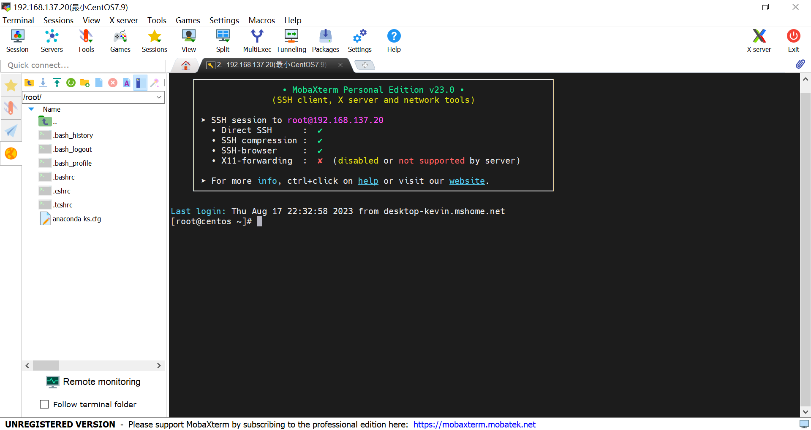

输入 `nmtui` 设置 IP 地址：

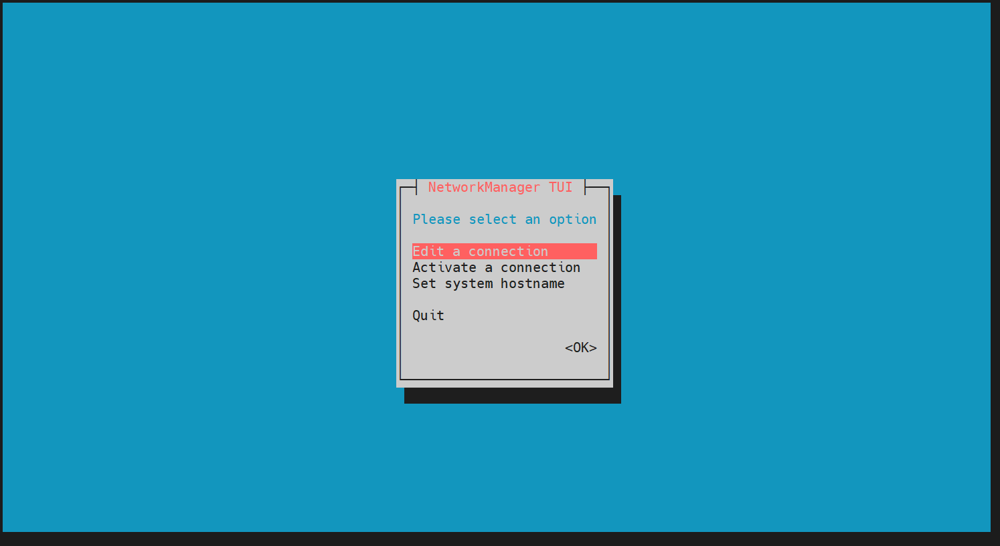

选择 enp0s3 这个网卡编辑其 IP 地址：

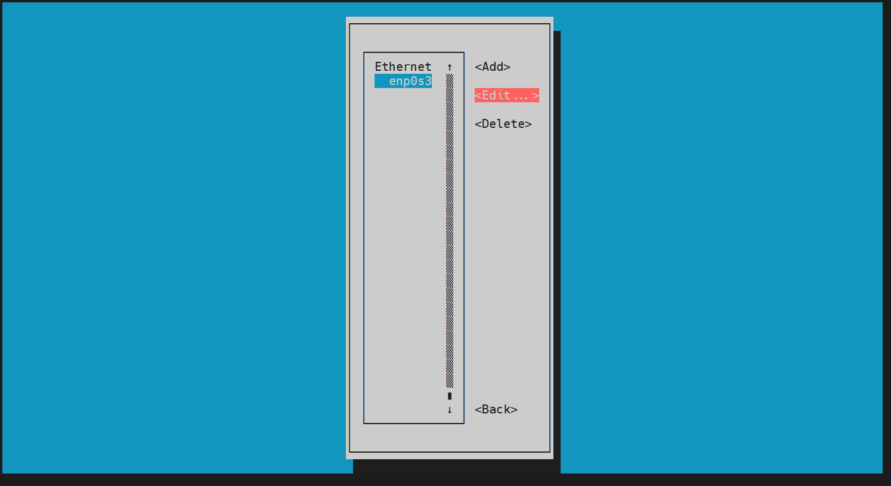

将 IP 地址修改成 `192.168.137.60/24` 地址（其中 /24 对应的是子网掩码 255.255.255.0）：

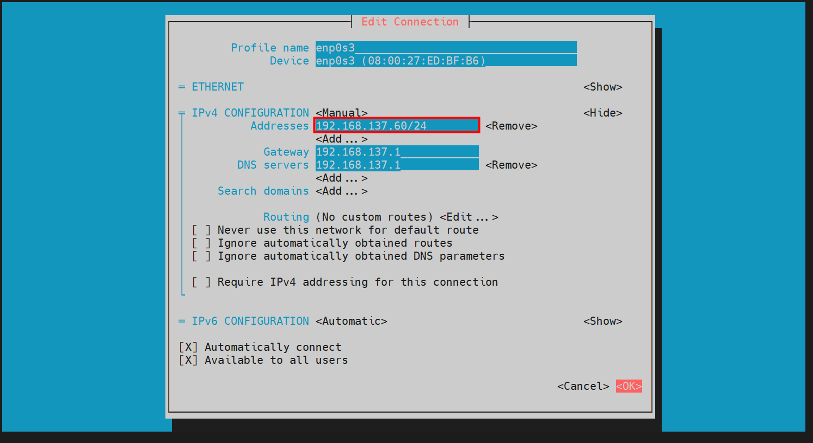

设置主机名和主机映射：

```bash
# 虚拟机设置hostname
hostnamectl set-hostname server1.kevin.local
# 添加hostname映射
vi /etc/hosts
=======================================================
192.168.137.60 server1.kevin.local localhost localhost.localdomain localhost4 localhost4.localdomain
=======================================================
# 保存后关机
poweroff
```

经过设置的 POC-Server60 虚拟机的信息如下：

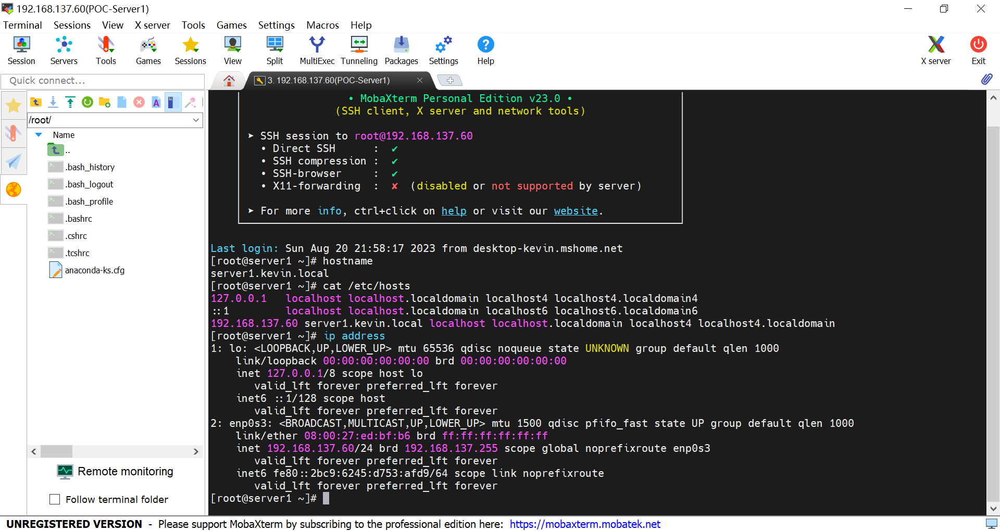

然后，依次启动 POC-Server70、POC-Server80 和 POC-Server90，按照 POC-Server60 虚拟机的方式设置其 IP 地址（192.168.137.70、192.168.137.80、192.168.137.90）、主机名（server2.kevin.local、server3.kevin.local、server4.kevin.local）和主机映射。

> 本小节练习安装时间参考：15 分钟。

<div STYLE="page-break-after: always;"></div>