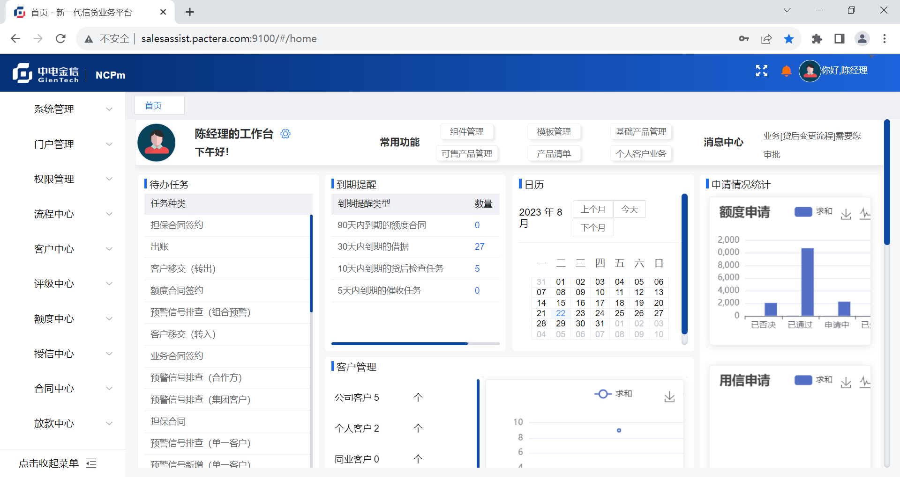

# 第7章 安装信贷前端

信贷 NCPm2 的前端服务安装在“POC-Server60（192.168.137.60）”虚拟机的 Nginx 服务上，安装介质存放在“`POC信贷前端安装包`”文件夹中，其后端服务网关安装在“POC-Server70（192.168.137.70）”服务器上。

## 7.1 解压安装

将 `ncpm2-console-2.0.5.tar.gz` 文件上传到服务器的 `/etc/nginx/` 目录，解压后完成安装。

```bash
systemctl stop nginx
# 上传ncpm2-console-2.0.5.tar.gz到/etc/nginx下解压
cd /etc/nginx/
tar -xzvf ncpm2-console-2.0.5.tar.gz
# 清除部署文件
rm -f /etc/nginx/ncpm2-console-2.0.5.tar.gz
# 启动Nginx
systemctl start nginx
```

由于信贷系统微前端打包时使用了固定的域名 `salesassist.pactera.com` 所以需要在用浏览器访问信贷系统的机器的 hosts 中添加`192.168.137.60 salesassist.pactera.com` 映射信息。

打开浏览器访问：[http://salesassist.pactera.com:9100](http://salesassist.pactera.com:9100)，开始使用信贷系统。

> 用户名=`superAdmin` 或 `CMT9527`，密码=`risk@2023`。



如果后端服务网关安装地址发生改变，请执行 `vi /etc/nginx/conf.d/ijep8_sys.conf` 命令修改配置文件中后端服务网关的地址信息：

```bash
# 配置信贷前端连接后端服务网关的地址
vi /etc/nginx/conf.d/ijep8_sys.conf
=======================================================
server 192.168.137.70:9000; #第2行，修改后端服务网关地址
=======================================================
```

## 7.2 启动服务

请执行如下命令启动服务：

```bash
systemctl start nginx
```

## 7.3 停止服务

请执行如下命令停止服务：

```bash
systemctl stop nginx
```

## 7.4 删除服务

POC 工作结束后，停止所有的服务，使用直接删除的方式清除环境，请执行如下命令：

```bash
systemctl stop nginx
rm -rf /etc/nginx/ncpm2 /etc/nginx/conf.d/ijep8_* /etc/nginx/conf.d/gcb_*
systemctl start nginx
```

> 本章练习安装时间参考：10 分钟。

<div STYLE="page-break-after: always;"></div>