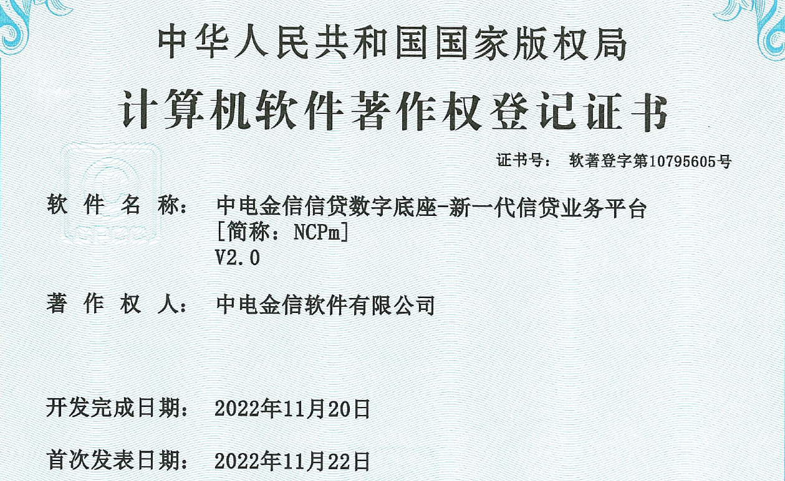

# 后记

综合信贷 2.0（NCPm2.0）是一个基于 Spring Cloud 的典型的分布式微服务系统，部署这个系统需要较多的基础背景知识，包括：

- Linux 基础管理（用户用户组所有者权限、文件的操作权限）和操作知识；
- 微服务使用的 MySQL 数据库的安装、操作知识；
- Redis、ES、MongoDB 等中间件的安装配置知识；
- 服务注册与发现中间件 Consul 和 Nacos 的安装配置知识；
- 要了解常见中间件的连接配置信息，以便在客户环境下连接到现有的中间件服务；
- 少量的 Linux 命令行脚本编辑知识。

“磨刀不误砍柴工”，未雨绸缪才是王道，希望参加本练习的同事能够更多的关注基础知识的积累，以面对千变万化的客户环境，独当一面才是真正的你。

实践出真知，希望你能在客户处用自己的专业赢得客户的尊重。

------

BUCMT_PD，张光勇，2023/8/22，广州。

