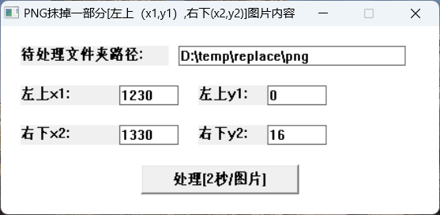

# PNG图片处理，使用C++代码

我需要对一批图片进行处理，使用 JAVA 写完代码后，想进一步写成 Windows 下的极小的 GUI 应用，可以在 GUI 界面上设置涂抹掉 PNG 文件的区域和递归处理的文件夹路径。使用 CLion 开发环境，豆包帮我做了代码转化，并持续提示添加了 GUI 界面的代码，效率数十倍的提高。

两个文件如下：

CMakeLists.txt 文件中引入需要的 png 和 zip 处理库：

```makefile
cmake_minimum_required(VERSION 3.30)
project(ErasePNG)

set(CMAKE_CXX_STANDARD 20)

# 指定 libpng 库的路径
set(PNG_INCLUDE_DIR "C:/msys64/mingw64/include")
set(PNG_LIBRARY_DIR "C:/msys64/mingw64/lib")

# 查找 PNG 库
find_library(PNG_LIBRARY NAMES libpng16.a PATHS ${PNG_LIBRARY_DIR})
find_path(PNG_INCLUDE_DIR NAMES png.h PATHS ${PNG_INCLUDE_DIR})

# 指定 zlib 库的路径
set(ZLIB_INCLUDE_DIR "C:/msys64/mingw64/include")
set(ZLIB_LIBRARY_DIR "C:/msys64/mingw64/lib")

# 查找 zlib 库
find_library(ZLIB_LIBRARY NAMES libz.a PATHS ${ZLIB_LIBRARY_DIR})
find_path(ZLIB_INCLUDE_DIR NAMES zlib.h PATHS ${ZLIB_INCLUDE_DIR})

# 检查是否找到 PNG 库和头文件
if(PNG_INCLUDE_DIR AND PNG_LIBRARY)
    # 包含 PNG 头文件目录
    include_directories(${PNG_INCLUDE_DIR})
    # 检查是否找到 zlib 库和头文件
    if(ZLIB_INCLUDE_DIR AND ZLIB_LIBRARY)
        # 包含 zlib 头文件目录
        include_directories(${ZLIB_INCLUDE_DIR})
        # 添加可执行文件，设置为 Windows GUI 程序
        add_executable(ErasePNG WIN32 main.cpp)
        # 链接 PNG 和 zlib 库到可执行文件
        target_link_libraries(ErasePNG ${PNG_LIBRARY} ${ZLIB_LIBRARY})
    else()
        message(FATAL_ERROR "zlib library not found!")
    endif()
else()
    message(FATAL_ERROR "PNG library not found!")
endif()
```

main.cpp 文件内容如下：

```cpp
#include <iostream>
#include <filesystem>
#include <png.h>
#include <chrono>
#include <fcntl.h>
#include <io.h>
#include <windows.h>

namespace fs = std::filesystem;

// 处理单个 PNG 文件
void processPngFile(const fs::path &filePath, int startX, int endX, int startY, int endY) {
    // 打开文件以读取，使用 _wfopen 处理宽字符路径
    FILE *fp = _wfopen(filePath.c_str(), L"rb");
    if (!fp) {
        std::wcerr << L"无法打开文件: " << filePath.c_str() << std::endl;
        return;
    }

    // 检查是否为 PNG 文件
    png_byte header[8];
    fread(header, 1, 8, fp);
    if (png_sig_cmp(header, 0, 8)) {
        std::wcerr << L"不是有效的 PNG 文件: " << filePath.c_str() << std::endl;
        fclose(fp);
        return;
    }

    // 创建 PNG 读取结构
    png_structp png_ptr = png_create_read_struct(PNG_LIBPNG_VER_STRING, nullptr, nullptr, nullptr);
    if (!png_ptr) {
        fclose(fp);
        return;
    }

    // 创建 PNG 信息结构
    png_infop info_ptr = png_create_info_struct(png_ptr);
    if (!info_ptr) {
        png_destroy_read_struct(&png_ptr, nullptr, nullptr);
        fclose(fp);
        return;
    }

    // 设置错误处理
    if (setjmp(png_jmpbuf(png_ptr))) {
        png_destroy_read_struct(&png_ptr, &info_ptr, nullptr);
        fclose(fp);
        return;
    }

    // 初始化 PNG I/O
    png_init_io(png_ptr, fp);
    png_set_sig_bytes(png_ptr, 8);
    png_read_info(png_ptr, info_ptr);

    // 获取图像信息
    int width = png_get_image_width(png_ptr, info_ptr);
    int height = png_get_image_height(png_ptr, info_ptr);
    int bit_depth = png_get_bit_depth(png_ptr, info_ptr);
    int color_type = png_get_color_type(png_ptr, info_ptr);

    // 转换为 8 位深度
    if (bit_depth < 8) {
        png_set_packing(png_ptr);
    } else if (bit_depth == 16) {
        png_set_strip_16(png_ptr);
    }

    // 转换为 RGBA
    if (color_type == PNG_COLOR_TYPE_PALETTE) {
        png_set_palette_to_rgb(png_ptr);
    }
    if (color_type == PNG_COLOR_TYPE_GRAY || color_type == PNG_COLOR_TYPE_GRAY_ALPHA) {
        png_set_gray_to_rgb(png_ptr);
    }
    if (png_get_valid(png_ptr, info_ptr, PNG_INFO_tRNS)) {
        png_set_tRNS_to_alpha(png_ptr);
    }

    // 更新信息
    png_read_update_info(png_ptr, info_ptr);

    // 分配内存
    png_bytep *row_pointers = new png_bytep[height];
    for (int y = 0; y < height; ++y) {
        row_pointers[y] = new png_byte[png_get_rowbytes(png_ptr, info_ptr)];
    }

    // 读取图像数据
    png_read_image(png_ptr, row_pointers);

    // 关闭读取文件
    fclose(fp);

    // 处理指定区域
    if (startX < 0 || endX >= width || startY < 0 || endY >= height) {
        std::wcerr << L"指定区域超出图片范围: " << filePath.c_str() << std::endl;
        for (int y = 0; y < height; ++y) {
            delete[] row_pointers[y];
        }
        delete[] row_pointers;
        png_destroy_read_struct(&png_ptr, &info_ptr, nullptr);
        return;
    }

    int bytes_per_pixel = png_get_channels(png_ptr, info_ptr);
    for (int y = startY; y <= endY; ++y) {
        png_byte *left_pixel = &row_pointers[y][startX * bytes_per_pixel];
        for (int x = startX + 1; x <= endX; ++x) {
            png_byte *current_pixel = &row_pointers[y][x * bytes_per_pixel];
            for (int i = 0; i < bytes_per_pixel; ++i) {
                current_pixel[i] = left_pixel[i];
            }
        }
    }

    // 打开文件以写入，使用 _wfopen 处理宽字符路径
    fp = _wfopen(filePath.c_str(), L"wb");
    if (!fp) {
        std::wcerr << L"无法打开文件进行写入: " << filePath.c_str() << std::endl;
        for (int y = 0; y < height; ++y) {
            delete[] row_pointers[y];
        }
        delete[] row_pointers;
        png_destroy_read_struct(&png_ptr, &info_ptr, nullptr);
        return;
    }

    // 创建 PNG 写入结构
    png_structp write_png_ptr = png_create_write_struct(PNG_LIBPNG_VER_STRING, nullptr, nullptr, nullptr);
    if (!write_png_ptr) {
        fclose(fp);
        for (int y = 0; y < height; ++y) {
            delete[] row_pointers[y];
        }
        delete[] row_pointers;
        png_destroy_read_struct(&png_ptr, &info_ptr, nullptr);
        return;
    }

    // 创建 PNG 写入信息结构
    png_infop write_info_ptr = png_create_info_struct(write_png_ptr);
    if (!write_info_ptr) {
        png_destroy_write_struct(&write_png_ptr, nullptr);
        fclose(fp);
        for (int y = 0; y < height; ++y) {
            delete[] row_pointers[y];
        }
        delete[] row_pointers;
        png_destroy_read_struct(&png_ptr, &info_ptr, nullptr);
        return;
    }

    // 设置错误处理
    if (setjmp(png_jmpbuf(write_png_ptr))) {
        png_destroy_write_struct(&write_png_ptr, &write_info_ptr);
        fclose(fp);
        for (int y = 0; y < height; ++y) {
            delete[] row_pointers[y];
        }
        delete[] row_pointers;
        png_destroy_read_struct(&png_ptr, &info_ptr, nullptr);
        return;
    }

    // 初始化 PNG 写入 I/O
    png_init_io(write_png_ptr, fp);

    // 设置写入信息
    png_set_IHDR(write_png_ptr, write_info_ptr, width, height, 8, PNG_COLOR_TYPE_RGBA, PNG_INTERLACE_NONE, PNG_COMPRESSION_TYPE_DEFAULT, PNG_FILTER_TYPE_DEFAULT);

    // 写入信息
    png_write_info(write_png_ptr, write_info_ptr);

    // 写入图像数据
    png_write_image(write_png_ptr, row_pointers);

    // 写入结束信息
    png_write_end(write_png_ptr, nullptr);

    // 释放资源
    for (int y = 0; y < height; ++y) {
        delete[] row_pointers[y];
    }
    delete[] row_pointers;
    png_destroy_read_struct(&png_ptr, &info_ptr, nullptr);
    png_destroy_write_struct(&write_png_ptr, &write_info_ptr);
    fclose(fp);
}

// 递归处理目录下的 PNG 文件
void processDirectory(const fs::path &dirPath, int startX, int endX, int startY, int endY, int &fileCount) {
    for (const auto &entry: fs::recursive_directory_iterator(dirPath)) {
        if (entry.is_regular_file() && entry.path().extension() == ".png") {
            processPngFile(entry.path(), startX, endX, startY, endY);
            ++fileCount;
        }
    }
}

// 窗口过程函数
LRESULT CALLBACK WndProc(HWND hwnd, UINT msg, WPARAM wParam, LPARAM lParam) {
    static HWND hFolderPathLabel, hFolderPathEdit, hX1Label, hX1Edit, hY1Label, hY1Edit, hX2Label, hX2Edit, hY2Label,
            hY2Edit, hButton;
    switch (msg) {
        case WM_CREATE: {
            // 创建文件夹路径说明标签
            hFolderPathLabel = CreateWindowW(L"STATIC", L"待处理文件夹路径:", WS_VISIBLE | WS_CHILD, 20, 20, 150, 20, hwnd, NULL, NULL, NULL);
            // 创建文件夹路径输入框
            hFolderPathEdit = CreateWindowW(L"EDIT", L"", WS_VISIBLE | WS_CHILD | WS_BORDER, 180, 20, 230, 20, hwnd, (HMENU)1, NULL, NULL);
            SetWindowTextW(hFolderPathEdit, L"D:\\temp\\replace\\png");

            // 创建左上角 x1 坐标说明标签
            hX1Label = CreateWindowW(L"STATIC", L"左上x1:", WS_VISIBLE | WS_CHILD, 20, 60, 100, 20, hwnd, NULL, NULL, NULL);
            // 创建左上角 x1 坐标输入框
            hX1Edit = CreateWindowW(L"EDIT", L"", WS_VISIBLE | WS_CHILD | WS_BORDER, 120, 60, 60, 20, hwnd, (HMENU)2, NULL, NULL);
            SetWindowTextW(hX1Edit, L"1230");

            // 创建左上角 y1 坐标说明标签
            hY1Label = CreateWindowW(L"STATIC", L"左上y1:", WS_VISIBLE | WS_CHILD, 200, 60, 100, 20, hwnd, NULL, NULL, NULL);
            // 创建左上角 y1 坐标输入框
            hY1Edit = CreateWindowW(L"EDIT", L"", WS_VISIBLE | WS_CHILD | WS_BORDER, 270, 60, 60, 20, hwnd, (HMENU)3, NULL, NULL);
            SetWindowTextW(hY1Edit, L"0");

            // 创建右下角 x2 坐标说明标签
            hX2Label = CreateWindowW(L"STATIC", L"右下x2:", WS_VISIBLE | WS_CHILD, 20, 100, 100, 20, hwnd, NULL, NULL, NULL);
            // 创建右下角 x2 坐标输入框
            hX2Edit = CreateWindowW(L"EDIT", L"", WS_VISIBLE | WS_CHILD | WS_BORDER, 120, 100, 60, 20, hwnd, (HMENU)4, NULL, NULL);
            SetWindowTextW(hX2Edit, L"1330");

            // 创建右下角 y2 坐标说明标签
            hY2Label = CreateWindowW(L"STATIC", L"右下y2:", WS_VISIBLE | WS_CHILD, 200, 100, 100, 20, hwnd, NULL, NULL, NULL);
            // 创建右下角 y2 坐标输入框
            hY2Edit = CreateWindowW(L"EDIT", L"", WS_VISIBLE | WS_CHILD | WS_BORDER, 270, 100, 60, 20, hwnd, (HMENU)5, NULL, NULL);
            SetWindowTextW(hY2Edit, L"16");

            // 定义按钮宽度
            int buttonWidth = 160;
            // 获取窗口宽度
            RECT windowRect;
            GetClientRect(hwnd, &windowRect);
            int windowWidth = windowRect.right - windowRect.left;
            // 计算按钮的 x 坐标，使其居中
            int buttonX = (windowWidth - buttonWidth) / 2;
            // 创建按钮
            hButton = CreateWindowW(L"BUTTON", L"处理[2秒/图片]", WS_VISIBLE | WS_CHILD, buttonX, 140, buttonWidth, 30, hwnd, (HMENU)6, NULL, NULL);
            break;
        }
        case WM_COMMAND: {
            if (LOWORD(wParam) == 6) {
                // 按钮点击事件
                wchar_t folderPath[256];
                wchar_t x1Str[10], y1Str[10], x2Str[10], y2Str[10];
                GetWindowTextW(hFolderPathEdit, folderPath, 256);
                GetWindowTextW(hX1Edit, x1Str, 10);
                GetWindowTextW(hY1Edit, y1Str, 10);
                GetWindowTextW(hX2Edit, x2Str, 10);
                GetWindowTextW(hY2Edit, y2Str, 10);

                int startX = _wtoi(x1Str);
                int startY = _wtoi(y1Str);
                int endX = _wtoi(x2Str);
                int endY = _wtoi(y2Str);

                fs::path inputDir = folderPath;

                auto startTime = std::chrono::high_resolution_clock::now(); // 记录开始时间

                int fileCount = 0;
                processDirectory(inputDir, startX, endX, startY, endY, fileCount);

                auto endTime = std::chrono::high_resolution_clock::now(); // 记录结束时间
                auto duration = std::chrono::duration_cast<std::chrono::nanoseconds>(endTime - startTime).count();
                // 计算时间差，单位是纳秒
                double seconds = static_cast<double>(duration) / 1e9; // 将纳秒转换为秒

                wchar_t message[256];
                swprintf_s(message, L"【%d】个图片文件处理完毕，耗时：%.3f 秒。", fileCount, seconds);
                MessageBoxW(hwnd, message, L"处理结果", MB_OK);
            }
            break;
        }
        case WM_DESTROY:
            PostQuitMessage(0);
            break;
        default:
            return DefWindowProcW(hwnd, msg, wParam, lParam);
    }
    return 0;
}

// 主函数
int WINAPI WinMain(HINSTANCE hInstance, HINSTANCE hPrevInstance, PSTR szCmdLine, int iCmdShow) {
    // 注册窗口类
    WNDCLASSW wc = {};
    wc.lpfnWndProc = WndProc;
    wc.hInstance = hInstance;
    wc.lpszClassName = L"ErasePNGWindowClass";
    RegisterClassW(&wc);

    // 获取屏幕尺寸
    int screenWidth = GetSystemMetrics(SM_CXSCREEN);
    int screenHeight = GetSystemMetrics(SM_CYSCREEN);

    // 定义窗口大小
    int windowWidth = 450;
    int windowHeight = 220;

    // 计算窗口左上角坐标，使其位于屏幕中央
    int windowX = (screenWidth - windowWidth) / 2;
    int windowY = (screenHeight - windowHeight) / 2;

    // 创建窗口，去掉 WS_MAXIMIZEBOX 和 WS_THICKFRAME 标志，禁止最大化和调整大小
    HWND hwnd = CreateWindowW(L"ErasePNGWindowClass", L"PNG抹掉一部分[左上（x1,y1）,右下(x2,y2)]图片内容", WS_OVERLAPPEDWINDOW & ~(WS_MAXIMIZEBOX | WS_THICKFRAME), windowX, windowY, windowWidth, windowHeight, NULL, NULL, hInstance, NULL);

    // 显示窗口
    ShowWindow(hwnd, iCmdShow);
    UpdateWindow(hwnd);

    // 消息循环
    MSG msg = {};
    while (GetMessageW(&msg, NULL, 0, 0)) {
        TranslateMessage(&msg);
        DispatchMessageW(&msg);
    }

    return msg.wParam;
}
```

测试处理程序运行情况：




Kevin@Chengdu#20250207