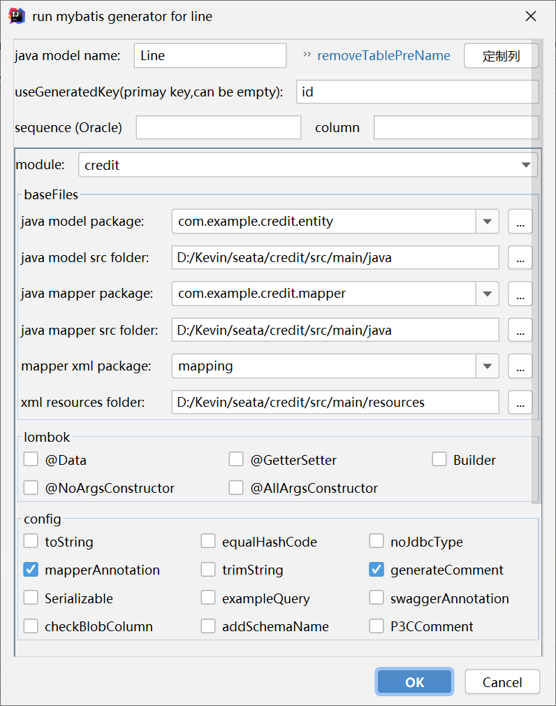

## Seata 分布式事务

本文的示例业务场景选择了分布式微服务（信贷中台）下的“**还款业务**”，并做了最大程度的简化，涉及 3 个能力中心，完成一次还款，涉及 3 个数据库中的 3 张表，这些数据变动就形成了一个典型的分布式事务：

1. 核算（account）能力中心（端口8080）：新增还款记录。往**还款记录表**（repayment ）中插入 1 条还款记录数据；
2. 贷后（ loan）能力中心（端口8081）：更新用户贷款的**借据余额**。更新**借据表**（iou）；
3. 授信（credit）能力中心（端口8082）：更新用户的**授信额度余额**。更新**授信额度表**（line）。

示例中的初始数据为：

1. 用户1001（张三），借款10万元；
2. 用户1001（张三），授信额度额度为30万元，当前（借款10万后）授信额度余额为20万元，还未开始还款；
3. 核算中用户1001（张三）的还款记录为空。

> 为了简化，用户只使用了用户编号 1001，并没有提供用户表记录用户名之类的信息。

本文采用 Spring Cloud 2020.0.1、Consul、Seata 1.4 和 MySQL 技术栈。 

### 1 创建数据库

分别创建 account、loan 和 credit 数据库。

#### 1.1 创建核算数据库 account

创建数据库和表：

```mysql
CREATE database account;
CREATE TABLE `account`.`repayment` (  
  `id` INT NOT NULL AUTO_INCREMENT,
  `user_id` VARCHAR(32) NOT NULL COMMENT '用户id',
  `repay_date` DATETIME NOT NULL COMMENT '还款日期',
  `repay_amount` DECIMAL(18,4) NOT NULL COMMENT '还款金额',
  PRIMARY KEY (`id`) 
);
```

#### 1.2 创建贷后数据库 loan

创建数据库和表：

```mysql
CREATE database loan;
CREATE TABLE `loan`.`iou` (  
  `id` INT NOT NULL AUTO_INCREMENT,
  `user_id` VARCHAR(32) NOT NULL COMMENT '用户id',
  `balance` DECIMAL(18,4) NOT NULL COMMENT '借款余额',
  PRIMARY KEY (`id`) 
);
INSERT INTO iou (id, user_id, balance) VALUES (1, '1001', 100000);
```

#### 1.3 创建授信数据库 credit 

创建数据库和表：

```mysql
CREATE database credit;
CREATE TABLE `credit`.`line` (
  `id` INT NOT NULL AUTO_INCREMENT,
  `user_id` VARCHAR(32) NOT NULL COMMENT '用户id',
  `limit_amount` DECIMAL(18,4) NOT NULL COMMENT '授信额度',
  `balance` DECIMAL(18,4) NOT NULL COMMENT '授信额度余额',
  PRIMARY KEY (`id`)
);
INSERT INTO line (id, user_id, limit_amount, balance) VALUES (1, '1001', 300000, 200000);
```

### 2 创建贷后（loan）项目

要添加 actuator 依赖，Consul 检查服务状态要用到。使用的依赖主要有 Web、Openfeign、MyBatis 和 Seata：

```xml
<dependency>
    <groupId>org.springframework.boot</groupId>
    <artifactId>spring-boot-starter-web</artifactId>
</dependency>
<dependency>
    <groupId>org.springframework.cloud</groupId>
    <artifactId>spring-cloud-starter-openfeign</artifactId>
</dependency>
<dependency>
    <groupId>org.springframework.boot</groupId>
    <artifactId>spring-boot-starter-actuator</artifactId>
</dependency>
<dependency>
    <groupId>org.mybatis.spring.boot</groupId>
    <artifactId>mybatis-spring-boot-starter</artifactId>
    <version>2.1.4</version>
</dependency>
<dependency>
    <groupId>org.springframework.cloud</groupId>
    <artifactId>spring-cloud-starter-consul-discovery</artifactId>
</dependency>
<dependency>
    <groupId>org.springframework.cloud</groupId>
    <artifactId>spring-cloud-starter-openfeign</artifactId>
</dependency>
<dependency>
    <groupId>io.seata</groupId>
    <artifactId>seata-spring-boot-starter</artifactId>
    <version>1.4.0</version>
</dependency>
```

项目配置：

```yaml
server:
  port: 8081
spring:
  application:
    name: seata-demo-loan
  cloud:
    consul:
      host: localhost
      port: 8500
# mysql数据源配置
  datasource:
    url: jdbc:mysql://localhost:3306/loan?useUnicode=true&characterEncoding=utf-8&serverTimezone=GMT%2B8
    username: root
    password: 123456
    driver-class-name: com.mysql.cj.jdbc.Driver
# mybatis 配置信息
mybatis:
  mapper-locations: classpath:mapping/*Mapper.xml
  type-aliases-package: com.example.loan.entity
  configuration:
    map-underscore-to-camel-case: true
```

启动类，添加 Consul 服务发现注解、Feign 注解和 MyBatis 注解：

```java
@SpringBootApplication
@EnableDiscoveryClient
@EnableFeignClients
@MapperScan("com.example.loan.mapper")
public class LoanApplication {
    ...
```

创建数据库表对应的 entity 类（也可使用 MybatisCodeHelper 生成）：

```java
public class Iou {
    private int id;
    private String userId;
    private BigDecimal balance;
    ...
```

在 src\main\resources\mapping 下创建 MyBatis 的 mapper.xml：

```xml
<?xml version="1.0" encoding="UTF-8"?>
<!DOCTYPE mapper PUBLIC "-//mybatis.org//DTD Mapper 3.0//EN" "http://mybatis.org/dtd/mybatis-3-mapper.dtd">
<mapper namespace="com.example.loan.mapper.LoanMapper">
  <select id="selectByUserId" parameterType="java.lang.String" resultType="com.example.loan.entity.Iou">
    select id, user_id, balance
    from iou
    where user_id = #{userId}
  </select>

  <update id="updateBalance" parameterType="com.example.loan.entity.Iou">
    update iou
    <set>
       balance = #{balance,jdbcType=DECIMAL},
    </set>
    where user_id = #{userId,jdbcType=VARCHAR}
  </update>
</mapper>
```

创建 LoanMapper 接口：

```java
@Mapper
public interface LoanMapper {
    int updateBalance(Iou record);
    Iou selectByUserId(String userId);
}
```

创建 IouService 类：

```java
@Service
public class IouService {
    @Autowired
    LoanMapper loanMapper;

    public BigDecimal updateBalance(String userId, BigDecimal repayAmount){
        Iou iou = loanMapper.selectByUserId(userId);
        BigDecimal balance = iou.getBalance().subtract(repayAmount);//还款后，借据余额减少
        iou.setBalance(balance);
        loanMapper.updateBalance(iou);
        return balance;
    }
}
```

创建  IouController 类：

```java
@RestController
public class IouController {
    @Autowired
    IouService iouService;

    @RequestMapping("/loan/iou/test")
    public String test(String name){
        String userId = "1001";
        BigDecimal amount = new BigDecimal(1234.1234);

        iouService.updateBalance(userId, amount);

        return "hello, " + name;
    }
}
```

启动 Consul 后启动 loan 服务，测试是否可以正常注册到 Consul，并正常存取数据。

### 3 创建核算（account）项目

由于在该示例中，核算项目并不调用其他服务，所以不依赖 Feign，其他步骤和贷后项目保持一致。

具体内容，请参考源码。

数据库操作 mapper 文件如下：

```xml
<?xml version="1.0" encoding="UTF-8"?>
<!DOCTYPE mapper PUBLIC "-//mybatis.org//DTD Mapper 3.0//EN" "http://mybatis.org/dtd/mybatis-3-mapper.dtd">
<mapper namespace="com.example.account.mapper.AccountMapper">
    <insert id="addRepayment">
        INSERT INTO repayment (user_id, repay_date, repay_amount) VALUES (#{userId}, #{repayDate}, #{repayAmount});
    </insert>
</mapper>
```

### 4 创建授信（credit）项目

授信项目也不调用其他服务，不依赖 Feign，其他步骤和贷后项目保持一致。

1. 创建`\resources\mapping`目录，存放 MyBatis Mapping 文件；
2. 创建`com.example.credit.entity`包，存放数据库表对应的实体；
3. 创建`com.example.credit.mapper`包，存放 MyBatis Mapper 接口文件；
4. 使用 MybatisCodeHelper 插件生成对应的 MyBatis 文件。



5. 修改 Mapper，提供查询和更新语句。

```xml
<?xml version="1.0" encoding="UTF-8"?>
<!DOCTYPE mapper PUBLIC "-//mybatis.org//DTD Mapper 3.0//EN" "http://mybatis.org/dtd/mybatis-3-mapper.dtd">
<mapper namespace="com.example.credit.mapper.LineMapper">
  <select id="selectByUserId" parameterType="java.lang.String" resultType="com.example.credit.entity.Line">
    select id, user_id, limit_amount, balance
    from line
    where user_id = #{userId}
  </select>
  <update id="updateBalance" parameterType="com.example.credit.entity.Line">
    update line
    <set>
       balance = #{balance,jdbcType=DECIMAL},
    </set>
    where user_id = #{userId,jdbcType=VARCHAR}
  </update>
</mapper>
```

### 5 配置 seata 服务器

在 seata 官网[https://seata.io/zh-cn/blog/download.html](https://seata.io/zh-cn/blog/download.html)下载 source 和 binary 包。

1. 修改 C:\Java\seata\conf 下的 registry.conf 文件，将 registry 和 config 都修改成 consul：

```
registry {
  # file 、nacos 、eureka、redis、zk、consul、etcd3、sofa
  type = "consul"
...
config {
  # file、nacos 、apollo、zk、consul、etcd3
  type = "consul"
...
```

2. 修改 C:\Java\seata\conf 下的 file.conf 文件，将 store 修改为 db，并修改数据库连接信息：

```
store {
  ## store mode: file、db、redis
  mode = "db"
...
```

3. 创建 seata 数据库，创建 seata 需要的 3 张表，脚本位置 C:\Java\seata-1.4.0\script\server\db：

```sql
-- -------------------------------- The script used when storeMode is 'db' --------------------------------
-- the table to store GlobalSession data
CREATE TABLE IF NOT EXISTS `global_table`
(
    `xid`                       VARCHAR(128) NOT NULL,
    `transaction_id`            BIGINT,
    `status`                    TINYINT      NOT NULL,
    `application_id`            VARCHAR(32),
    `transaction_service_group` VARCHAR(32),
    `transaction_name`          VARCHAR(128),
    `timeout`                   INT,
    `begin_time`                BIGINT,
    `application_data`          VARCHAR(2000),
    `gmt_create`                DATETIME,
    `gmt_modified`              DATETIME,
    PRIMARY KEY (`xid`),
    KEY `idx_gmt_modified_status` (`gmt_modified`, `status`),
    KEY `idx_transaction_id` (`transaction_id`)
) ENGINE = InnoDB
  DEFAULT CHARSET = utf8;

-- the table to store BranchSession data
CREATE TABLE IF NOT EXISTS `branch_table`
(
    `branch_id`         BIGINT       NOT NULL,
    `xid`               VARCHAR(128) NOT NULL,
    `transaction_id`    BIGINT,
    `resource_group_id` VARCHAR(32),
    `resource_id`       VARCHAR(256),
    `branch_type`       VARCHAR(8),
    `status`            TINYINT,
    `client_id`         VARCHAR(64),
    `application_data`  VARCHAR(2000),
    `gmt_create`        DATETIME(6),
    `gmt_modified`      DATETIME(6),
    PRIMARY KEY (`branch_id`),
    KEY `idx_xid` (`xid`)
) ENGINE = InnoDB
  DEFAULT CHARSET = utf8;

-- the table to store lock data
CREATE TABLE IF NOT EXISTS `lock_table`
(
    `row_key`        VARCHAR(128) NOT NULL,
    `xid`            VARCHAR(96),
    `transaction_id` BIGINT,
    `branch_id`      BIGINT       NOT NULL,
    `resource_id`    VARCHAR(256),
    `table_name`     VARCHAR(32),
    `pk`             VARCHAR(36),
    `gmt_create`     DATETIME,
    `gmt_modified`   DATETIME,
    PRIMARY KEY (`row_key`),
    KEY `idx_branch_id` (`branch_id`)
) ENGINE = InnoDB
  DEFAULT CHARSET = utf8;
```

4. 在 consul 中导入配置信息，配置脚本在 C:\Java\seata-1.4.0\script\config-center\consul 目录下，在该目录下使用`Git Bash Here`可在 Windows 下执行 sh 命令。在启动 consul 的情况下，执行下面的命令，将配置项导入到 consul 中：

> 配置中心中的配置项，是存放在`C:\Java\seata-1.4.0\script\config-center\config.txt`这个文件中的，需要根据项目情况，先修改后导入。修改内容主要有数据库连接信息等。

```bash
sh ${SEATAPATH}/script/config-center/consul/consul-config.sh -h localhost -p 8500
```

5. 在对应的贷后、核算和授信数据库中执行如下建表语句，该脚本存放在 C:\Java\seata-1.4.0\script\client\at\db 目录下：

```mysql
-- for AT mode you must to init this sql for you business database. the seata server not need it.
CREATE TABLE IF NOT EXISTS `undo_log`
(
    `branch_id`     BIGINT(20)   NOT NULL COMMENT 'branch transaction id',
    `xid`           VARCHAR(100) NOT NULL COMMENT 'global transaction id',
    `context`       VARCHAR(128) NOT NULL COMMENT 'undo_log context,such as serialization',
    `rollback_info` LONGBLOB     NOT NULL COMMENT 'rollback info',
    `log_status`    INT(11)      NOT NULL COMMENT '0:normal status,1:defense status',
    `log_created`   DATETIME(6)  NOT NULL COMMENT 'create datetime',
    `log_modified`  DATETIME(6)  NOT NULL COMMENT 'modify datetime',
    UNIQUE KEY `ux_undo_log` (`xid`, `branch_id`)
) ENGINE = InnoDB
  AUTO_INCREMENT = 1
  DEFAULT CHARSET = utf8 COMMENT ='AT transaction mode undo table';
```

6. 启动 seata 服务器，启动脚本在`C:\Java\seata\bin\seata-server.bat`，需要先导入配置信息后再启动。

### 6 对现有项目进行修改

1. 修改贷后、核算、授信项目的配置文件 application.yml，参考文件为`C:\Java\seata-1.4.0\script\client\spring\application.yml`

> 为了简化起见，微服务项目中使用了 seata 的本地文件配置，没有连接到 consul 配置中心。

```yaml
seata:
  enabled: true
  application-id: seata-demo-account
  tx-service-group: my_test_tx_group
  enable-auto-data-source-proxy: true
  data-source-proxy-mode: AT
  use-jdk-proxy: false
  service:
    vgroup-mapping:
      my_test_tx_group: default
    grouplist:
      default: localhost:8091
    enable-degrade: false
    disable-global-transaction: false
  registry:
    type: consul
    load-balance: RandomLoadBalance
    load-balance-virtual-nodes: 10
    consul:
      server-addr: localhost:8500
      cluster: default
  config:
    type: file
    file:
      name: file.conf
```

2. 在 resource 资源目录下添加 file.conf 文件（参考C:\Java\seata-1.4.0\script\client\conf\file.conf），内容如下：

```
transport {
  # tcp, unix-domain-socket
  type = "TCP"
  #NIO, NATIVE
  server = "NIO"
  #enable heartbeat
  heartbeat = true
  # the client batch send request enable
  enableClientBatchSendRequest = false
  #thread factory for netty
  threadFactory {
    bossThreadPrefix = "NettyBoss"
    workerThreadPrefix = "NettyServerNIOWorker"
    serverExecutorThreadPrefix = "NettyServerBizHandler"
    shareBossWorker = false
    clientSelectorThreadPrefix = "NettyClientSelector"
    clientSelectorThreadSize = 1
    clientWorkerThreadPrefix = "NettyClientWorkerThread"
    # netty boss thread size
    bossThreadSize = 1
    #auto default pin or 8
    workerThreadSize = "default"
  }
  shutdown {
    # when destroy server, wait seconds
    wait = 3
  }
  serialization = "seata"
  compressor = "none"
}
```

3. 在启动类上添加`@EnableAutoDataSourceProxy`注解；
4. 在需要分布式事务的服务类上添加`@GlobalTransactional(rollbackFor = Exception.class)`注解；
5. 针对使用 Feign 调用的项目，需要向后续服务传递事务的 xid，为贷后项目创建`FeignRequestInterceptor`类：

> 在使用 Feign 调用的时候，不会自动在 http 头中传递 xid，需要自行处理，请求连接器是个很好的添加地方。如果没有这个 xid 传递过程，每个事务分支，都会生成自己的 xid 那这些分支就不在一个分布式事务中了。可以参照事务传播策略：PROPAGATION_REQUIRED=支持当前事务，如果当前没有事务，就新建一个事务。

```java
@Configuration
public class FeignRequestInterceptor implements RequestInterceptor {
    @Override
    public void apply(RequestTemplate template) {
        //在feign调用过程中，传递seata的xid，以形成一个分布式事务组
        String xid = RootContext.getXID();
        template.header(RootContext.KEY_XID, xid);
    }
}
```

6. 为 Feign 调用的每一个 Client 接口注解，添加 configuration 属性值，以将 xid 传递到被调用的事务分支：

```java
@FeignClient(name = "seata-demo-account", configuration = FeignRequestInterceptor.class)
public interface AccountClient {
    @PostMapping("/account/repayment/add")
    int addRepayment(@RequestParam("userId") String userId, @RequestParam("repayAmount") BigDecimal repayAmount);
}
```

### 7 分布式事务测试

依次启动 consul、seata 服务器后，启动核算、授信和贷后服务。


正常启动后可以看到全局事务客户端初始化，及资源管理器

尝试一次还款 1 元的操作，启动分布式事务，可以正常完成事务：

```
2021-03-10 23:16:28.427  INFO 20716 --- [io-8081-exec-10] i.seata.tm.api.DefaultGlobalTransaction  : Begin new global transaction [172.28.0.1:8091:113054060331929600]
2021-03-10 23:16:28.463  INFO 20716 --- [io-8081-exec-10] i.seata.tm.api.DefaultGlobalTransaction  : [172.28.0.1:8091:113054060331929600] commit status: Committed
2021-03-10 23:16:28.764  INFO 20716 --- [h_RMROLE_1_2_16] i.s.c.r.p.c.RmBranchCommitProcessor      : rm client handle branch commit process:xid=172.28.0.1:8091:113054060331929600,branchId=113054060420009984,branchType=AT,resourceId=jdbc:mysql://localhost:3306/loan,applicationData=null
2021-03-10 23:16:28.764  INFO 20716 --- [h_RMROLE_1_2_16] io.seata.rm.AbstractRMHandler            : Branch committing: 172.28.0.1:8091:113054060331929600 113054060420009984 jdbc:mysql://localhost:3306/loan null
2021-03-10 23:16:28.764  INFO 20716 --- [h_RMROLE_1_2_16] io.seata.rm.AbstractRMHandler            : Branch commit result: PhaseTwo_Committed
=================================================
2021-03-10 23:16:28.760  INFO 6268 --- [h_RMROLE_1_2_16] i.s.c.r.p.c.RmBranchCommitProcessor      : rm client handle branch commit process:xid=172.28.0.1:8091:113054060331929600,branchId=113054060378066944,branchType=AT,resourceId=jdbc:mysql://localhost:3306/account,applicationData=null
2021-03-10 23:16:28.761  INFO 6268 --- [h_RMROLE_1_2_16] io.seata.rm.AbstractRMHandler            : Branch committing: 172.28.0.1:8091:113054060331929600 113054060378066944 jdbc:mysql://localhost:3306/account null
2021-03-10 23:16:28.761  INFO 6268 --- [h_RMROLE_1_2_16] io.seata.rm.AbstractRMHandler            : Branch commit result: PhaseTwo_Committed
=================================================
2021-03-10 23:16:28.766  INFO 19524 --- [h_RMROLE_1_2_16] i.s.c.r.p.c.RmBranchCommitProcessor      : rm client handle branch commit process:xid=172.28.0.1:8091:113054060331929600,branchId=113054060470341632,branchType=AT,resourceId=jdbc:mysql://localhost:3306/credit,applicationData=null
2021-03-10 23:16:28.766  INFO 19524 --- [h_RMROLE_1_2_16] io.seata.rm.AbstractRMHandler            : Branch committing: 172.28.0.1:8091:113054060331929600 113054060470341632 jdbc:mysql://localhost:3306/credit null
2021-03-10 23:16:28.766  INFO 19524 --- [h_RMROLE_1_2_16] io.seata.rm.AbstractRMHandler            : Branch commit result: PhaseTwo_Committed
```

通过日志，可以看到上述事务分支（由 loan 发起，account 和 credit 加入），都在一个全局分布式事务`Begin new global transaction [172.28.0.1:8091:113054060331929600]`中。

停掉授信服务，尝试一次还款 100 元的操作，启动分布式事务，事务出错回滚：

```
2021-03-10 23:45:17.215  INFO 20716 --- [nio-8081-exec-3] i.seata.tm.api.DefaultGlobalTransaction  : Begin new global transaction [172.28.0.1:8091:113061311394353152]
2021-03-10 23:45:19.399  INFO 20716 --- [h_RMROLE_1_5_16] i.s.c.r.p.c.RmBranchRollbackProcessor    : rm handle branch rollback process:xid=172.28.0.1:8091:113061311394353152,branchId=113061311973167104,branchType=AT,resourceId=jdbc:mysql://localhost:3306/loan,applicationData=null
2021-03-10 23:45:19.399  INFO 20716 --- [h_RMROLE_1_5_16] io.seata.rm.AbstractRMHandler            : Branch Rollbacking: 172.28.0.1:8091:113061311394353152 113061311973167104 jdbc:mysql://localhost:3306/loan
2021-03-10 23:45:19.409  INFO 20716 --- [h_RMROLE_1_5_16] i.s.r.d.undo.AbstractUndoLogManager      : xid 172.28.0.1:8091:113061311394353152 branch 113061311973167104, undo_log deleted with GlobalFinished
2021-03-10 23:45:19.410  INFO 20716 --- [h_RMROLE_1_5_16] io.seata.rm.AbstractRMHandler            : Branch Rollbacked result: PhaseTwo_Rollbacked
2021-03-10 23:45:19.470  INFO 20716 --- [nio-8081-exec-3] i.seata.tm.api.DefaultGlobalTransaction  : [172.28.0.1:8091:113061311394353152] rollback status: RollbackRetrying
2021-03-10 23:45:19.470  WARN 20716 --- [nio-8081-exec-3] i.s.tm.api.DefaultFailureHandlerImpl     : Retrying to rollback transaction[172.28.0.1:8091:113061311394353152]
2021-03-10 23:45:19.471 ERROR 20716 --- [nio-8081-exec-3] o.a.c.c.C.[.[.[/].[dispatcherServlet]    : Servlet.service() for servlet [dispatcherServlet] in context with path [] threw exception [Request processing failed; nested exception is feign.RetryableException: Connection refused: connect executing POST http://seata-demo-credit/credit/line/update?userId=1001&repayAmount=1] with root cause

java.net.ConnectException: Connection refused: connect
...
2021-03-10 23:45:29.571  INFO 20716 --- [actionRetry_1_1] i.s.tm.api.DefaultFailureHandlerImpl     : transaction [172.28.0.1:8091:113061311394353152] current status is [RollbackRetrying]
=================================================
2021-03-10 23:45:17.228  INFO 22456 --- [nio-8080-exec-3] io.seata.tm.TransactionManagerHolder     : TransactionManager Singleton io.seata.tm.DefaultTransactionManager@cc6cc13
2021-03-10 23:45:19.414  INFO 22456 --- [h_RMROLE_1_2_16] i.s.c.r.p.c.RmBranchRollbackProcessor    : rm handle branch rollback process:xid=172.28.0.1:8091:113061311394353152,branchId=113061311859920896,branchType=AT,resourceId=jdbc:mysql://localhost:3306/account,applicationData=null
2021-03-10 23:45:19.414  INFO 22456 --- [h_RMROLE_1_2_16] io.seata.rm.AbstractRMHandler            : Branch Rollbacking: 172.28.0.1:8091:113061311394353152 113061311859920896 jdbc:mysql://localhost:3306/account
2021-03-10 23:45:19.466 ERROR 22456 --- [h_RMROLE_1_2_16] i.s.r.d.u.parser.JacksonUndoLogParser    : json decode exception, Cannot construct instance of `java.time.LocalDateTime` (no Creators, like default constructor, exist): cannot deserialize from Object value (no delegate- or property-based Creator)
 at [Source: (byte[])"{"@class":"io.seata.rm.datasource.undo.BranchUndoLog","xid":"172.28.0.1:8091:113061311394353152","branchId":113061311859920896,"sqlUndoLogs":["java.util.ArrayList",[{"@class":"io.seata.rm.datasource.undo.SQLUndoLog","sqlType":"INSERT","tableName":"repayment","beforeImage":{"@class":"io.seata.rm.datasource.sql.struct.TableRecords$EmptyTableRecords","tableName":"repayment","rows":["java.util.ArrayList",[]]},"afterImage":{"@class":"io.seata.rm.datasource.sql.struct.TableRecords","tableName":"repaym"[truncated 869 bytes]; line: 1, column: 984] (through reference chain: io.seata.rm.datasource.undo.BranchUndoLog["sqlUndoLogs"]->java.util.ArrayList[0]->io.seata.rm.datasource.undo.SQLUndoLog["afterImage"]->io.seata.rm.datasource.sql.struct.TableRecords["rows"]->java.util.ArrayList[0]->io.seata.rm.datasource.sql.struct.Row["fields"]->java.util.ArrayList[2]->io.seata.rm.datasource.sql.struct.Field["value"])
===以上由于LocalDateTime的反序列化问题，导致一致重试回滚===
```

由于LocalDateTime的反序列化问题（可能是 seata 的 bug 或者是 MySQL 驱动问题，date 类型数据序列化进undo_log表后无法反序列化），导致一直重试回滚，查看数据库中的重做日志 undo_log 表记录，注意其中的 xid 字段值：


出于技术测试目的，调整还款调用逻辑（LoanService 类）为贷后-授信-核算（当然，这不符合真实业务逻辑），以便测试观察事务正常回滚：

```java
iouService.updateBalance(userId, repayAmount);//贷后.借据
creditClient.updateLine(userId, repayAmount);//授信.额度
accountClient.addRepayment(userId, repayAmount);//核算.还款记录
```

启动贷后和授信，停掉核算，测试分布式事务是否可以正确回滚：

```
2021-03-11 00:06:12.470  INFO 15620 --- [nio-8081-exec-9] io.seata.tm.TransactionManagerHolder     : TransactionManager Singleton io.seata.tm.DefaultTransactionManager@118c7eef
2021-03-11 00:06:12.478  INFO 15620 --- [nio-8081-exec-9] i.seata.tm.api.DefaultGlobalTransaction  : Begin new global transaction [172.28.0.1:8091:113066576344780800]
2021-03-11 00:06:15.159  INFO 15620 --- [h_RMROLE_1_1_16] i.s.c.r.p.c.RmBranchRollbackProcessor    : rm handle branch rollback process:xid=172.28.0.1:8091:113066576344780800,branchId=113066576827125760,branchType=AT,resourceId=jdbc:mysql://localhost:3306/loan,applicationData=null
2021-03-11 00:06:15.160  INFO 15620 --- [h_RMROLE_1_1_16] io.seata.rm.AbstractRMHandler            : Branch Rollbacking: 172.28.0.1:8091:113066576344780800 113066576827125760 jdbc:mysql://localhost:3306/loan
2021-03-11 00:06:15.195  INFO 15620 --- [h_RMROLE_1_1_16] i.s.r.d.undo.AbstractUndoLogManager      : xid 172.28.0.1:8091:113066576344780800 branch 113066576827125760, undo_log deleted with GlobalFinished
2021-03-11 00:06:15.196  INFO 15620 --- [h_RMROLE_1_1_16] io.seata.rm.AbstractRMHandler            : Branch Rollbacked result: PhaseTwo_Rollbacked
2021-03-11 00:06:15.199  INFO 15620 --- [nio-8081-exec-9] i.seata.tm.api.DefaultGlobalTransaction  : [172.28.0.1:8091:113066576344780800] rollback status: Rollbacked
2021-03-11 00:06:15.208 ERROR 15620 --- [nio-8081-exec-9] o.a.c.c.C.[.[.[/].[dispatcherServlet]    : Servlet.service() for servlet [dispatcherServlet] in context with path [] threw exception [Request processing failed; nested exception is feign.RetryableException: Connection refused: connect executing POST http://seata-demo-account/account/repayment/add?userId=1001&repayAmount=1] with root cause

java.net.ConnectException: Connection refused: connect
...
=================================================
2021-03-11 00:06:12.731  INFO 12344 --- [nio-8082-exec-1] io.seata.tm.TransactionManagerHolder     : TransactionManager Singleton io.seata.tm.DefaultTransactionManager@5fb2f3c9
2021-03-11 00:06:15.098  INFO 12344 --- [h_RMROLE_1_1_16] i.s.c.r.p.c.RmBranchRollbackProcessor    : rm handle branch rollback process:xid=172.28.0.1:8091:113066576344780800,branchId=113066578450321408,branchType=AT,resourceId=jdbc:mysql://localhost:3306/credit,applicationData=null
2021-03-11 00:06:15.103  INFO 12344 --- [h_RMROLE_1_1_16] io.seata.rm.AbstractRMHandler            : Branch Rollbacking: 172.28.0.1:8091:113066576344780800 113066578450321408 jdbc:mysql://localhost:3306/credit
2021-03-11 00:06:15.155  INFO 12344 --- [h_RMROLE_1_1_16] i.s.r.d.undo.AbstractUndoLogManager      : xid 172.28.0.1:8091:113066576344780800 branch 113066578450321408, undo_log deleted with GlobalFinished
2021-03-11 00:06:15.156  INFO 12344 --- [h_RMROLE_1_1_16] io.seata.rm.AbstractRMHandler            : Branch Rollbacked result: PhaseTwo_Rollbacked
```

通过上面的日志，可以清晰的看到`xid 172.28.0.1:8091:113066576344780800`这个分布式事务自动回滚了。

查看数据库，回滚后，当前分布式事务所在对应的 3 个库的 undo_log 表记录已经清空，贷后和授信数据保持一致正确性（没有这一次的还款）。

### 8 seata 背景知识

[Seata](https://seata.io/) 是从两段提交演变而来的一种分布式事务解决方案，提供了 `AT`、`TCC`、`SAGA` 和 `XA` 等事务模式。其中对一般业务管理系统来说，`AT`自动事务模式比较匹配：效率可以接受、对代码没有侵入。

既然 `Seata` 是两段提交，那我们看看它在每个阶段都做了点啥？下边我们还以下单扣库存、扣余额举例。


 `Seata` 分布式事务中的几种角色：

- `Transaction Coordinator(TC)`:  全局事务协调者，用来协调全局事务和各个分支事务（不同服务）的状态， 驱动全局事务和各个分支事务的回滚或提交。
- `Transaction Manager(TM)`:  事务管理者，业务层中用来开启/提交/回滚一个整体事务（在调用服务的方法中用注解开启事务）。
- `Resource Manager(RM)`:  资源管理者，一般指业务数据库代表了一个分支事务（`Branch Transaction`），管理分支事务与 `TC` 进行协调注册分支事务并且汇报分支事务的状态，驱动分支事务的提交或回滚。

> Seata 实现分布式事务，设计了一个关键角色 `UNDO_LOG` （回滚日志记录表），我们在每个应用分布式事务的业务库中创建这张表，这个表的核心作用就是，将业务数据在更新前后的数据镜像组织成回滚日志，备份在 `UNDO_LOG` 表中，以便业务异常能随时回滚。

整体机制：

一阶段：业务数据和回滚日志（undo_log）记录在同一个本地事务中提交，释放本地锁和连接资源。

二阶段：

- 提交异步化，非常快速地完成；
- 事务回滚时，通过一阶段的回滚日志进行反向补偿。

基本原理，请参考[https://seata.io/zh-cn/docs/overview/what-is-seata.html](https://seata.io/zh-cn/docs/overview/what-is-seata.html)

### 9 配套代码

配套代码在我的 [github](https://github.com/gyzhang/SpringCloudCourseCode/tree/master/spring-cloud-seata) 上，请自行取用。


Kevin，20210311，苏州

