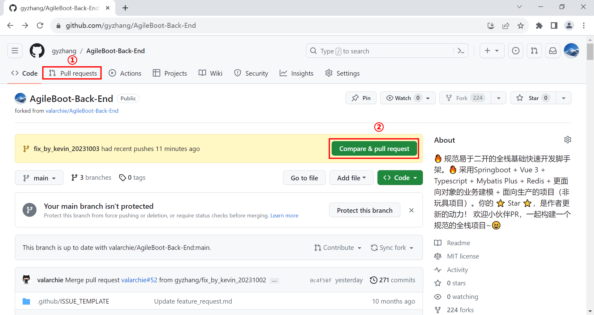
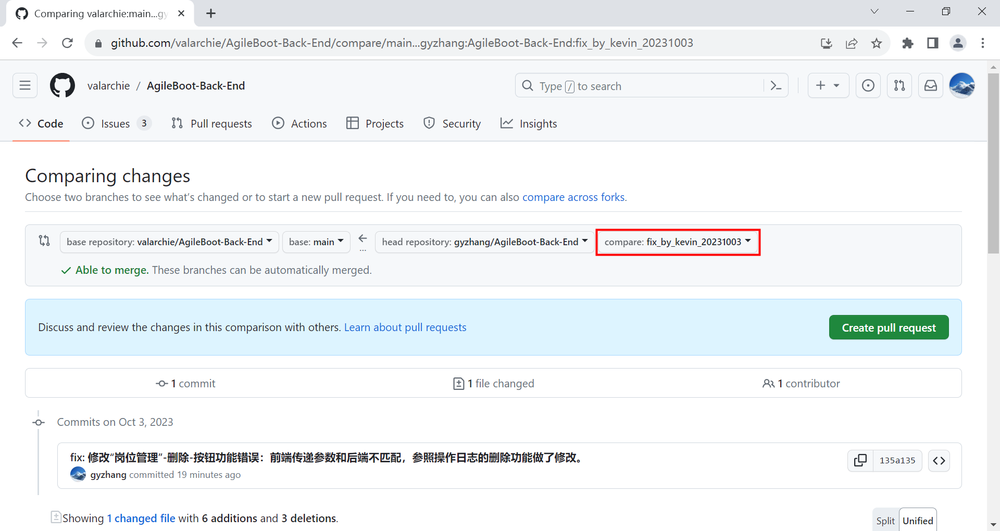
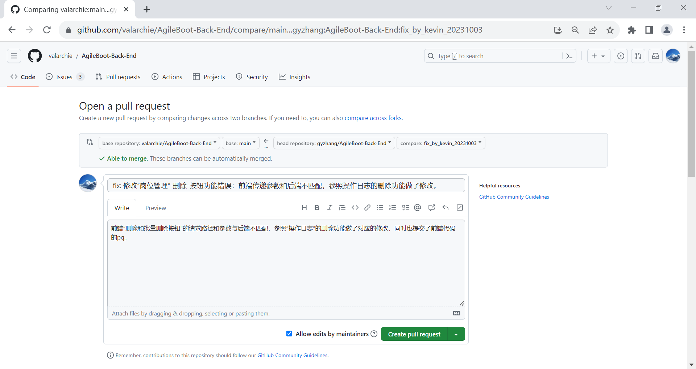
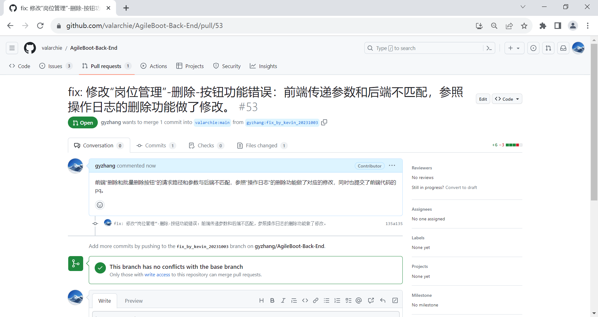
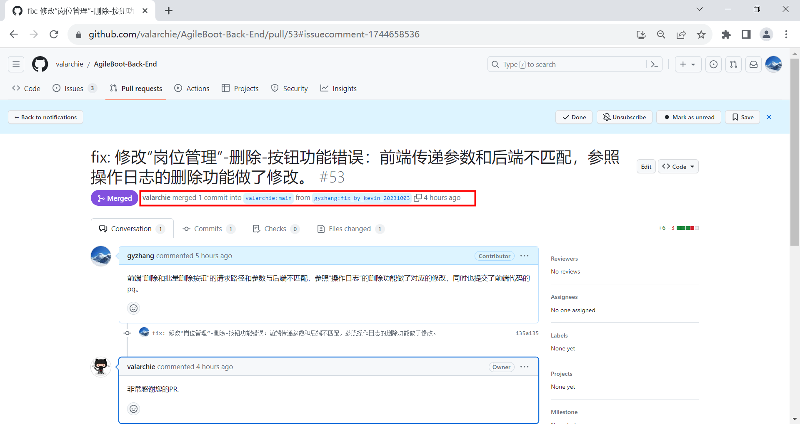
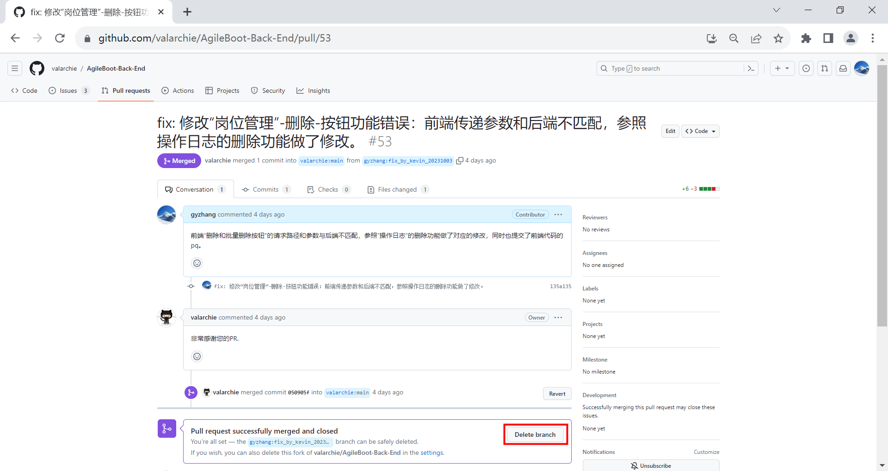
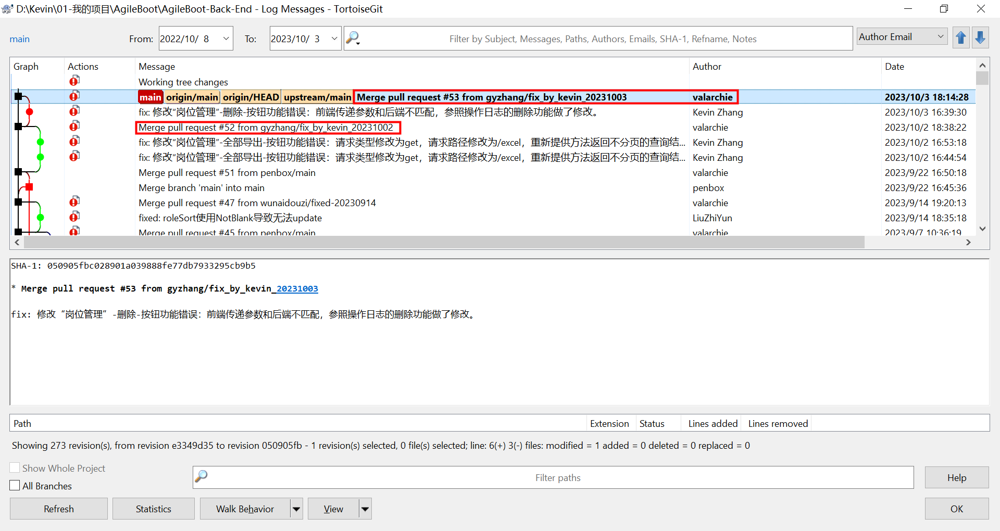

# 如何在Github上贡献代码

1、在github上fork原始项目：https://github.com/valarchie/AgileBoot-Back-End
2、在本地clone自己fork后的项目：git clone git@github.com:gyzhang/AgileBoot-Back-End.git
3、在本地项目仓库中添加原始项目为upstream：git remote add upstream git@github.com:valarchie/AgileBoot-Back-End.git
4、检查本地项目仓库的upstream：git remote -v
5、在本地仓库中更新原始项目仓库的代码：git pull upstream main
6、在本地仓库中创建修改分支：git branch fix_by_kevin_20231003
7、在本地仓库中切换到修改分支：git checkout fix_by_kevin_20231003
8、修改bug并进行充分的测试验证
9、添加修改的文件到暂存区（stage）：git add xxx.xxx
10、查看当前修改状态，确认修改的文件是否在暂存区：git status
11、提交（可选git commit --edit）暂存区中的修改内容：git commit -m "fix: 修改“岗位管理”-删除-按钮功能错误：前端传递参数和后端不匹配，参照操作日志的删除功能做了修改。"
12、将本地提交（修改分支中的）推送到远端仓库，如果不清楚请使用git remote -v命令，在github上一般我们自己的fork的仓库就是origin：git push origin fix_by_kevin_20231003
13、登录到自己的 github 账户，进入已fork的项目页面；
14、点击上部 "Pull Requests"（拉取请求）选项卡；
15、在右侧的 "New pull request"（新建拉取请求）按钮上点击；
16、在 "Comparing changes"（比较变更）页面中，选择 "base" 和 "head" 的正确选项。通常，你需要将 "base" 设置为你所贡献的项目（https://github.com/valarchie/AgileBoot-Back-End）的分支（github为 "main"），将 "head" 设置为你自己的修改分支（fix_by_kevin_20231002）；
17、添加一个标题来描述你的 PR，说明你所做的修改的内容；
18、在 PR 的描述中，详细说明你所做的修改的目的和内容，以便维护者或其他贡献者可以更好地理解你的工作；
19、点击 "Create pull request"（创建拉取请求）按钮来创建 PR。
20、等待原始仓库合并你的代码到main中（后续你git pull upstream main就更新了你贡献的代码），然后就删除你的这次开发分支
21、开始新一次的代码贡献：请从第5步开始拉取原始仓库的最新代码，然后创建本地修改分支>>修改>>测试>>提交>>推送到github>>创建PR

以上，因为墙的原因，在大多数情况下需要“科学上网”。


在本地修改分支上修改测试通过后，提交代码并推送到 github，在 github 的这两个位置上都可以开启 Pull Request：



我使用上面的第①的 Pull requests 来完成后续的 PR，选择自己 fork 过来的仓库中的修改分支，例如（fix_by_kevin_20231003）和原始仓库进行对比，然后创建 Pull Request：



为 Pull Request 填写标题和说明，然后单击 Create pull request 按钮创建 PR：



等待原仓库作者（valarchie）合并 pull request：



等待原作者合并后，在 github 上收到消息中有紫色的 Merged 标记说明已经合并：



在原仓库作者合并 PR 后，可在 github 上删除对应的修改分支：



本地仓库切换回 main 分支获取原仓库的更新（`git pull upstream main`）后，可安全删除修改分支：

```bash
# 本地仓库切换回main分支
$ git checkout main
Switched to branch 'main'
M       agileboot-admin/src/main/resources/application-dev.yml
Your branch is ahead of 'origin/main' by 3 commits.
  (use "git push" to publish your local commits)

# 获取原始仓库合并修改后的更新
$ git pull upstream main
remote: Enumerating objects: 1, done.
remote: Counting objects: 100% (1/1), done.
remote: Total 1 (delta 0), reused 0 (delta 0), pack-reused 0
Unpacking objects: 100% (1/1), 805 bytes | 402.00 KiB/s, done.
From github.com:valarchie/AgileBoot-Back-End
 * branch            main       -> FETCH_HEAD
   0c4f58f..050905f  main       -> upstream/main
Updating 0c4f58f..050905f
Fast-forward
 .../com/agileboot/admin/controller/system/SysPostController.java | 9 ++++++---
 1 file changed, 6 insertions(+), 3 deletions(-)
# 以上可以看到我们之前提交的包含1个文件的合并请求

# 查看当前版本库状态
$ git status
On branch main
Your branch is ahead of 'origin/main' by 5 commits.
  (use "git push" to publish your local commits)

Changes not staged for commit:
  (use "git add <file>..." to update what will be committed)
  (use "git restore <file>..." to discard changes in working directory)
        modified:   agileboot-admin/src/main/resources/application-dev.yml

no changes added to commit (use "git add" and/or "git commit -a")
# 提示需要git push
$ git push
Enumerating objects: 1, done.
Counting objects: 100% (1/1), done.
Writing objects: 100% (1/1), 825 bytes | 825.00 KiB/s, done.
Total 1 (delta 0), reused 0 (delta 0), pack-reused 0
To github.com:gyzhang/AgileBoot-Back-End.git
   0c4f58f..050905f  main -> main

# 列出本地分支，备用>列出远程分支的命令是：git branch -r
$ git branch
  fix_by_kevin_20231002
* main
# 删除本地不需要的（pq已经合并）修改分支
$ git branch -D fix_by_kevin_20231003
Deleted branch fix_by_kevin_20231003 (was 135a135).
# 删除本地仓库对应的远端仓库（自己fork的仓库）的修改分支
$ git branch -r -D origin/fix_by_kevin_20231003
Deleted remote-tracking branch origin/fix_by_kevin_20231003 (was 135a135).
```

查看本地仓库中的 git 日志，可以清晰的看到原仓库作者（valarchie）合并修改 bug 后的 pull request：




