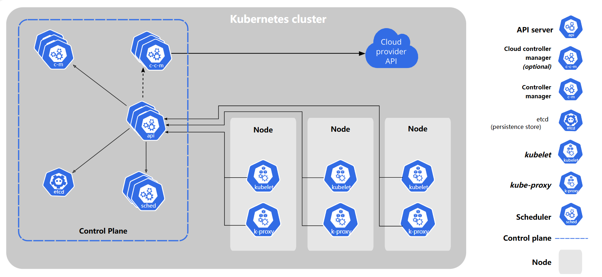
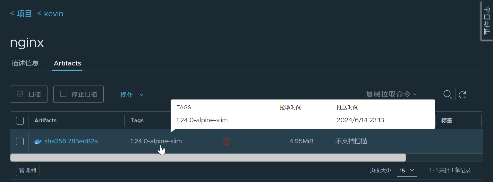
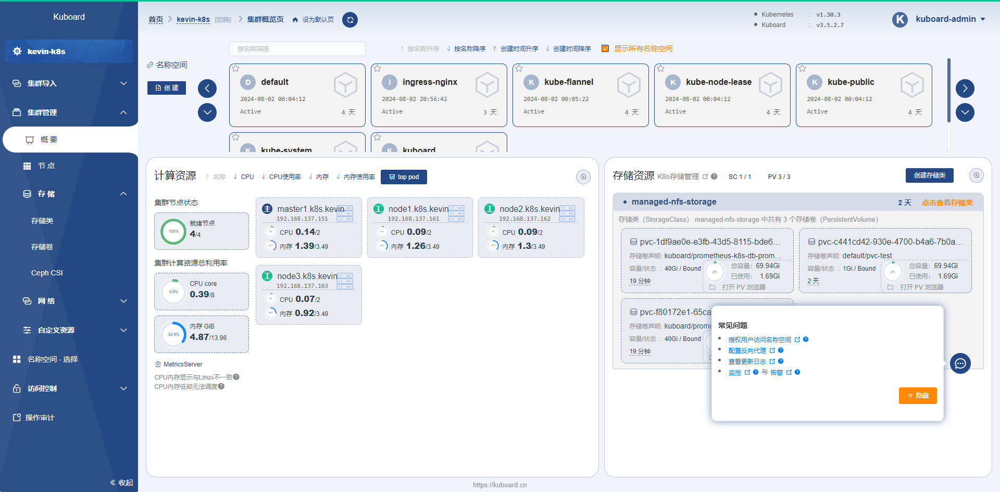

# 使用K8s部署系统

当前分布式微服务系统的部署架构，十有八九都是云原生部署架构：

- 往复杂里讲，7x24 高可用的“三地四中心五节点”多活单元化部署架构，底层一定是用 Kubernetes 在管理部署的微服务实例副本；

- 在简单场景里，微服务一定会部署到多个服务器上，为了简化，很有可能使用容器化部署，跨多个服务器（虚拟机或物理机）的容器管理，也得需要一个 Swarm 或 Kubernetes 集群，让你的“重复”部署工作尽量简化、自动化和稳定。

所以，如果你在从事微服务系统的建设，部署就离不开 Kubernetes，无论这个工作是由开发团队来做，还是运维团队来做。但是作为一个称职的“全栈”开发者，如何部署简化版的 Kubernetes 集群，也是一个可选技能，毕竟系统开发完成了，总得找个地方一遍一遍地部署、一遍一遍地运行起来，比如 SIT（System Integration Test，系统集成测试）、UAT（User Acceptance Test，用户验收测试）、POC（Proof of Concept，验证性测试） 等场景。

本章通过搭建最简的 K8s 集群来验证一个典型的 K8s 集群中需要部署的各种组件及其基本配置。

## 1.1 基本概念

Kubernetes 也称为 K8s，是用于自动部署、扩缩和管理容器化应用程序的开源系统。它将组成应用程序的容器组合成逻辑单元，以便于管理和服务发现。Kubernetes 源自 Google 15 年生产环境的运维经验，同时凝聚了社区的最佳创意和实践。

K8s 集群由一组运行容器化应用程序的工作机器（称为节点）组成。每个集群至少有一个工作节点。

- 工作节点承载作为应用程序工作负载组件的 Pod；

- 控制平面管理集群中的工作节点和 Pod。

在生产环境中，控制平面通常运行在多台计算机上，集群通常运行多个节点，从而提供容错性和高可用性。



在一个可用的 K8s 集群中，通过添加更多的工作节点，可以快速的水平扩展工作负载容量。当然，为了提高 K8s 集群的可靠性，生产环境下一定是部署多个控制平面节点和多个工作节点。

> 更多 K8s 的概念，请参考官方 [https://kubernetes.io/](https://kubernetes.io/ ) 文档。

## 1.2 安装简介

一个最小可用的 K8s 集群包含 1 个“控制平面”节点和 1 个“工作节点”。K8s 集群中的机器最小配置为 2C2G（CPU 2 核心及以上，每台机器 2 GB 或更多的 RAM），集群中的所有机器的网络彼此均能相互连接（公网和内网都可以）。

本章以 1 个“控制平面”节点和 3 个“工作节点”来安装 K8s 集群，并为该 K8s 集群提供 **Helm** 包管理器、**flannel** 网络组件、**Ingress** 路由网关、**Dashboard** 仪表盘、**PV** 存储服务器、**Harbor** 私有镜像仓库服务器。

当前 K8s 最新版本为 1.30.3，Docker 最新版本为 27.1.1，本章将使用最新版本在 Rocky Linux 9.4 上完成后续安装验证。 

## 1.3 准备服务器

本章安装最小的可用 K8s 集群，包含的服务器信息有：

- 1 个控制平面节点（master）；

- 3 个 工作节点（node）；

- 1个存储（PV）节点；

- 1个私有镜像（Harbor）节点。

| IP 地址         | 节点角色 | CPU  | 内存 | 存储 | 主机名            |
| :-------------- | -------- | ---- | ---- | ---- | ----------------- |
| 192.168.137.151 | 控制平面 | 2C   | 2G   | 256G | master1.k8s.kevin |
| 192.168.137.161 | 工作节点 | 2C   | 2G   | 256G | node1.k8s.kevin   |
| 192.168.137.162 | 工作节点 | 2C   | 2G   | 256G | node2.k8s.kevin   |
| 192.168.137.163 | 工作节点 | 2C   | 2G   | 256G | node3.k8s.kevin   |
| 192.168.137.170 | 存储     | 1C   | 2G   | 256G | pv.k8s.kevin      |
| 192.168.137.180 | 镜像私服 | 1C   | 2G   | 256G | harbor.k8s.kevin  |

> 在 K8s 集群中，添加工作节点是非常容易的。这里初始化 3 个工作节点是因为将来的一些后续安装服务，如 MySQL 采用 1主 2 从 的 Helm Chart 部署时需要 3 个节点。

### 1.3.1 准备虚拟机

使用 VirtualBox 安装 Rocky Linux 9.4 虚拟机后 `vi /etc/ssh/sshd_config`，设置其中的 112 行的值为 `UseDNS no`，避免 ssh 客户端连接缓慢的问题。然后按照后续步骤做必要配置，最后以复制虚拟机的方式快速完成后续节点的安装配置。

> 需要注意的是，复制完虚拟机后，必须设置 hostname、machine id 和 ip 地址。
>
> K8s 集群中的所有节点需要满足：主机名不同、MAC 地址不同、IP 地址不同、机器 ID 不同。

### 1.3.2 替换 yum 源

将 Rocky Linux 的 yum 源设置为阿里云提供的镜像源，可以有效地加快后续安装过程中 yum 安装包的下载。

```bash
# 第1步
sed -e 's|^mirrorlist=|#mirrorlist=|g' \
    -e 's|^#baseurl=http://dl.rockylinux.org/$contentdir|baseurl=https://mirrors.aliyun.com/rockylinux|g' \
    -i.bak \
    /etc/yum.repos.d/rocky*.repo
# 第2步    
dnf makecache
```

### 1.3.3 关闭防火墙

Rocky Linux 使用的防火墙是 `firewalld`，它是一个动态的管理工具，用于配置和管理 Linux 防火墙规则。Firewalld 为系统管理员提供了一种简单且灵活的方法来管理网络连接，并保护服务器免受未经授权的访问和恶意攻击。通常在测试验证环境下，为了减少配置防火墙规则的工作，我们可以直接关闭防火墙。但是，**在生产环境或公网部署等对安全性有要求的场景下，千万不能关闭防火墙**。

```bash
systemctl stop firewalld
systemctl disable firewalld
systemctl status firewalld
```

### 1.3.4 禁用 SELinux

SELinux (Security-Enhanced Linux)  是一种 Linux 操作系统的安全机制，它提供了强大的安全性增强功能，用于强化操作系统的安全性。SELinux 最初由美国国家安全局（NSA）开发，并在许多主流 Linux 发行版中得到广泛支持，包括 Red Hat Enterprise Linux（RHEL）、CentOS、Rocky、Fedora 等。

传统的 UNIX 权限模型依赖于用户、组和权限位（读、写、执行）来控制对文件和资源的访问。然而，这种权限模型有时过于宽松，存在潜在的漏洞，特别是当恶意用户或攻击者试图利用系统漏洞时。SELinux 解决了这个问题，引入了更细粒度的访问控制，基于规则和策略来限制进程和用户对资源的访问。

通常在实验环境下，为了减少配置安全策略的工作，我们可以直接禁用 SELinux。但是，**在生产环境或公网部署等对安全性有要求的场景下，千万不能禁用 SELinux**。

```bash
vi /etc/sysconfig/selinux
<<<<<<<<<<<<<<<<<<<<<<<<<<<<<<<<<<<<<<<<<<<<<<<<<<<<<<<
SELINUX=disabled #禁用selinux
<<<<<<<<<<<<<<<<<<<<<<<<<<<<<<<<<<<<<<<<<<<<<<<<<<<<<<<
# 或者如下命令
sed -i 's/SELINUX=enforcing/SELINUX=disabled/g' /etc/selinux/config
# 重启linux服务器后“禁用selinux”生效
# 验证
getenforce
>>>>>>>>>>>>>>>>>>>>>>>>>>>>>>>>>>>>>>>>>>>>>>>>>>>>>>>
Disabled
>>>>>>>>>>>>>>>>>>>>>>>>>>>>>>>>>>>>>>>>>>>>>>>>>>>>>>>
```

### 1.3.5 设置操作系统时区

在 Linux 系统中，时区是一个重要的概念，用于表示系统所在的地理区域的本地时间偏移。它允许系统根据地理位置和季节更改本地时间，以便在不同的地区正确显示时间。正确设置时区对于确保时间同步和日志记录非常重要，尤其在跨时区的系统和服务器上。

不正确的时区，会导致系统日志等信息的混乱。请检查操作系统的时区，如不正确，修改成 `Asia/Shanghai` 时区：

```bash
timedatectl status
timedatectl set-timezone Asia/Shanghai
```

### 1.3.6 同步时间服务器

在一个网络中的相互关联的服务器上，如果时间出现较大偏差，会导致一些依赖于时间标记的服务出现错乱。为了避免不必要的麻烦，可以使用互联网上的时间服务器来同步网络中各节点服务器的时间。

```bash
# 安装chrony服务
dnf install chrony
# 开机启动服务
systemctl enable chronyd
# 启动服务
systemctl start chronyd
# 添加chrony服务器
mkdir /etc/chrony/
vi /etc/chrony/chrony.conf
<<<<<<<<<<<<<<<<<<<<<<<<<<<<<<<<<<<<<<<<<<<<<<<<<<<<<<<
server 0.pool.ntp.org iburst
server 1.pool.ntp.org iburst
server 2.pool.ntp.org iburst
server 3.pool.ntp.org iburst
<<<<<<<<<<<<<<<<<<<<<<<<<<<<<<<<<<<<<<<<<<<<<<<<<<<<<<<
# 重启
systemctl restart chronyd
# 查看同步信息
chronyc sources
>>>>>>>>>>>>>>>>>>>>>>>>>>>>>>>>>>>>>>>>>>>>>>>>>>>>>>>
MS Name/IP address         Stratum Poll Reach LastRx Last sample               
===============================================================================
^* tock.ntp.infomaniak.ch        1   6    17    25    +40ms[  +37ms] +/-  200ms
^+ stratum2-1.ntp.mow01.ru.>     2   6    17    25    +35ms[  +31ms] +/-  123ms
^+ ntp6.flashdance.cx            2   6    17    27    -18ms[  -22ms] +/-  155ms
^- ntp7.flashdance.cx            2   6    17    26    -15ms[  -18ms] +/-  156ms
>>>>>>>>>>>>>>>>>>>>>>>>>>>>>>>>>>>>>>>>>>>>>>>>>>>>>>>
```

### 1.3.7 修改内核参数

Linux 内核参数是用于调整和配置 Linux 内核行为的设置。内核参数允许系统管理员根据需要对内核的各种方面进行微调，以满足特定的硬件和应用需求，或优化系统性能和稳定性。例如：

- `net.core.somaxconn` 参数：指定套接字监听队列的最大长度，适用于高并发网络应用；
- `fs.file-max`：限制系统可以打开的文件描述符（句柄数）的最大数量。对于高并发系统，可能需要增加该值；
- `vm.overcommit_memory`：设置内存分配策略，1 表示内核允许分配所有的物理内存，而不管当前的内存状态如何。

例如设置以下内核参数，有利于 K8s 集群稳定运行：

```bash
vi /etc/sysctl.conf
<<<<<<<<<<<<<<<<<<<<<<<<<<<<<<<<<<<<<<<<<<<<<<<<<<<<<<<
net.core.somaxconn = 1024
vm.overcommit_memory = 1

net.bridge.bridge-nf-call-ip6tables = 1
net.bridge.bridge-nf-call-iptables = 1
net.ipv4.ip_forward = 1

net.ipv4.tcp_syncookies = 1 
net.ipv4.tcp_max_tw_buckets = 20480 
net.ipv4.tcp_max_syn_backlog = 20480
net.ipv4.tcp_fin_timeout = 20

net.core.netdev_max_backlog = 262144
<<<<<<<<<<<<<<<<<<<<<<<<<<<<<<<<<<<<<<<<<<<<<<<<<<<<<<<
sysctl -p
```

### 1.3.8 修改打开句柄数

适当设置 `* soft nofile` 和 `* hard nofile` 这两个参数对于确保系统的稳定性、性能和安全性都是非常重要的。它们通常可以在高并发或资源密集型应用程序中特别有用，以确保系统能够适应用户的需求并保持稳健运行。

执行以下命令，增加操作系统打开的句柄数：

```bash
# 添加两行，增大文件句柄数
vi /etc/security/limits.conf
<<<<<<<<<<<<<<<<<<<<<<<<<<<<<<<<<<<<<<<<<<<<<<<<<<<<<<<
* soft nofile 102400
* hard nofile 102400
<<<<<<<<<<<<<<<<<<<<<<<<<<<<<<<<<<<<<<<<<<<<<<<<<<<<<<<
# 修改完成后重启系统，查看限制数
ulimit -n
```

### 1.3.9 配置 hosts 文件

主机名用于标志一台主机的名称，在网络中是唯一的。网络中节点之间可以通过主机名进行访问。

修改 `/etc/hosts` 文件，添加主机名到 IP 地址的映射关系：

```bash
# 在hosts中添加主机名的dns解析
vi /etc/hosts
<<<<<<<<<<<<<<<<<<<<<<<<<<<<<<<<<<<<<<<<<<<<<<<<<<<<<<<
192.168.137.151 master1.k8s.kevin
192.168.137.161 node1.k8s.kevin
192.168.137.162 node2.k8s.kevin
192.168.137.163 node3.k8s.kevin
192.168.137.164 node4.k8s.kevin
192.168.137.165 node5.k8s.kevin
192.168.137.166 node6.k8s.kevin
192.168.137.167 node7.k8s.kevin
192.168.137.168 node8.k8s.kevin
192.168.137.169 node9.k8s.kevin
192.168.137.170 pv.k8s.kevin
192.168.137.180 harbor.k8s.kevin
199.232.68.133 raw.githubusercontent.com
<<<<<<<<<<<<<<<<<<<<<<<<<<<<<<<<<<<<<<<<<<<<<<<<<<<<<<<
```

> 本章安装步骤的后续操作会从 githubusercontent.com 下载资源，由于墙的原因无法解析 DNS，通过 hosts 映射可以访问到必要资源。

### 1.3.10 禁用 swap 分区

K8s 官方安装文档要求在安装 K8s 节点的服务器上禁用 swap 分区。执行如下命令，禁用 swap 分区：

```bash
sed -ri 's/.*swap.*/#&/' /etc/fstab
# 验证
free -h
>>>>>>>>>>>>>>>>>>>>>>>>>>>>>>>>>>>>>>>>>>>>>>>>>>>>>>>
              total        used        free      shared  buff/cache   available
Mem:            15G        607M         14G         16M        397M         14G
Swap:            0B          0B          0B
>>>>>>>>>>>>>>>>>>>>>>>>>>>>>>>>>>>>>>>>>>>>>>>>>>>>>>>
```

### 1.3.11 升级 systemd

在 Linux 上，控制组（CGroup）用于限制分配给进程的资源。

kubelet 和底层容器运行时都需要对接控制组来强制执行为 Pod 和容器管理资源并为诸如 CPU、内存这类资源设置请求和限制。若要对接控制组，kubelet 和容器运行时需要使用一个 **cgroup 驱动**。 关键的一点是 kubelet 和容器运行时需使用相同的 cgroup 驱动并且采用相同的配置。

可用的 cgroup 驱动有两个：cgroupfs 和 systemd。Rocky Linux 中使用的是 systemd 组件。

执行如下命令为 Linux 服务器升级 systemd 组件。

```bash
# 升级systemd
dnf -y upgrade systemd
```

> 做完上面 1.3.1~1.3.11 的操作后，可以将虚拟机打包压缩，供后续恢复、复制等使用，避免重复安装设置。

### 1.3.12 复制虚拟机

对一台 Rocky Linux 服务器做完基本的操作系统设置后，可以通过复制的方式生成后续节点的虚拟机，从而避免多次安装操作系统。

虚拟机复制后，需要设置**主机名**、**IP 地址**，并重新生成**机器 ID**，请按参考下命令完成复制后的主机设置：

```bash
# 设置主机名
hostnamectl set-hostname master1.k8s.kevin
# 重新生成机器id
rm -f /etc/machine-id
systemd-machine-id-setup
# 修改ip地址 master1:192.168.137.151, node1:192.168.137.161, node2:192.168.137.162...
nmtui

# 查看ip，显而易见，集群内机器的ip必须不一样
ip address
# 查看主机名，请注意其主机名和机器ID必须在集群内唯一
hostnamectl
>>>>>>>>>>>>>>>>>>>>>>>>>>>>>>>>>>>>>>>>>>>>>>>>>>>>>>>
 Static hostname: master1.k8s.kevin
       Icon name: computer-vm
         Chassis: vm 🖴
      Machine ID: 9910b85e2c894be6b4c47b77c681ac4e
         Boot ID: ef89c0605c1d4439a8f03e6fe8e81321
  Virtualization: oracle
Operating System: Rocky Linux 9.4 (Blue Onyx)
     CPE OS Name: cpe:/o:rocky:rocky:9::baseos
          Kernel: Linux 5.14.0-427.13.1.el9_4.x86_64
    Architecture: x86-64
 Hardware Vendor: innotek GmbH
  Hardware Model: VirtualBox
Firmware Version: VirtualBox
>>>>>>>>>>>>>>>>>>>>>>>>>>>>>>>>>>>>>>>>>>>>>>>>>>>>>>>
```

## 1.4 安装 K8s

因为 K8s 依赖于容器环境，虽然官方文档指出 K8s 支持多种容器运行时（containerd、CRI-O、Docker Engine、Mirantis Container Runtime），但本章选择 Docker 作为 K8s 的容器环境。

需要在规划的 5 台服务器（1 个控制平面节点、3 个工作节点和 Harbor 镜像私服）上都安装 Docker，为了保证后续操作的顺利，请在安装过程中指定与本章一致的 Docker 版本（使用当前最新版本 27.1.1）。

### 1.4.1 安装 Docker

通常情况下，我们需要为每台服务器单独安装 Docker，当然为了减少网络下载和安装配置时间，可以在一台虚拟机上安装完成后，通过复制虚拟机的方式来节省大量的时间。

> 复制虚拟机后请参考 1.3.12 章节完成复制后的虚拟机的设置。

首先使用 dnf 添加 Docker 的阿里云 yum 镜像源后，在联网的情况下使用 dnf 安装指定版本的 docker 、docker compose 和 containerd 服务。

```bash
# 添加国内阿里云的安装源
dnf config-manager --add-repo http://mirrors.aliyun.com/docker-ce/linux/centos/docker-ce.repo 
dnf install docker-ce-27.1.1 docker-ce-cli-27.1.1 docker-compose-plugin-2.29.1 #该命令会自动安装对应的containerd
```

> 提取离线安装包命令为： `dnf install docker-ce-27.1.1 docker-ce-cli-27.1.1 docker-compose-plugin-2.29.1 --downloadonly --downloaddir=/root/docker-27.1.1-rocky-9.4`
>
> 离线安装 Docker 的命令为：dnf -y localinstall *.rpm

为了提高后续镜像下载速度，可以为 Docker 设置国内镜像源。

执行命令 `vi /etc/docker/daemon.json` 添加如下内容：

```json
{
    "registry-mirrors":[
        "https://huecker.io",
        "https://docker.m.daocloud.io",
        "https://dockerhub.timeweb.cloud",
        "https://hub-mirror.c.163.com",
        "https://registry.aliyuncs.com",
        "https://registry.docker-cn.com",
        "https://docker.mirrors.ustc.edu.cn"
    ]
}
```

> 如果不存在 /etc/docker/ 目录，则执行 `mkdir -p /etc/docker/` 创建这个目录。

编辑完 Docker 的配置文件后，执行如下命令，重启 Docker：

```bash
systemctl daemon-reload
systemctl restart docker
systemctl status docker
# 设置开机启动Docker
systemctl enable docker
```

检查 Docker 和 Docker Compose 的版本信息后，从互联网上拉取一个 `busybox` 镜像来测试安装的 Docker 环境是否可以正常使用。

```bash
# 检查docker是否安装成功
docker --version
>>>>>>>>>>>>>>>>>>>>>>>>>>>>>>>>>>>>>>>>>>>>>>>>>>>>>>>
Docker version 27.1.1, build 6312585
>>>>>>>>>>>>>>>>>>>>>>>>>>>>>>>>>>>>>>>>>>>>>>>>>>>>>>>
docker compose version
>>>>>>>>>>>>>>>>>>>>>>>>>>>>>>>>>>>>>>>>>>>>>>>>>>>>>>>
Docker Compose version v2.29.1
>>>>>>>>>>>>>>>>>>>>>>>>>>>>>>>>>>>>>>>>>>>>>>>>>>>>>>>
docker pull busybox
docker images
docker rmi busybox:latest
```

### 1.4.2 安装 K8s

K8s 集群中的每台服务器（master1、node1、node2 和 node3）都需要安装以下的软件包：

- `kubeadm`：用来初始化集群的指令。
- `kubelet`：在集群中的每个节点上用来启动 Pod 和容器等。
- `kubectl`：用来与集群通信的命令行工具。

在 master1 上初始化 K8s 集群创建“控制平面”，然后将 node1、node2 和 node3 加入 master1 机器上的“控制平面”来构建一个可用的 K8s 集群。

#### 1.4.2.1 设置 K8s 源

为 master1 服务器设置阿里云 K8s 源，加快后续下载速度。

```bash
vi /etc/yum.repos.d/kubernetes.repo
<<<<<<<<<<<<<<<<<<<<<<<<<<<<<<<<<<<<<<<<<<<<<<<<<<<<<<<
[kubernetes]
name=Kubernetes
baseurl=https://mirrors.aliyun.com/kubernetes-new/core/stable/v1.30/rpm/
enabled=1
gpgcheck=1
gpgkey=https://mirrors.aliyun.com/kubernetes-new/core/stable/v1.30/rpm/repodata/repomd.xml.key
<<<<<<<<<<<<<<<<<<<<<<<<<<<<<<<<<<<<<<<<<<<<<<<<<<<<<<<
```

#### 1.4.2.2 安装 K8s

一般情况下，在国内我们无法正常访问 google 提供的 K8s 镜像，所以 containerd 配置文件（/etc/containerd/config.toml）中需要将 google 的源替换为阿里云的源，否则会因为网络不通的原因无法安装。

RHEL 9 类的 Linux 操作系统，使用了 cgroup v2，必须要在 containerd 配置文件中进行设定。

Rocky Linux 9.4 属于 RHEL 9 类的 Linux，所以必须设置启用 cgroup v2 的参数。

使用如下命令查看你的操作系统中使用 cgroup 的版本信息：

```bash
stat -fc %T /sys/fs/cgroup/
>>>>>>>>>>>>>>>>>>>>>>>>>>>>>>>>>>>>>>>>>>>>>>>>>>>>>>>
cgroup2fs # 表示cgroup v2，如果输出tmpfs就是cgroup v1
>>>>>>>>>>>>>>>>>>>>>>>>>>>>>>>>>>>>>>>>>>>>>>>>>>>>>>>
```

> 在 Rocky Linux 9.4 中将 `/etc/containerd/config.toml` 文件第 139 行修改成 `SystemdCgroup = true` 来启用 cgroup v2
>
> 参照官方文档 [https://kubernetes.io/docs/setup/production-environment/container-runtimes/#containerd-systemd](https://kubernetes.io/docs/setup/production-environment/container-runtimes/#containerd-systemd), 不设置“启用 cgroup v2”的情况下初始化完 K8s 会出现容器 CrashLoopBackOff 的问题。
>
> 解决问题的帖子来源于 [https://github.com/kubernetes/kubernetes/issues/118461](https://github.com/kubernetes/kubernetes/issues/118461)

```bash
# 删除containerd的配置文件
rm -f /etc/containerd/config.toml
# 重新生成配置文件
containerd config default > /etc/containerd/config.toml
# 替换63行sandbox_image的位置到阿里云sandbox_image = "registry.aliyuncs.com/google_containers/pause:3.9"
sed -i 's/registry.k8s.io\/pause:3.8/registry.aliyuncs.com\/google_containers\/pause:3.9/g' /etc/containerd/config.toml
# 第139行，官方文档https://kubernetes.io/docs/setup/production-environment/container-runtimes/#containerd-systemd，指出Linux Distribution cgroup v2 support，RHEL and RHEL-like distributions (since 9)需要使用cgroup v2，修改第139行为true
vi /etc/containerd/config.toml
<<<<<<<<<<<<<<<<<<<<<<<<<<<<<<<<<<<<<<<<<<<<<<<<<<<<<<<
[plugins."io.containerd.grpc.v1.cri".containerd.runtimes.runc]
  ...
  [plugins."io.containerd.grpc.v1.cri".containerd.runtimes.runc.options]
    SystemdCgroup = true # 第139行，将false修改成true
<<<<<<<<<<<<<<<<<<<<<<<<<<<<<<<<<<<<<<<<<<<<<<<<<<<<<<<
```

> 如果使用私服 harbor.k8s.kevin 离线安装，则执行命令 `sed -i 's/registry.k8s.io\/pause:3.8/harbor.k8s.kevin\/google_containers\/pause:3.9/g' /etc/containerd/config.toml`

使用 dnf 命令安装 K8s，启动 kubelet 并设置其开机启动。

```bash
# 安装K8s，1.30.3，在master和node上都安装
dnf install -y kubeadm-1.30.3 kubectl-1.30.3 kubelet-1.30.3

systemctl daemon-reload
systemctl restart kubelet
systemctl enable kubelet
systemctl status kubelet

# 查看当前版本(1.30.3)K8s需要的镜像，使用阿里云镜像站
kubeadm config images list --image-repository=registry.aliyuncs.com/google_containers
>>>>>>>>>>>>>>>>>>>>>>>>>>>>>>>>>>>>>>>>>>>>>>>>>>>>>>>
registry.aliyuncs.com/google_containers/kube-apiserver:v1.30.3
registry.aliyuncs.com/google_containers/kube-controller-manager:v1.30.3
registry.aliyuncs.com/google_containers/kube-scheduler:v1.30.3
registry.aliyuncs.com/google_containers/kube-proxy:v1.30.3
registry.aliyuncs.com/google_containers/coredns:v1.11.1
registry.aliyuncs.com/google_containers/pause:3.9
registry.aliyuncs.com/google_containers/etcd:3.5.12-0
>>>>>>>>>>>>>>>>>>>>>>>>>>>>>>>>>>>>>>>>>>>>>>>>>>>>>>>

# 提前拉取K8s配置需要的镜像，避免在实验K8s配置master节点的过程中多次拉取浪费时间
kubeadm config images pull --image-repository=registry.aliyuncs.com/google_containers
```

> 安装完 K8s 后，请备份这个虚拟机，避免后续安装工作节点的时候重复下载 K8s 的安装包。

在安装完 K8s 的软件后，可以通过复制虚拟机的方式复制出 node1、node2  和 node3 工作节点的虚拟机供后续添加工作节点使用。

### 1.4.3 配置控制平面节点

K8s 提供了 kubeadm 工具来完成 K8s 集群的创建和配置工作。

#### 1.4.3.1 初始化 K8s 集群

在 master1 虚拟机中执行如下命令来初始化 K8s 集群。

```bash
# master节点初始化K8s
kubeadm init \
--image-repository=registry.aliyuncs.com/google_containers \
--kubernetes-version=1.30.3 \
--apiserver-advertise-address=192.168.137.151 \
--service-cidr=10.1.0.0/16 \
--pod-network-cidr=10.244.0.0/16
>>>>>>>>>>>>>>>>>>>>>>>>>>>>>>>>>>>>>>>>>>>>>>>>>>>>>>>
...
Your Kubernetes control-plane has initialized successfully!

To start using your cluster, you need to run the following as a regular user:

  mkdir -p $HOME/.kube
  sudo cp -i /etc/kubernetes/admin.conf $HOME/.kube/config
  sudo chown $(id -u):$(id -g) $HOME/.kube/config

Alternatively, if you are the root user, you can run:

  export KUBECONFIG=/etc/kubernetes/admin.conf

You should now deploy a pod network to the cluster.
Run "kubectl apply -f [podnetwork].yaml" with one of the options listed at:
  https://kubernetes.io/docs/concepts/cluster-administration/addons/

Then you can join any number of worker nodes by running the following on each as root:

kubeadm join 192.168.137.151:6443 --token muttct.p1pg9xj6ogitp079 \
        --discovery-token-ca-cert-hash sha256:1dee67d1c6eb4467de56f8c65b6a7ec78facb338334d0d0c75b864abc582417e
>>>>>>>>>>>>>>>>>>>>>>>>>>>>>>>>>>>>>>>>>>>>>>>>>>>>>>>
```

> 如果使用私服 harbor.k8s.kevin 离线安装初始化 K8s 集群，首先需要为操作系统引入 Harbor 自签名的证书（详见 1.5.6.3.1 小节），然后为 `kubeadm init` 命令提供参数 `--image-repository=harbor.k8s.kevin/google_containers` 这样就会从私服下载镜像文件。

按照初始化过程中的提示，配置 kubectl 工具，以方便后续使用。

```bash
mkdir -p $HOME/.kube
cp -i /etc/kubernetes/admin.conf $HOME/.kube/config
chown $(id -u):$(id -g) $HOME/.kube/config

systemctl restart kubelet
systemctl status kubelet
systemctl enable kubelet
```

检查 master1 节点的健康状况：

```bash
kubectl get nodes
>>>>>>>>>>>>>>>>>>>>>>>>>>>>>>>>>>>>>>>>>>>>>>>>>>>>>>>
NAME                STATUS   ROLES           AGE   VERSION
master1.k8s.kevin   Ready    control-plane   87s   v1.30.3
>>>>>>>>>>>>>>>>>>>>>>>>>>>>>>>>>>>>>>>>>>>>>>>>>>>>>>>
kubectl get cs
>>>>>>>>>>>>>>>>>>>>>>>>>>>>>>>>>>>>>>>>>>>>>>>>>>>>>>>
Warning: v1 ComponentStatus is deprecated in v1.19+
NAME                 STATUS    MESSAGE   ERROR
controller-manager   Healthy   ok
scheduler            Healthy   ok
etcd-0               Healthy   ok
>>>>>>>>>>>>>>>>>>>>>>>>>>>>>>>>>>>>>>>>>>>>>>>>>>>>>>>
kubectl get pods --all-namespaces
>>>>>>>>>>>>>>>>>>>>>>>>>>>>>>>>>>>>>>>>>>>>>>>>>>>>>>>
NAMESPACE      NAME                                        READY   STATUS    RESTARTS   AGE
kube-system    coredns-75cc456b4d-ns6kw                    0/1     Running   0          84s
kube-system    coredns-75cc456b4d-qjvdp                    0/1     Running   0          84s
kube-system    etcd-master1.k8s.kevin                      1/1     Running   0          100s
kube-system    kube-apiserver-master1.k8s.kevin            1/1     Running   0          100s
kube-system    kube-controller-manager-master1.k8s.kevin   1/1     Running   0          100s
kube-system    kube-proxy-fssdj                            1/1     Running   0          84s
kube-system    kube-scheduler-master1.k8s.kevin            1/1     Running   0          100s
>>>>>>>>>>>>>>>>>>>>>>>>>>>>>>>>>>>>>>>>>>>>>>>>>>>>>>>
```

#### 1.4.3.2 部署网络组件

K8s 常用的网络组件有如下四个：

- **Flannel：**Flannel 是一个简单且高效的网络解决方案，用于为 Kubernetes 集群中的容器提供网络连接，它通过为每个节点创建一个子网，然后使用 VXLAN 隧道将节点之间的流量路由到正确的容器；

- **Calico：**Calico 是一个开源的网络解决方案，它基于 BGP 协议构建了一个高度可扩展的容器网络。Calico 可以提供网络策略功能，允许管理员定义流量控制规则；

- **Weave Net：**Weave Net 是一个具有网络拓扑感知能力的软件定义网络（SDN）解决方案，它能够自动发现和管理 Kubernetes 集群中的网络连接；

- **Cilium：**Cilium 是一个用于 Kubernetes 集群的网络和安全解决方案，它结合了 BPF（Berkeley Packet Filter）和 XDP（eXpress Data Path）技术，提供高性能的网络层和安全功能。

本章中，我们选择部署 flannel 网络组件，并检查当前 K8s 中运行的 pods 情况，包括安装的 kube-flannel 组件和 coredns 等来验证其是否正确部署。

```bash
curl -o ~/kube-flannel.yml https://raw.githubusercontent.com/flannel-io/flannel/master/Documentation/kube-flannel.yml
kubectl apply -f ~/kube-flannel.yml
>>>>>>>>>>>>>>>>>>>>>>>>>>>>>>>>>>>>>>>>>>>>>>>>>>>>>>>
namespace/kube-flannel created
clusterrole.rbac.authorization.k8s.io/flannel created
clusterrolebinding.rbac.authorization.k8s.io/flannel created
serviceaccount/flannel created
configmap/kube-flannel-cfg created
daemonset.apps/kube-flannel-ds created
>>>>>>>>>>>>>>>>>>>>>>>>>>>>>>>>>>>>>>>>>>>>>>>>>>>>>>>
kubectl get pods --all-namespaces
>>>>>>>>>>>>>>>>>>>>>>>>>>>>>>>>>>>>>>>>>>>>>>>>>>>>>>>
NAMESPACE      NAME                                        READY   STATUS    RESTARTS   AGE
kube-flannel   kube-flannel-ds-vx2ln                       1/1     Running   0          32s
...
>>>>>>>>>>>>>>>>>>>>>>>>>>>>>>>>>>>>>>>>>>>>>>>>>>>>>>>
```

> 如果使用私服 harbor.k8s.kevin 离线部署 Flannel，则对 kube-flannel.yml 中的 Docker 镜像地址做修改。

备份 flannel 网络组件用到的镜像，以备不时之需：

```bash
# 第1步：下载
docker pull --platform linux/amd64 docker.io/flannel/flannel-cni-plugin:v1.5.1-flannel1
docker pull --platform linux/amd64 docker.io/flannel/flannel:v0.25.5

# 第2步：备份
docker save docker.io/flannel/flannel-cni-plugin:v1.5.1-flannel1 -o flannel-cni-plugin-v1.5.1-flannel1.tar
docker save docker.io/flannel/flannel:v0.25.5 -o flannel-v0.25.5.tar

# 第3步：重新标记到本地私服
docker tag docker.io/flannel/flannel-cni-plugin:v1.5.1-flannel1 harbor.k8s.kevin/flannel/flannel-cni-plugin:v1.5.1-flannel1
docker tag docker.io/flannel/flannel:v0.25.5 harbor.k8s.kevin/flannel/flannel:v0.25.5

# 第4步：推送到本地私服
docker push harbor.k8s.kevin/flannel/flannel-cni-plugin:v1.5.1-flannel1
docker push harbor.k8s.kevin/flannel/flannel:v0.25.5
```

### 1.4.4 添加工作节点

通过复制 `1.4.2 安装 K8s` 后的 master1 虚拟机来创建 node1、node2 和 node3 工作节点服务器。

> 复制虚拟机后请参考 1.3.12 章节完成复制后的虚拟机的设置。

在 node1、node2 和 node3 工作节点上执行如下命令，将工作节点添加到经过初始化后的 K8s 集群中。

```bash
# 工作节点加入K8s网络
systemctl enable kubelet.service
kubeadm join 192.168.137.151:6443 --token muttct.p1pg9xj6ogitp079 \
        --discovery-token-ca-cert-hash sha256:1dee67d1c6eb4467de56f8c65b6a7ec78facb338334d0d0c75b864abc582417e
>>>>>>>>>>>>>>>>>>>>>>>>>>>>>>>>>>>>>>>>>>>>>>>>>>>>>>>
...
This node has joined the cluster:
* Certificate signing request was sent to apiserver and a response was received.
* The Kubelet was informed of the new secure connection details.

Run 'kubectl get nodes' on the control-plane to see this node join the cluster.
>>>>>>>>>>>>>>>>>>>>>>>>>>>>>>>>>>>>>>>>>>>>>>>>>>>>>>>
```

> 如果 token 过期则在 master1 上执行如下命令：
>
> `kubeadm token create --print-join-command` 命令来获取正确的工作节点加入命令。

由于各种原因，需要重新将已经加入过某个 K8s 集群的工作节点加入某个 K8s 集群，可以执行命令 `kubeadm reset` 重置后，重新加入。该方法适用于从当前工作节点的虚拟机复制新的工作节点后重置再重新加入，以此来扩展 K8s 集群。

### 1.4.5 查看集群信息

当在 K8s 集群中添加了工作节点后，在 master1 节点上执行如下命令查看当前集群的信息，并确认其 STATUS 的值是否为 Ready 以验证 K8s 集群是否正常工作。

```bash
kubectl version
>>>>>>>>>>>>>>>>>>>>>>>>>>>>>>>>>>>>>>>>>>>>>>>>>>>>>>>
Client Version: v1.30.3
Kustomize Version: v5.0.4-0.20230601165947-6ce0bf390ce3
Server Version: v1.30.3
>>>>>>>>>>>>>>>>>>>>>>>>>>>>>>>>>>>>>>>>>>>>>>>>>>>>>>>
kubectl get nodes
>>>>>>>>>>>>>>>>>>>>>>>>>>>>>>>>>>>>>>>>>>>>>>>>>>>>>>>
NAME                STATUS   ROLES           AGE     VERSION
master1.k8s.kevin   Ready    control-plane   7h11m   v1.30.3
node1.k8s.kevin     Ready    <none>          7h9m    v1.30.3
node2.k8s.kevin     Ready    <none>          7h9m    v1.30.3
node3.k8s.kevin     Ready    <none>          7h9m    v1.30.3
>>>>>>>>>>>>>>>>>>>>>>>>>>>>>>>>>>>>>>>>>>>>>>>>>>>>>>>
```

在 master1 节点上执行如下命令，查看 K8s 集群中的 Pods 是否 Ready 和 Running，需要注意的是其中的 kube-flannel 和 coredns 是否工作正常。

```bash
kubectl get pods --all-namespaces
>>>>>>>>>>>>>>>>>>>>>>>>>>>>>>>>>>>>>>>>>>>>>>>>>>>>>>>
NAMESPACE      NAME                                        READY   STATUS    RESTARTS        AGE
kube-flannel   kube-flannel-ds-52rvt                       1/1     Running   0               4m7s
...
>>>>>>>>>>>>>>>>>>>>>>>>>>>>>>>>>>>>>>>>>>>>>>>>>>>>>>>
```

### 1.4.6 安装 Helm

[Helm](https://helm.sh/) 是 Kubernetes 的一种包管理器，是查找、共享和使用为 Kubernetes 构建的软件的最佳方式。

Helm 中有三个重要的概念：

- **Chart：**代表着 Helm 包。它包含在 Kubernetes 集群内部运行应用程序，工具或服务所需的所有资源定义。你可以把它看作是 Homebrew formula，Apt dpkg，或 Yum RPM 在 Kubernetes 中的等价物；
- **Repository：** 是用来存放和共享 charts 的地方。它就像 Maven 的中央仓库或是 Fedora 的软件包仓库，只不过它是供 Kubernetes 包所使用的；
- **Release：**是运行在 Kubernetes 集群中的 chart 的实例。一个 chart 通常可以在同一个集群中安装多次。每一次安装都会创建一个新的 release。以 MySQL chart 为例，如果你想在你的集群中运行两个数据库，你可以安装该 chart 两次。每一个数据库都会拥有它自己的 release 和 release name。

在了解了上述这些概念以后，我们就可以这样来理解 **Helm：**Helm 安装 charts 到 Kubernetes 集群中，每次安装都会创建一个新的 release。你可以在 Helm 的 chart repositories 中寻找新的 chart。

参考[官方安装文档 https://helm.sh/docs/intro/install/](https://helm.sh/docs/intro/install/)，完成 Helm 的安装。

#### 1.4.6.1 离线安装

到 [https://get.helm.sh/helm-v3.15.3-linux-amd64.tar.gz](https://get.helm.sh/helm-v3.15.3-linux-amd64.tar.gz) 下载最新版的 Helm 离线安装文件。将下载的离线安装文件上传到 master1 服务器后解压。

```bash
tar -xzvf helm-v3.15.3-linux-amd64.tar.gz
```

然后将 linux-amd64 目录下的 helm 移动到 `/usr/local/bin/` 目录下，供后续使用。

```bash
mv ./linux-amd64/helm /usr/local/bin/helm
rm -rf linux-amd64/
```

#### 1.4.6.2 在线脚本安装

Helm 现在也提供了一个安装程序脚本，你可以使用这个脚本自动获取安装最新版本的 Helm。

```bash
curl -fsSL -o get_helm.sh https://raw.githubusercontent.com/helm/helm/main/scripts/get-helm-3
chmod 700 get_helm.sh
./get_helm.sh
```

#### 1.4.6.3 添加仓库源

当你已经安装好了 Helm 之后，就可以添加一个 chart 仓库。

你可以从 [https://artifacthub.io/packages/search?kind=0](https://artifacthub.io/packages/search?kind=0) 中查找有效的 Helm chart 仓库。

```bash
# 添加官方的Helm仓库
helm repo add bitnami https://charts.bitnami.com/bitnami
# 更新Helm仓库以确保获取最新的chart列表
helm repo update
```

#### 1.4.6.4 验证 Helm

执行 `helm version` 验证 Helm 是否可用。

在 Helm 安装配置好了之后，可以在仓库中查找你需要的 Chart，然后安装。

```bash
# 在bitnami仓库中查找redis的chart
helm search repo bitnami | grep redis
# 安装bitnami/redis这个chart为hello-helm-redis名称的release
helm install hello-helm-redis bitnami/redis
# 列出K8s网络中安装的所有release
helm list
# 卸载名为hello-helm-redis的release
helm uninstall hello-helm-redis
```

> 安装 chart 和卸载 release 的操作，需要在按照本章完成 K8s 集群的安装配置后进行。

### 1.4.7 部署验证

经过上述的安装和配置过程，你应该已经拥有了一个可以正常工作的最小 K8s 集群了。

我们可以通过创建一个 pod 来验证 K8s 是否可以正常工作，这里使用最新版本的 nginx 来做验证。

> 如果出现无法拉取 Docker 镜像的情况，请使用本章后续部署配置的 Harbor 私有镜像仓库。

```bash
kubectl create deployment nginx --image=nginx:1.27.0
kubectl expose deployment nginx --port=80 --type=NodePort
kubectl get pod,svc
>>>>>>>>>>>>>>>>>>>>>>>>>>>>>>>>>>>>>>>>>>>>>>>>>>>>>>>
NAME                         READY   STATUS    RESTARTS   AGE
pod/nginx-7854ff8877-8djvt   1/1     Running   0          20s

NAME                 TYPE        CLUSTER-IP     EXTERNAL-IP   PORT(S)        AGE
service/kubernetes   ClusterIP   10.1.0.1       <none>        443/TCP        61m
service/nginx        NodePort    10.1.181.116   <none>        80:31930/TCP   10s
>>>>>>>>>>>>>>>>>>>>>>>>>>>>>>>>>>>>>>>>>>>>>>>>>>>>>>>
```

在宿主机上，使用浏览器访问 [http://192.168.137.151:31930/](http://192.168.137.151:31930/), 如能查看到 Nginx 的缺省页面，则表示 K8s 部署成功。

> 需要注意的是通过上述命令 NodePort 暴露的 Nginx 端口是动态分配的，你需要使用生成的端口才能访问到 Nginx 缺省页面。

## 1.5 部署 Harbor

Harbor 是一个开源的受信任的云原生注册表项目（最主要是用作私有镜像服务器），用于存储、签名和扫描内容。Harbor 通过添加用户通常需要的功能，如安全、身份和管理，扩展了开源 Docker Distribution。使注册表更靠近构建和运行环境，可以提高镜像传输效率。Harbor 支持在注册表之间复制镜像，还提供高级安全功能，如用户管理、访问控制和活动（activity，工作流程中的一个任务）审核。

在本章中，Harbor 只使用 htpps 并且创建公有项目存储镜像，为以下两种模式提供服务：

- 安装 Docker 的机器（K8s 集群中所有的节点）正确向公有项目推送和拉取镜像；
- 使用 K8s 部署应用时，在部署脚本中正确拉取镜像。

### 1.5.1 下载解压

到官网 [https://github.com/goharbor/harbor/releases/tag/v2.10.3](https://github.com/goharbor/harbor/releases/tag/v2.10.3) 下载最新版本的 Harbor 离线安装文件 harbor-offline-installer-v2.10.3.tgz，然后上传到服务器的 /opt 目录。

```bash
cd /opt
tar -xzvf harbor-offline-installer-v2.10.3.tgz
```

### 1.5.2 配置

在 Harbor 中使用 HTTPS 方式提供服务，需要为 Harbor 服务器提供证书，并且还需要为使用 Harbor 服务的服务器中的 Docker 或 K8s 提供证书信任。证书的生成和使用的主要步骤有：

1. 自建 CA 证书：签发 Harbor 服务器证书，确保 Harbor 服务器在网络中的身份是可信的；

2. Harbor 服务器证书：配置在 Harbor 服务器上，启用 HTTPS 通信，保证从客户端到服务器的数据传输是加密的；

3. Docker 客户端证书：部署在 Docker 客户端（如 master 和 node 节点），确保这些客户端在与 Harbor 服务器通信时能够验证服务器的身份，并且通信数据是加密的。

生成三个不同的证书是为了满足不同角色和通信路径的安全需求。通过这种方式，实验环境中的各个组件（master 节点、node 节点、Harbor 服务器）能够进行安全的身份验证和数据加密通信，确保整个系统的安全性和完整性。

> 如果 Docker 客户端服务器信任自建的 CA 证书，则不需要为 Docker 客户端部署对应的 Harbor 服务器证书，因为 Harbor 服务器的证书是使用自建的 CA 证书签发的。

#### 1.5.2.1 创建证书

通过 openssl 创建自签名证书，为 Harbor 和使用 Harbor 服务的客户签名证书。

```bash
mkdir -p /opt/harbor/cert
cd /opt/harbor/cert

# 生成CA证书私钥
openssl genrsa -out ca.key 4096
# 生成CA证书
openssl req -x509 -new -nodes -sha512 -days 3650 \
 -subj "/C=CN/ST=Beijing/L=Beijing/O=example/OU=Personal/CN=k8s.kevin" \
 -key ca.key \
 -out ca.crt

# 生成harbor服务器的私钥
openssl genrsa -out harbor.k8s.kevin.key 4096
# 生成harbor服务器的证书签名请求（CSR）
openssl req -sha512 -new \
    -subj "/C=CN/ST=Beijing/L=Beijing/O=example/OU=Personal/CN=harbor.k8s.kevin" \
    -key harbor.k8s.kevin.key \
    -out harbor.k8s.kevin.csr

# 生成x509 v3扩展文件
cat > v3.ext <<-EOF
authorityKeyIdentifier=keyid,issuer
basicConstraints=CA:FALSE
keyUsage = digitalSignature, nonRepudiation, keyEncipherment, dataEncipherment
extendedKeyUsage = serverAuth
subjectAltName = @alt_names

[alt_names]
DNS.1=harbor.k8s.kevin
DNS.2=k8s.kevin
DNS.3=k8s
EOF
# 使用v3.ext文件为harbor服务器生成证书
openssl x509 -req -sha512 -days 3650 \
    -extfile v3.ext \
    -CA ca.crt -CAkey ca.key -CAcreateserial \
    -in harbor.k8s.kevin.csr \
    -out harbor.k8s.kevin.crt
# 将harbor.k8s.kevin.crt转换为harbor.k8s.kevin.cert，供Docker使用
openssl x509 -inform PEM -in harbor.k8s.kevin.crt -out harbor.k8s.kevin.cert
```

> Docker 守护进程将 .crt 文件解释为 CA 证书，将 .cert 文件解释为客户端证书。所以，将 crt 转换为 cert 以供 Docker 使用。

#### 1.5.2.2 配置 harbor.yml

将生成的证书文件 `harbor.k8s.kevin.crt` 和 `harbor.k8s.kevin.key` 拷贝到 Harbor 服务器指定的位置，例如 `/opt/harbor/cert/` 目录下，然后通过 harbor.yml 文件为 Harbor 安装提供指定的参数，其中包含了前面创建的并拷贝到指定目录下的证书。

```bash
cd /opt/harbor/
cp harbor.yml.tmpl harbor.yml
vi harbor.yml
# 指定IP地址，第5行，hostname: harbor.k8s.kevin
# 修改管理员密码，第37行，harbor_admin_password: GoodMan525，后续使用admin/GoodMan525登录
# 配置https相关的内容，在第13~20行，修改17、18行指定证书地址
<<<<<<<<<<<<<<<<<<<<<<<<<<<<<<<<<<<<<<<<<<<<<<<<<<<<<<<
https:
  # https port for harbor, default is 443
  port: 443
  # The path of cert and key files for nginx
  certificate: /opt/harbor/cert/harbor.k8s.kevin.crt
  private_key: /opt/harbor/cert/harbor.k8s.kevin.key
  # enable strong ssl ciphers (default: false)
  # strong_ssl_ciphers: false
<<<<<<<<<<<<<<<<<<<<<<<<<<<<<<<<<<<<<<<<<<<<<<<<<<<<<<<
```

### 1.5.3 安装

在 Harbor 服务器上，使用配置好的 harbor.yml 安装 Harbor：

```bash
# 修改配置harbor.yml后，执行安装脚本
cd /opt/harbor/
./install.sh
>>>>>>>>>>>>>>>>>>>>>>>>>>>>>>>>>>>>>>>>>>>>>>>>>>>>>>>
[Step 0]: checking if docker is installed ...
Note: docker version: 27.1.1
[Step 1]: checking docker-compose is installed ...
Note: Docker Compose version v2.29.1
[Step 2]: loading Harbor images ...
...
Loaded image: goharbor/registry-photon:v2.10.3
[Step 3]: preparing environment ...
[Step 4]: preparing harbor configs ...
[Step 5]: starting Harbor ...
✔ ----Harbor has been installed and started successfully.----
>>>>>>>>>>>>>>>>>>>>>>>>>>>>>>>>>>>>>>>>>>>>>>>>>>>>>>>
# 启动harbor
docker compose up -d
```

### 1.5.4 恢复镜像

在停止 Harbor 服务的情况下，通过备份 Harbor 服务器上的 `/data` 目录可以备份 Harbor 服务器上创建的项目及其中存放的镜像文件数据。在另外新安装的 Harbor 服务器上可以通过解压覆盖 `/data` 目录的方式来完成项目及镜像文件的备份和迁移。

1. 首先执行 `docker compose stop` 命令停止 Harbor 服务；
2. 然后执行 `rm -rf /data` 命令删除 Harbor 的数据文件目录，上传解压之前备份的 `harbor-2.10.3.data.backup.tar.gz` 文件到根目录后在根目录执行 `tar -xzvf harbor-2.10.3.data.backup.tar.gz` 命令恢复备份的镜像文件数据；
3. 最后重启 Harbor 服务器，完成 Harbor 项目及镜像数据的恢复。

### 1.5.5 管理脚本

创建 `harbor.sh` 文件，并赋予其执行权限 `chmod +x harbor.sh`，内容如下：

```bash
#!/bin/bash

cd /opt/harbor  #harbor安装路径

stop(){
    docker compose stop
}

start(){
   docker compose up -d
}

status(){
    docker compose ps
}

case "$1" in
    'start')
        start
        status
        ;;
    'stop')
        stop
        status
        ;;
    'restart')
        stop
        start
        status
        ;;
    'status')
        status
        ;;
    *)
    echo "Useage: sh $0 {stop|start|restart|status}"
esac
```

设置 Harbor 开机自启动：

```bash
# 以下为追加操作，未做幂等，不要重复执行
echo 'su root -c "/opt/harbor/harbor.sh start"' >> /etc/rc.local
# 查看追加情况
cat /etc/rc.local
# 对/etc/rc.local的真实文件/etc/rc.d/rc.local添加执行权限
chmod 744 /etc/rc.d/rc.local
```

关机后重新启动，查看 Harbor 运行情况：

```bash
/opt/harbor/harbor.sh status
```

在宿主机的浏览器中访问 [http://192.168.137.180/](http://192.168.137.180/)，使用 admin/GoodMan525 登录验证。

### 1.5.6 使用 Harbor

我们一般通过两种方式使用 Harbor：

1. 直接从 Docker 连接到 Harbor，拉取和推送镜像;
2. 在 K8s 中直接使用部署脚本拉取镜像。

这两种方式的配置不一样，以下我们单独进行讲解。

#### 1.5.6.1 Docker 连接到 Harbor

其他安装了 Docker 的服务器（在本章中指 master1、node1、node2 和 node3），确保 `/etc/docker/daemon.json` 配置文件中没有 `-insecure-registry` 配置项。

> 其他安装了 Docker 的服务器是指需要从 Harbor 服务器上拉取/推送镜像的 Docker 机器。

以下操作都在 master1 服务器上进行。

使用如下命令登录 Harbor 服务器：

```bash
docker login harbor.k8s.kevin -u admin -p GoodMan525
>>>>>>>>>>>>>>>>>>>>>>>>>>>>>>>>>>>>>>>>>>>>>>>>>>>>>>>
WARNING! Using --password via the CLI is insecure. Use --password-stdin.
Error response from daemon: Get "https://harbor.k8s.kevin/v2/": tls: failed to verify certificate: x509: certificate signed by unknown authority
>>>>>>>>>>>>>>>>>>>>>>>>>>>>>>>>>>>>>>>>>>>>>>>>>>>>>>>
```

> 当我们没有为 Docker 服务器提供证书或为操作系统添加自签名 CA 证书的情况下，不能正常登录。

为安装了 Docker 的机器提供证书：

```bash
mkdir -p /etc/docker/certs.d/harbor.k8s.kevin/
# 复制证书文件harbor.k8s.kevin.cert、harbor.k8s.kevin.key、ca.crt到Docker服务器
ll /etc/docker/certs.d/harbor.k8s.kevin/
>>>>>>>>>>>>>>>>>>>>>>>>>>>>>>>>>>>>>>>>>>>>>>>>>>>>>>>
total 12
-rw-r--r-- 1 root root 2021 Jun 14 23:00 ca.crt
-rw-r--r-- 1 root root 2090 Jun 14 23:00 harbor.k8s.kevin.cert
-rw-r--r-- 1 root root 3243 Jun 14 23:00 harbor.k8s.kevin.key
>>>>>>>>>>>>>>>>>>>>>>>>>>>>>>>>>>>>>>>>>>>>>>>>>>>>>>>
/etc/docker/certs.d/
    └── harbor.k8s.kevin
       ├── harbor.k8s.kevin.cert  <-- CA签署的服务器证书
       ├── harbor.k8s.kevin.key   <-- CA签名的服务器密钥
       └── ca.crt                 <-- CA证书
```

为 Docker 服务器提供了证书信息后，重启 Docker 服务器后再次登录：

```bash
docker login harbor.k8s.kevin -u admin -p GoodMan525
>>>>>>>>>>>>>>>>>>>>>>>>>>>>>>>>>>>>>>>>>>>>>>>>>>>>>>>
WARNING! Using --password via the CLI is insecure. Use --password-stdin.
WARNING! Your password will be stored unencrypted in /root/.docker/config.json.
Configure a credential helper to remove this warning. See
https://docs.docker.com/engine/reference/commandline/login/#credentials-store

Login Succeeded
>>>>>>>>>>>>>>>>>>>>>>>>>>>>>>>>>>>>>>>>>>>>>>>>>>>>>>>
cat /root/.docker/config.json
>>>>>>>>>>>>>>>>>>>>>>>>>>>>>>>>>>>>>>>>>>>>>>>>>>>>>>>
{
        "auths": {
                "harbor.k8s.kevin": {
                        "auth": "YWRtaW46R29vZE1hbjUyNQ=="
                }
        }
}
>>>>>>>>>>>>>>>>>>>>>>>>>>>>>>>>>>>>>>>>>>>>>>>>>>>>>>>
```

经验证，可以正常登录 Harbor 服务器。

> node1、node2 和 node3 节点，都要按照上面的步骤拷贝证书，登录 Harbor 服务器。

#### 1.5.6.2 Docker 推送和拉取私有镜像

首先在 Harbor 的管理界面上创建私有项目 kevin，后续的镜像将存放在这里。

以下操作都在 master1 服务器上进行。

##### 1.5.6.2.1 推送镜像到 Harbor

上传之前备份的 `nginx-1.24.0-alpine-slim.tar` 镜像文件到 Docker 服务器上然后恢复。

```bash
# 恢复备份的镜像
docker load -i ./nginx-1.24.0-alpine-slim.tar
# 查看镜像
docker images
>>>>>>>>>>>>>>>>>>>>>>>>>>>>>>>>>>>>>>>>>>>>>>>>>>>>>>>
REPOSITORY   TAG                  IMAGE ID       CREATED         SIZE
nginx        1.24.0-alpine-slim   517cf77e51a3   10 months ago   11.5MB
busybox      latest               65ad0d468eb1   13 months ago   4.26MB
>>>>>>>>>>>>>>>>>>>>>>>>>>>>>>>>>>>>>>>>>>>>>>>>>>>>>>>
```

对 nginx:1.24.0-alpine-slim 镜像重新标记后，推送到 Harbor 服务器的 kevin 私有项目中：

```bash
# 重新标记nginx:1.24.0-alpine-slim 镜像
docker tag nginx:1.24.0-alpine-slim harbor.k8s.kevin/kevin/nginx:1.24.0-alpine-slim
# 推送到Harbor服务器
docker push harbor.k8s.kevin/kevin/nginx:1.24.0-alpine-slim
>>>>>>>>>>>>>>>>>>>>>>>>>>>>>>>>>>>>>>>>>>>>>>>>>>>>>>>
The push refers to repository [harbor.k8s.kevin/kevin/nginx]
2b60bbe779e0: Pushed
4c6a1307a10b: Pushed
bb0903fd6f90: Pushed
9c01e5b3bd66: Pushed
57b608dd7b54: Pushed
36b50b131297: Pushed
1.24.0-alpine-slim: digest: sha256:785ed82af07602663e62d36f462b1f9a212f0587de8737189fff9f258801d7c0 size: 1568
>>>>>>>>>>>>>>>>>>>>>>>>>>>>>>>>>>>>>>>>>>>>>>>>>>>>>>>
```

在 Harbor 的管理界面端查看 kevin 私有项目下是否已经添加了 `kevin/nginx:1.24.0-alpine-slim` 这个镜像。



##### 1.5.6.2.2 从 Harbor 拉取镜像

在 Docker 服务器上删除 nginx 镜像。

```bash
# 删除镜像
docker rmi harbor.k8s.kevin/kevin/nginx:1.24.0-alpine-slim
docker rmi nginx:1.24.0-alpine-slim
# 查看本机镜像
docker images
>>>>>>>>>>>>>>>>>>>>>>>>>>>>>>>>>>>>>>>>>>>>>>>>>>>>>>>
REPOSITORY   TAG       IMAGE ID       CREATED         SIZE
busybox      latest    65ad0d468eb1   13 months ago   4.26MB
>>>>>>>>>>>>>>>>>>>>>>>>>>>>>>>>>>>>>>>>>>>>>>>>>>>>>>>
```

从 Harbor 拉取镜像，并查看本机镜像，检查是否从 Harbor 拉取到了指定的镜像。

```bash
# 拉取镜像
docker pull harbor.k8s.kevin/kevin/nginx:1.24.0-alpine-slim
>>>>>>>>>>>>>>>>>>>>>>>>>>>>>>>>>>>>>>>>>>>>>>>>>>>>>>>
1.24.0-alpine-slim: Pulling from kevin/nginx
9398808236ff: Pull complete
708173787fc8: Pull complete
b5b131b8c886: Pull complete
ab69664ce136: Pull complete
d7f3c29ebbc5: Pull complete
80b006910f42: Pull complete
Digest: sha256:785ed82af07602663e62d36f462b1f9a212f0587de8737189fff9f258801d7c0
Status: Downloaded newer image for harbor.k8s.kevin/kevin/nginx:1.24.0-alpine-slim
harbor.k8s.kevin/kevin/nginx:1.24.0-alpine-slim
>>>>>>>>>>>>>>>>>>>>>>>>>>>>>>>>>>>>>>>>>>>>>>>>>>>>>>>
# 查看本机镜像
docker images
>>>>>>>>>>>>>>>>>>>>>>>>>>>>>>>>>>>>>>>>>>>>>>>>>>>>>>>
REPOSITORY                     TAG                  IMAGE ID       CREATED         SIZE
harbor.k8s.kevin/kevin/nginx   1.24.0-alpine-slim   517cf77e51a3   10 months ago   11.5MB
busybox                        latest               65ad0d468eb1   13 months ago   4.26MB
>>>>>>>>>>>>>>>>>>>>>>>>>>>>>>>>>>>>>>>>>>>>>>>>>>>>>>>
```

#### 1.5.6.3 K8s 使用 Harbor

在 K8s 集群中使用自签名证书配置的 Harbor，需要在所有节点的操作系统中添加自签名证书信任，然后在 K8s 部署文件中使用 Docker 到 Harbor 的登录信息。

所以，首先检查所有的 K8s 节点（本章是 master1、node1、node2 和 node3）是否正确拷贝了 Harbor 证书，并在 Docker 中登录 Harbor 服务器。

```bash
# 在master1、node1、node2和node3上检查证书
ll /etc/docker/certs.d/harbor.k8s.kevin/
>>>>>>>>>>>>>>>>>>>>>>>>>>>>>>>>>>>>>>>>>>>>>>>>>>>>>>>
total 12
-rw-r--r-- 1 root root 2021 Jun 14 23:00 ca.crt
-rw-r--r-- 1 root root 2090 Jun 14 23:00 harbor.k8s.kevin.cert
-rw-r--r-- 1 root root 3243 Jun 14 23:00 harbor.k8s.kevin.key
>>>>>>>>>>>>>>>>>>>>>>>>>>>>>>>>>>>>>>>>>>>>>>>>>>>>>>>
/etc/docker/certs.d/
    └── harbor.k8s.kevin
       ├── harbor.k8s.kevin.cert  <-- CA签署的服务器证书
       ├── harbor.k8s.kevin.key   <-- CA签名的服务器密钥
       └── ca.crt                 <-- CA证书
# 登录harbor服务器
docker login harbor.k8s.kevin -u admin -p GoodMan525
```

> 如果你的 Docker 不能登录 Harbor，请按照 `1.5.6.1 Docker 连接到 Harbor` 小节重新配置。

##### 1.5.6.3.1 将自签名证书添加到操作系统

在 K8s 的每一个节点上执行如下动作，把为 Harbor 签名的自签名证书添加到操作系统的受信任证书中：

```bash
cp /etc/docker/certs.d/harbor.k8s.kevin/ca.crt /etc/pki/ca-trust/source/anchors/
update-ca-trust
```

##### 1.5.6.3.2 在 K8s 中添加 Docker 登录信息

使用以下命令得到 `/root/.docker/config.json` 的 BASE64 编码的信息：

```bash
cat /root/.docker/config.json | base64 -w 0
>>>>>>>>>>>>>>>>>>>>>>>>>>>>>>>>>>>>>>>>>>>>>>>>>>>>>>>
ewoJImF1dGhzIjogewoJCSJoYXJib3IuazhzLmtldmluIjogewoJCQkiYXV0aCI6ICJZV1J0YVc0NlIyOXZaRTFoYmpVeU5RPT0iCgkJfQoJfQp9
>>>>>>>>>>>>>>>>>>>>>>>>>>>>>>>>>>>>>>>>>>>>>>>>>>>>>>>
```

在 master1 服务器上创建 harbor_secret.yaml 文件

```yaml
apiVersion: v1
kind: Secret
metadata:
  name: harbor-login-secret
  namespace: default
type: kubernetes.io/dockerconfigjson
data:
  .dockerconfigjson: ewoJImF1dGhzIjogewoJCSJoYXJib3IuazhzLmtldmluIjogewoJCQkiYXV0aCI6ICJZV1J0YVc0NlIyOXZaRTFoYmpVeU5RPT0iCgkJfQoJfQp9
```

在 master1 服务器上执行如下命令，在集群中添加登录到 Harbor 的 Secrets 数据：

```bash
kubectl create -f harbor_secret.yaml
```

##### 1.5.6.3.3 在 K8s 中部署应用并从 Harbor 拉取镜像

在 master1 服务器上创建部署文件 test_harbor_secret.yaml，并中按照如下示例使用 Harbor 的登录信息：

```yaml
kind: Deployment
apiVersion: apps/v1
metadata:
  name: harbor-nginx-test
  namespace: default
spec:
  replicas: 2
  selector:
    matchLabels:
      app: harbor-nginx-test
  template:
    metadata:
      labels:
        app: harbor-nginx-test
    spec:
      imagePullSecrets:
        - name: harbor-login-secret
      containers:
        - name: harbor-nginx-test
          image: harbor.k8s.kevin/kevin/nginx:1.24.0-alpine-slim
          imagePullPolicy: Always
```

执行如下命令，进行部署测试验证：

```bash
kubectl apply -f test_harbor_secret.yaml
>>>>>>>>>>>>>>>>>>>>>>>>>>>>>>>>>>>>>>>>>>>>>>>>>>>>>>>
deployment.apps/harbor-nginx-test created
>>>>>>>>>>>>>>>>>>>>>>>>>>>>>>>>>>>>>>>>>>>>>>>>>>>>>>>
kubectl get pods --all-namespaces
>>>>>>>>>>>>>>>>>>>>>>>>>>>>>>>>>>>>>>>>>>>>>>>>>>>>>>>
NAMESPACE              NAME                                         READY   STATUS             RESTARTS      AGE
default                harbor-nginx-test-7fbc55b45f-7d6pq           1/1     Running            0             45s
default                harbor-nginx-test-7fbc55b45f-njcc2           1/1     Running            0             45s
>>>>>>>>>>>>>>>>>>>>>>>>>>>>>>>>>>>>>>>>>>>>>>>>>>>>>>>
```

查看 K8s 中的 pods 信息，可以看到，已通过 Harbor 拉取 harbor.k8s.kevin/kevin/nginx:1.24.0-alpine-slim 镜像创建了两个 harbor-nginx-test pod。

## 1.6 部署 Ingress

Ingress 是对集群中服务的外部访问进行管理的 API 对象，典型的访问方式是 HTTP。

Ingress 可以提供负载均衡、SSL 终端（SSL termination）和基于名称的虚拟托管（name-based virtual hosting）。

> 当前 Ingress 的功能已经被冻结了。K8s 社区正在向 [Gateway API](https://kubernetes.io/docs/concepts/services-networking/gateway/) 添加新功能。后续，K8s 云原生应用部署应该使用 Gateway API 组件。
>
> Gateway API：通过使用可扩展的、角色导向的、 协议感知的配置机制来提供网络服务。它是一个附加组件， 包含可提供动态基础设施配置和高级流量路由的 API 类别。

### 1.6.1 安装 Ingress

在控制平面节点虚拟机 master1 上使用以下命令来为你的 K8s 集群安装 Ingress 组件。

```bash
curl -o ~/kubernetes-ingress.yaml https://raw.githubusercontent.com/kubernetes/ingress-nginx/controller-v1.9.0/deploy/static/provider/cloud/deploy.yaml
# 由于墙的原因，下载回来的kubernetes-ingress.yaml需要替换registry.k8s.io为registry.lanK8s.cn
# 由于墙的原因，registry.k8s.io地址改为k8s.dockerproxy.com也可以
kubectl apply -f ~/kubernetes-ingress.yaml
>>>>>>>>>>>>>>>>>>>>>>>>>>>>>>>>>>>>>>>>>>>>>>>>>>>>>>>
namespace/ingress-nginx created
serviceaccount/ingress-nginx created
serviceaccount/ingress-nginx-admission created
role.rbac.authorization.k8s.io/ingress-nginx created
role.rbac.authorization.k8s.io/ingress-nginx-admission created
clusterrole.rbac.authorization.k8s.io/ingress-nginx created
clusterrole.rbac.authorization.k8s.io/ingress-nginx-admission created
rolebinding.rbac.authorization.k8s.io/ingress-nginx created
rolebinding.rbac.authorization.k8s.io/ingress-nginx-admission created
clusterrolebinding.rbac.authorization.k8s.io/ingress-nginx created
clusterrolebinding.rbac.authorization.k8s.io/ingress-nginx-admission created
configmap/ingress-nginx-controller created
service/ingress-nginx-controller created
service/ingress-nginx-controller-admission created
deployment.apps/ingress-nginx-controller created
job.batch/ingress-nginx-admission-create created
job.batch/ingress-nginx-admission-patch created
ingressclass.networking.k8s.io/nginx created
validatingwebhookconfiguration.admissionregistration.k8s.io/ingress-nginx-admission created
>>>>>>>>>>>>>>>>>>>>>>>>>>>>>>>>>>>>>>>>>>>>>>>>>>>>>>>
kubectl get pods --namespace=ingress-nginx
```

### 1.6.2 备份镜像

请将 Ingress 中的两个镜像文件拉取回来，然后备份，以供不时之需：

```bash
# 拉取镜像文件
docker pull registry.lanK8s.cn/ingress-nginx/controller:v1.8.0
docker pull registry.lanK8s.cn/ingress-nginx/kube-webhook-certgen:v20230407

# 创建存放备份镜像的目录
mkdir -p /root/images/ingress-nginx/1.8.0
# 备份两个镜像文件
docker save registry.lanK8s.cn/ingress-nginx/controller:v1.8.0 -o /root/images/ingress-nginx/1.8.0/controller-v1.8.0.tar
docker save registry.lanK8s.cn/ingress-nginx/kube-webhook-certgen:v20230407 -o /root/images/ingress-nginx/1.8.0/kube-webhook-certgen-v20230407.tar
# 恢复两个镜像文件
docker load -i /root/images/ingress-nginx/1.8.0/controller-v1.8.0.tar
docker load -i /root/images/ingress-nginx/1.8.0/kube-webhook-certgen-v20230407.tar
```

## 1.7 部署 Dashboard

[Kubernetes Dashboard](https://github.com/kubernetes/dashboard) 是用于 Kubernetes 集群的通用、基于 web 的 UI。它允许用户管理在集群中运行的应用程序并对其进行故障排除，以及管理集群本身。

> 为了方便后续的操作，强烈建议在 K8s 集群中部署 Dashboard，哪怕是最简单的 K8s 集群。

Kubernetes Dashboard 当前可用的主要有两个版本：

- 2.7.0 版本：上一代主流版本，依赖 2 个容器镜像，部署简单，功能可用也够用，建议在一般的测试验证环境中使用该版本，避免节外生枝；
- 7.5.0 版本：当前最新版本，功能齐全，使用 Helm 部署（如外网畅通，部署非常简单），依赖的 Docker 镜像（大约 20 个）较多，在线部署由于国内容器镜像拉取受限无法部署，需要外网 VPN，离线部署较为复杂。

### 1.7.1 使用 Helm 部署最新版本

Kubernetes Dashboard 当前最新版本是 7.5.0 仅支持 Helm 部署。通过官网提供的部署文档，在联通外网（可能需要 VPN）的情况下部署非常容易。

#### 1.7.1.1 在线部署

在可访问外网的情况下，按照官方文档的说明安装最新版本的 Kubernetes Dashboard：

```bash
# Add kubernetes-dashboard repository
helm repo add kubernetes-dashboard https://kubernetes.github.io/dashboard/
# Deploy a Helm Release named "kubernetes-dashboard" using the kubernetes-dashboard chart
helm upgrade --install kubernetes-dashboard kubernetes-dashboard/kubernetes-dashboard --create-namespace --namespace kubernetes-dashboard
>>>>>>>>>>>>>>>>>>>>>>>>>>>>>>>>>>>>>>>>>>>>>>>>>>>>>>>
Release "kubernetes-dashboard" does not exist. Installing it now.
NAME: kubernetes-dashboard
LAST DEPLOYED: Sun Jun 16 22:54:02 2024
NAMESPACE: kubernetes-dashboard
STATUS: deployed
REVISION: 1
TEST SUITE: None
NOTES:
*************************************************************************************************
*** PLEASE BE PATIENT: Kubernetes Dashboard may need a few minutes to get up and become ready ***
*************************************************************************************************

Congratulations! You have just installed Kubernetes Dashboard in your cluster.

To access Dashboard run:
  kubectl -n kubernetes-dashboard port-forward svc/kubernetes-dashboard-kong-proxy 8443:443

NOTE: In case port-forward command does not work, make sure that kong service name is correct.
      Check the services in Kubernetes Dashboard namespace using:
        kubectl -n kubernetes-dashboard get svc

Dashboard will be available at:
  https://localhost:8443
>>>>>>>>>>>>>>>>>>>>>>>>>>>>>>>>>>>>>>>>>>>>>>>>>>>>>>>
```

以上安装步骤，需要访问外网 Docker 镜像服务，众所周知，如果你没有外网 VPN，安装就一定无法成功完成。

#### 1.7.1.2 离线部署

在没有外网 VPN 或离线安装的情况下，一个可行的办法是：

1. 在有外网 VPN 的机器上拉取离线 Docker 镜像，然后重新 tag 后 push 到你自己搭建的 Harbor 服务器上；
2. 修改下载回来的 kubernetes-dashboard-7.5.0.tgz 安装 chart 文件中的 values.yaml(大约 6 个文件) 中的镜像地址（建议在 Windows 机器上使用 notepad-- 的“在目录查找”后替换，在替换完成后，用 BC 进行目录比较，确保没有遗漏）为你的 Harbor 私服镜像地址；
3. 执行命令 `kubectl create namespace kubernetes-dashboard` 创建命名空间；
4. 然后离线安装该 chart 文件（解压后的本地目录）：`helm install kubernetes-dashboard ./kubernetes-dashboard --namespace kubernetes-dashboard`，然后按照安装提示执行如下命令：

```bash
kubectl -n kubernetes-dashboard port-forward svc/kubernetes-dashboard-kong-proxy 8443:443
```

> 上面的命令，只是将 localhost 的 8443 端口转发到了 K8s 的 kubernetes-dashboard-kong-proxy 服务中去，只能在本机访问（这里是 master1，可通过 `curl https://localhost:8443 -k` 验证 Dashboard 是否正确提供服务）外部机器无法访问。

你可以通过为 kubernetes-dashboard-kong-proxy 服务修改 NodePort 的方式，向外提供 https 访问服务：

```bash
kubectl -n kubernetes-dashboard patch svc kubernetes-dashboard-kong-proxy -p '{"spec": {"type": "NodePort", "ports": [{"port": 443, "targetPort": 8443, "nodePort": 30001}]}}'
```

访问 Dashboard 服务，需要一个服务账号（ServiceAccount）。以下脚本为命名空间 kubernetes-dashboard 创建服务账号，后续将用这个账号登录 Dashboard。

#### 1.7.1.3 创建服务账号

在 master1 上创建 `kubernetes-dashboard-adminuser.yaml` 文件内容如下：

```yaml
apiVersion: v1
kind: ServiceAccount
metadata:
  name: admin-user
  namespace: kubernetes-dashboard
---
apiVersion: rbac.authorization.k8s.io/v1
kind: ClusterRoleBinding
metadata:
  name: admin-user
roleRef:
  apiGroup: rbac.authorization.k8s.io
  kind: ClusterRole
  name: cluster-admin
subjects:
- kind: ServiceAccount
  name: admin-user
  namespace: kubernetes-dashboard
```

部署这个 `kubernetes-dashboard-adminuser.yaml` 文件：

```
kubectl apply -f ~/kubernetes-dashboard-adminuser.yaml
```

为 admin-user 生成 token，登录 Dashboard 要用到：

```bash
kubectl -n kubernetes-dashboard create token admin-user
>>>>>>>>>>>>>>>>>>>>>>>>>>>>>>>>>>>>>>>>>>>>>>>>>>>>>>>
eyJhbGciOiJSUzI1NiIsImtpZCI...4xl3WW9RQZjTA
>>>>>>>>>>>>>>>>>>>>>>>>>>>>>>>>>>>>>>>>>>>>>>>>>>>>>>>
```

#### 1.7.1.4 登录验证

最后，通过宿主机访问 [https://192.168.137.151:30001/](https://192.168.137.151:30001/)，使用前面生成的 token 登录来检查 Dashboard 是否安装成功。

> 经过分析，Kubernetes Dashboard 在官方指定的 4 个镜像文件之外，还依赖了 16 个镜像（存放于 registry.k8s.io、docker.io 等仓库），离线部署的场景下都需要提前拉取。

### 1.7.2 使用 yaml 文件部署老版本

由于网络问题，可能导致 Helm 安装最新版本的 Dashboard 不能正确下载需要的镜像文件。我们可以使用传统的 yaml 文件部署较为老旧的版本。在实际工作中，老旧的 Dashboard 版本也能用，毕竟在不常用的工作环境中，有管理界面总好过使用命令。

首先从官网下载 kubernetes-dashboard.yaml 部署文件，当前最新版本是 2.7.0：

```bash
curl -o ~/kubernetes-dashboard.yaml https://raw.githubusercontent.com/kubernetes/dashboard/v2.7.0/aio/deploy/recommended.yaml
```

修改 kubernetes-dashboard.yaml，添加 nodePort 端口映射，加入 nodePort: 30001 和 type: NodePort 两项内容，将 Dashboard 访问端口映射为节点端口，以供外部访问：

```yaml
kind: Service
apiVersion: v1
metadata:
  labels:
    k8s-app: kubernetes-dashboard
  name: kubernetes-dashboard
  namespace: kubernetes-dashboard
spec:
  type: NodePort
  ports:
    - port: 443
      targetPort: 8443
      nodePort: 30001
  selector:
    k8s-app: kubernetes-dashboard
```

调大 token 有效期时长：在 kubernetes-dashboard.yaml 的 Deployment 的 .spec.template.spec.containners.args 中加上 “- --token-ttl=43200”，有效时间为 12 小时。

通过 kubernetes-dashboard.yaml 文件部署 Dashboard：

```bash
kubectl apply -f ~/kubernetes-dashboard.yaml
kubectl get pod,svc --namespace=kubernetes-dashboard
>>>>>>>>>>>>>>>>>>>>>>>>>>>>>>>>>>>>>>>>>>>>>>>>>>>>>>>
NAME                                             READY   STATUS    RESTARTS   AGE
pod/dashboard-metrics-scraper-5657497c4c-6nfxm   1/1     Running   0          12m
pod/kubernetes-dashboard-7b5bb9c67-4667j         1/1     Running   0          12m

NAME                                TYPE        CLUSTER-IP     EXTERNAL-IP   PORT(S)         AGE
service/dashboard-metrics-scraper   ClusterIP   10.1.231.12    <none>        8000/TCP        12m
service/kubernetes-dashboard        NodePort    10.1.146.197   <none>        443:30001/TCP   9m
>>>>>>>>>>>>>>>>>>>>>>>>>>>>>>>>>>>>>>>>>>>>>>>>>>>>>>>
```

访问 Dashboard 服务，需要一个服务账号（ServiceAccount）。以下脚本为命名空间 kubernetes-dashboard 创建服务账号，后续将用这个账号登录 Dashboard。

在 master1 上创建 `kubernetes-dashboard-adminuser.yaml` 文件内容如下：

```yaml
apiVersion: v1
kind: ServiceAccount
metadata:
  name: admin-user
  namespace: kubernetes-dashboard
---
apiVersion: rbac.authorization.k8s.io/v1
kind: ClusterRoleBinding
metadata:
  name: admin-user
roleRef:
  apiGroup: rbac.authorization.k8s.io
  kind: ClusterRole
  name: cluster-admin
subjects:
- kind: ServiceAccount
  name: admin-user
  namespace: kubernetes-dashboard
```

部署这个 kubernetes-dashboard-adminuser.yaml 文件：

```
kubectl apply -f ~/kubernetes-dashboard-adminuser.yaml
```

为 admin-user 生成 token：

```bash
kubectl -n kubernetes-dashboard create token admin-user
>>>>>>>>>>>>>>>>>>>>>>>>>>>>>>>>>>>>>>>>>>>>>>>>>>>>>>>
eyJhbGciOiJSU...oCAa45gho0A1w
>>>>>>>>>>>>>>>>>>>>>>>>>>>>>>>>>>>>>>>>>>>>>>>>>>>>>>>
```

宿主机 Chrome 浏览器访问：[https://192.168.137.151:30001/](https://192.168.137.151:30001/)，输入上面生成的 token，可访问 Dashboard，表示 Dashboard 部署成功。

官方文档指出，2.7.0 版本的 Dashboard 使用了如下两个镜像，可以提前拉取备份为离线镜像文件，需要的时候恢复到 Harbor 私有镜像仓库，以供离线安装场景使用。

```bash
docker pull docker.io/kubernetesui/dashboard:v2.7.0
docker pull docker.io/kubernetesui/metrics-scraper:v1.0.8
```

### 1.7.3 卸载 Dashboard

如果 Dashboard 是通过 Helm 安装的，则使用如下命令卸载：

```bash
helm uninstall kubernetes-dashboard
```

如果使用传统 yaml 文件安装的老旧版本的 Dashboard 则可以直接删除 kubernetes-dashboard 命名空间。

```bash
kubectl delete namespace kubernetes-dashboard
```

> 当然，如果使用 Helm 部署的 Dashboard 指定了命名空间，也可以通过删除命名空间的方式卸载。

## 1.8 配置 PV

PersistentVolume (PV) 和 PersistentVolumeClaim (PVC) 是 Kubernetes 中用于管理存储的两个资源对象。

- **PersistentVolume (PV)**：PersistentVolume 是集群中的一块存储，它是集群中的资源。就像 Node 是集群中的资源，Pods 是应用程序负载。PV 是由运维管理员设置的，就像 Node 是由集群管理员设置的一样。PV 是与具体的存储系统相关的，比如 NFS，iSCSI 或者云服务提供的存储。

- **PersistentVolumeClaim (PVC)**：PersistentVolumeClaim 是用户对存储的请求。用户不直接使用 PV，而是通过 PVC 来请求存储。PVC 是对 PV 资源的请求，它和 Pod 是类似的，PV 是集群的资源，PVC 是对这部分资源的请求。当 PVC 请求满足后，PV 就会被自动绑定到 PVC。

PVC 的使用逻辑是在 Pod 中定义一个存储卷（该存储卷类型为 PVC），定义的时候直接指定大小，PVC 必须与对应的 PV 建立关系，PVC 会根据配置的定义去 PV 申请，而 PV 是由存储空间创建出来的。PV 和 PVC 是 Kubernetes 抽象出来的一种存储资源。

### 1.8.1 安装 nfs 服务器

在 pv 虚拟机上搭建 nfs-server 服务：

```bash
# 安装nfs
dnf install -y nfs-utils rpcbind
# 启动nfs
systemctl start rpcbind
systemctl enable rpcbind
systemctl start nfs-server
systemctl enable nfs-server
```

### 1.8.2 配置 nfs 服务器

在 pv 虚拟机上，按照如下步骤配置 nfs，后续使用基于 nfs 服务的 PersistentVolume（持久化存储卷）存放的数据就存放在这里（/opt/nfs/data）：

```bash
#创建共享目录
mkdir -p /opt/nfs/data
chmod -R 777 /opt/nfs/data
#编辑并补加一下配置路径
echo "/opt/nfs/data *(rw,no_root_squash,sync)" >> /etc/exports
#配置生效
exportfs -r
#查看生效
showmount -e localhost
>>>>>>>>>>>>>>>>>>>>>>>>>>>>>>>>>>>>>>>>>>>>>>>>>>>>>>>
Export list for localhost:
/opt/nfs/data *
>>>>>>>>>>>>>>>>>>>>>>>>>>>>>>>>>>>>>>>>>>>>>>>>>>>>>>>
```

### 1.8.3 K8s 节点安装 nfs 服务

在 K8s 的工作节点 node1、node2 和 node3 上都要安装 nfs 服务（nfs 的客户端）以访问 nfs 服务器上的 nfs 文件系统。

```bash
dnf install -y nfs-utils
```

> 使用 nfs 服务的客户机上不能启动 nfs 服务，即不能执行 systemctl start nfs-server 命令。

### 1.8.4 创建服务账号

创建 RBAC 授权，在 master1 控制平面节点上创建一个 nfs-rbac.yaml 文件，内容如下：

```yaml
kind: ServiceAccount
apiVersion: v1
metadata:
  name: nfs-client-provisioner
---
kind: ClusterRole
apiVersion: rbac.authorization.k8s.io/v1
metadata:
  name: nfs-client-provisioner-runner
rules:
  - apiGroups: [""]
    resources: ["persistentvolumes"]
    verbs: ["get", "list", "watch", "create", "delete"]
  - apiGroups: [""]
    resources: ["persistentvolumeclaims"]
    verbs: ["get", "list", "watch", "update"]
  - apiGroups: ["storage.k8s.io"]
    resources: ["storageclasses"]
    verbs: ["get", "list", "watch"]
  - apiGroups: [""]
    resources: ["events"]
    verbs: ["create", "update", "patch"]
---
kind: ClusterRoleBinding
apiVersion: rbac.authorization.k8s.io/v1
metadata:
  name: run-nfs-client-provisioner
subjects:
  - kind: ServiceAccount
    name: nfs-client-provisioner
    namespace: default
roleRef:
  kind: ClusterRole
  name: nfs-client-provisioner-runner
  apiGroup: rbac.authorization.k8s.io
---
kind: Role
apiVersion: rbac.authorization.k8s.io/v1
metadata:
  name: leader-locking-nfs-client-provisioner
rules:
  - apiGroups: [""]
    resources: ["endpoints"]
    verbs: ["get", "list", "watch", "create", "update", "patch"]
---
kind: RoleBinding
apiVersion: rbac.authorization.k8s.io/v1
metadata:
  name: leader-locking-nfs-client-provisioner
subjects:
  - kind: ServiceAccount
    name: nfs-client-provisioner
    # replace with namespace where provisioner is deployed
    namespace: default
roleRef:
  kind: Role
  name: leader-locking-nfs-client-provisioner
  apiGroup: rbac.authorization.k8s.io
```

部署 nfs-rbac.yaml 文件：

```bash
kubectl apply -f nfs-rbac.yaml
>>>>>>>>>>>>>>>>>>>>>>>>>>>>>>>>>>>>>>>>>>>>>>>>>>>>>>>
serviceaccount/nfs-client-provisioner created
clusterrole.rbac.authorization.k8s.io/nfs-client-provisioner-runner created
clusterrolebinding.rbac.authorization.k8s.io/run-nfs-client-provisioner created
role.rbac.authorization.k8s.io/leader-locking-nfs-client-provisioner created
rolebinding.rbac.authorization.k8s.io/leader-locking-nfs-client-provisioner created
>>>>>>>>>>>>>>>>>>>>>>>>>>>>>>>>>>>>>>>>>>>>>>>>>>>>>>>
```

### 1.8.5 创建存储类

创建 nfs-storageclass.yaml 文件，内容如下：

```yaml
apiVersion: storage.k8s.io/v1
kind: StorageClass
metadata:
  name: managed-nfs-storage
provisioner: dev.io/nfs-provisioner #要和后面1.8.6节中的“nfs-client-provisioner 容器的 PROVISIONER_NAME”对应上
parameters:
  archiveOnDelete: "false"
```

部署 nfs-storageclass.yaml 文件：

```bash
kubectl apply -f nfs-storageclass.yaml
>>>>>>>>>>>>>>>>>>>>>>>>>>>>>>>>>>>>>>>>>>>>>>>>>>>>>>>
storageclass.storage.k8s.io/managed-nfs-storage created
>>>>>>>>>>>>>>>>>>>>>>>>>>>>>>>>>>>>>>>>>>>>>>>>>>>>>>>
```

### 1.8.6 创建 nfs 客户端动态供给器

创建 nfs-client-provisioner-deployment.yaml 文件，内容如下：

```yaml
kind: Deployment
apiVersion: apps/v1
metadata:
  name: nfs-client-provisioner
  namespace: default
spec:
  replicas: 1
  strategy:
    type: Recreate
  selector:
    matchLabels:
        app: nfs-client-provisioner
  template:
    metadata:
      labels:
        app: nfs-client-provisioner
    spec:
      serviceAccountName: nfs-client-provisioner
      containers:
        - name: nfs-client-provisioner
          image: registry.cn-hangzhou.aliyuncs.com/lfy_K8s_images/nfs-subdir-external-provisioner:v4.0.2
          volumeMounts:
            - name: nfs-client-root
              mountPath: /persistentvolumes
          env:
            - name: PROVISIONER_NAME
              value: dev.io/nfs-provisioner
            - name: NFS_SERVER
              value: pv.k8s.kevin # nfs服务地址
            - name: NFS_PATH
              value: /opt/nfs/data # nfs服务器上的存储地址
      volumes:
        - name: nfs-client-root
          nfs:
            server: pv.k8s.kevin # nfs服务地址
            path: /opt/nfs/data # nfs服务器上的存储地址
```

部署 nfs-client-provisioner-deployment.yaml 文件：

```bash
kubectl apply -f nfs-client-provisioner-deployment.yaml
>>>>>>>>>>>>>>>>>>>>>>>>>>>>>>>>>>>>>>>>>>>>>>>>>>>>>>>
deployment.apps/nfs-client-provisioner created
>>>>>>>>>>>>>>>>>>>>>>>>>>>>>>>>>>>>>>>>>>>>>>>>>>>>>>>
```

### 1.8.7 创建 pvc

创建一个 pvc（Persistent Volume Claim）的测试文件 pvc-test.yaml，内容如下：

```yaml
apiVersion: v1
kind: PersistentVolumeClaim
metadata:
  name: pvc-test
  namespace: default
spec:
  storageClassName: managed-nfs-storage # 和“1.8.5 创建存储类”中存储类的名字要对应上
  accessModes:
    - ReadWriteMany
  resources:
    requests:
      storage: 1Gi
```

部署 pvc-test.yaml 文件：

```bash
# 部署pvc
kubectl apply -f pvc-test.yaml
>>>>>>>>>>>>>>>>>>>>>>>>>>>>>>>>>>>>>>>>>>>>>>>>>>>>>>>
persistentvolumeclaim/pvc-test created
>>>>>>>>>>>>>>>>>>>>>>>>>>>>>>>>>>>>>>>>>>>>>>>>>>>>>>>
# 删除这个pvc的命令如下：
kubectl delete -n default persistentvolumeclaim pvc-test
```

### 1.8.8 验证 pvc、pv

通过部署一个 nginx 来验证 pvc、pv 是否好用。

创建 demo-nginx.yaml 文件，内容如下：

```yaml
kind: Deployment
apiVersion: apps/v1
metadata:
  name: nginx-demo-kevin
  namespace: default
spec:
  replicas: 1
  selector:
    matchLabels:
      app: nginx
  template:
    metadata:
      labels:
        app: nginx
    spec:
      containers:
        - name: nginx
          image: nginx
          imagePullPolicy: IfNotPresent
          volumeMounts:
            - name: nginx-pvc
              mountPath: /opt/pv-data
      volumes:
        - name: nginx-pvc
          persistentVolumeClaim:
            claimName: pvc-test
```

部署 demo-nginx.yaml 文件：

```bash
# 部署pvc
kubectl apply -f demo-nginx.yaml
>>>>>>>>>>>>>>>>>>>>>>>>>>>>>>>>>>>>>>>>>>>>>>>>>>>>>>>
deployment.apps/nginx-demo-kevin created
>>>>>>>>>>>>>>>>>>>>>>>>>>>>>>>>>>>>>>>>>>>>>>>>>>>>>>>
```

使用控制台进入“nginx-demo-kevin”这个 pod 的命令行内，向 /opt/pv-data 目录写个文件：

```bash
echo GoodMan > /opt/pv-data/kevin.txt
```

然后在控制台中重启 nginx-demo-kevin deployment（或者执行命令：`kubectl rollout restart -n default deployment nginx-demo-kevin`），然后观察文件是否任然存在。

```bash
root@nginx-demo-kevin-749f9596f4-gw8qn:/# cat /opt/pv-data/kevin.txt
>>>>>>>>>>>>>>>>>>>>>>>>>>>>>>>>>>>>>>>>>>>>>>>>>>>>>>>
GoodMan
>>>>>>>>>>>>>>>>>>>>>>>>>>>>>>>>>>>>>>>>>>>>>>>>>>>>>>>
```

如果能正确输出 GoodMan，则表示 pv 和 pvc 能正常工作。

> nginx-demo-kevin-749f9596f4-gw8qn 通过判断 pod 最后的两个连字符的内容来判断是否正确重启，每次重启后的 pod 名字是不一样的。

## 1.9 启停 K8s 集群

在使用 kubeadm 安装的 K8s 集群上按照如下步骤完成关闭和启动。如果不关闭 K8s 集群而直接关机（poweroff Linux 服务器），则有可能会导致后续开机后 K8s 集群异常不可用。

### 1.9.1 关闭 K8s 集群

在 master1 节点上执行如下命令，停止 K8s 集群，可安全停机（关闭服务器机器）维护：

```bash
# 查看所有的pods情况
kubectl get pods --all-namespaces
# 获取K8s网络集群的节点信息，这里是master1、node1、node2、node3
kubectl get nodes
# 在master1机器上执行
kubectl drain node1.k8s.kevin --ignore-daemonsets --delete-emptydir-data
kubectl drain node2.k8s.kevin --ignore-daemonsets --delete-emptydir-data
kubectl drain node3.k8s.kevin --ignore-daemonsets --delete-emptydir-data
kubectl cordon master1.k8s.kevin
kubectl drain master1.k8s.kevin --ignore-daemonsets --delete-emptydir-data
# 关闭master1、node1、node2、node3的机器
# 在pv机器192.168.137.170上
systemctl stop nfs-server
systemctl stop rpcbind
# 关闭pv的机器
# 在harbor机器192.168.137.180上
/opt/harbor/harbor.sh stop
# 关闭harbor的机器
```

### 1.9.2 启动 K8s 集群

在启动 K8s 集群前，请先启动 pv 和 harbor 服务器。这两个支撑环境服务器上的服务是随服务器自启动的，启动后不需要做额外的操作。

启动 master1、node1、node2、node3 服务器机器后，在 master1 机器上执行如下命令，开启 K8s 集群：

```bash
# 重启master1、node1、node2、node3机器后，在master1机器上执行
kubectl uncordon master1.k8s.kevin
kubectl uncordon node1.k8s.kevin
kubectl uncordon node2.k8s.kevin
kubectl uncordon node3.k8s.kevin
# 查看所有的节点是否都Ready
kubectl get nodes
# 再次查看pods情况，查看READY和STATUS列的状态，pod状态为Running则说明正确运行
kubectl get pods --all-namespaces
# 查看dashboard的管理员token，以方便宿主机访问仪表盘
kubectl -n kubernetes-dashboard create token admin-user
```

### 1.9.3 备份镜像

创建 k8s-backup-images.sh 文件，并 `chmod +x.k8s.backup-images.sh` 为其赋予执行权限，用来备份安装 K8s 的镜像文件。

```bash
#!/bin/bash

# 指定要备份镜像的命名空间
NAMESPACE="kube-system"
# 指定备份目录
BACKUP_DIR="/root.k8s.images/registry.aliyuncs.com/google_containers/"
mkdir -p "$BACKUP_DIR"

# 获取命名空间下的所有Pods
PODS=$(kubectl get pods -n $NAMESPACE -o jsonpath='{.items[*].metadata.name}')

# 遍历Pods
for POD in $PODS; do
    # 提取Pod中容器的镜像
    IMAGES=$(kubectl get pod $POD -n $NAMESPACE -o jsonpath='{.spec.containers[*].image}')
    
    # 遍历镜像
    for IMAGE in $IMAGES; do
        echo "Saving image $IMAGE from pod $POD in namespace $NAMESPACE..."
        # 拉取pod对应的image
        docker pull $IMAGE
        # 使用docker save保存镜像到tar文件
        docker save $IMAGE -o "${BACKUP_DIR}/${IMAGE//:/_}.tar"
        echo "Image $IMAGE saved as ${IMAGE//:/_}.tar"
    done
done
```

> 以上脚本中，通过替换 NAMESPACE 和 BACKUP_DIR，可以备份其他命名空间下的 Pod 所使用的镜像。

记得还需要备份 pause 镜像：

```bash
docker pull registry.aliyuncs.com/google_containers/pause:3.9
docker save registry.aliyuncs.com/google_containers/pause:3.9 -o pause-3.9.tar
```

通过 `kubeadm config images list` 来检查是否完全备份了 K8s 配置初始化需要的 7 个镜像：

```bash
# 使用kubeadm查看需要的7个镜像文件及版本，以方便核对具体的备份镜像文件
kubeadm config images list --image-repository=registry.aliyuncs.com/google_containers --kubernetes-version=1.30.3
>>>>>>>>>>>>>>>>>>>>>>>>>>>>>>>>>>>>>>>>>>>>>>>>>>>>>>>
registry.aliyuncs.com/google_containers/kube-apiserver:v1.30.3
registry.aliyuncs.com/google_containers/kube-controller-manager:v1.30.3
registry.aliyuncs.com/google_containers/kube-scheduler:v1.30.3
registry.aliyuncs.com/google_containers/kube-proxy:v1.30.3
registry.aliyuncs.com/google_containers/coredns:v1.11.1
registry.aliyuncs.com/google_containers/pause:3.9
registry.aliyuncs.com/google_containers/etcd:3.5.12-0
>>>>>>>>>>>>>>>>>>>>>>>>>>>>>>>>>>>>>>>>>>>>>>>>>>>>>>>
```

将上面备份的 7 个离线镜像 tar 文件拷贝到宿主机，供后续离线安装备用。

### 1.9.4 离线镜像

我们可以通过公网带 VPN 的 Docker 服务器，拉取安装部署过程中需要的镜像文件，通过重新标签（tag）后推送到本地 Harbor 服务器上，从而使用本地私有镜像仓库，避免在公网上重复拉取。

并且在一些内网环境中，根本无法访问互联网，本地私有仓库就是 K8s 安装部署的必要手段了。以下是可供参考的命令：

```bash
docker pull --platform linux/amd64 docker.io/flannel/flannel:v0.25.5
docker tag docker.io/flannel/flannel:v0.25.5 harbor.k8s.kevin/flannel/flannel:v0.25.5
docker push harbor.k8s.kevin/flannel/flannel:v0.25.5
```

## 1.10 使用 Kuboard 管理集群

Kuboard（[https://github.com/eip-work/kuboard-press](https://github.com/eip-work/kuboard-press)）是一款专为 Kubernetes 设计的免费管理界面，兼容 Kubernetes 版本 1.13 及以上，经验证支持 Kubernetes 版本 1.30.3。Kuboard 每周发布一个 beta 版本，最长每月发布一个正式版本，经过两年的不断迭代和优化，已经具备多集群管理、权限管理、监控套件、日志套件等丰富的功能，并且有 1000+ 的企业将 Kuboard 应用于其生产环境。

按照官方文档（[https://kuboard.cn/install/v3/install-built-in.html#%E9%83%A8%E7%BD%B2%E8%AE%A1%E5%88%92](https://kuboard.cn/install/v3/install-built-in.html#%E9%83%A8%E7%BD%B2%E8%AE%A1%E5%88%92)）推荐，我们将 Kuboard 安装到一个单独的 Docker 服务器上（192.168.137.200），独立于其管理的 K8s 集群。

安装脚本如下：

```bash
sudo docker run -d \
  --restart=unless-stopped \
  --name=kuboard \
  -p 80:80/tcp \
  -p 10081:10081/tcp \
  -e KUBOARD_ENDPOINT="http://192.168.137.200:80" \
  -e KUBOARD_AGENT_SERVER_TCP_PORT="10081" \
  -v /root/kuboard-data:/data \
  swr.cn-east-2.myhuaweicloud.com/kuboard/kuboard:v3
```

Kuboard 的容器启动后，客户端 Chrome 浏览器访问 [http://192.168.137.200/](http://192.168.137.200/) 输入用户名：admin，密码：Kuboard123，可登录管理界面，并按照提示导入需要管理的 K8s 集群。



## 1.11 离线安装包

操作系统 [Rocky Linux](https://rockylinux.org/) 9.4 安装介质在 [https://download.rockylinux.org/pub/rocky/9/isos/x86_64/Rocky-9.4-x86_64-minimal.iso](https://download.rockylinux.org/pub/rocky/9/isos/x86_64/Rocky-9.4-x86_64-minimal.iso) 这里下载。

本章内容所有涉及的离线安装介质（包括离线镜像），都可以在 [https://pan.baidu.com/s/1Lh8o3Uz63Ceq97rjUBgvsA?pwd=6998](https://pan.baidu.com/s/1Lh8o3Uz63Ceq97rjUBgvsA?pwd=6998) 这里找到。

请下载后，使用本章所讲述的内容，愉快的与 K8s 一起沉迷于学习无法自拔吧。

<div STYLE="page-break-after: always;"></div>
