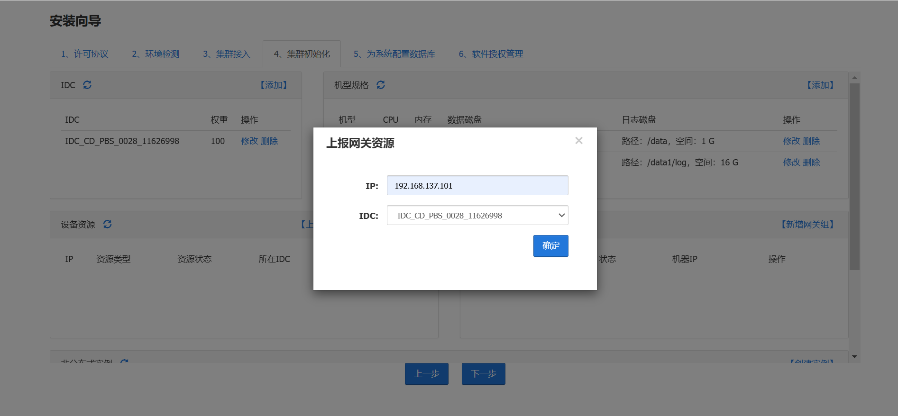
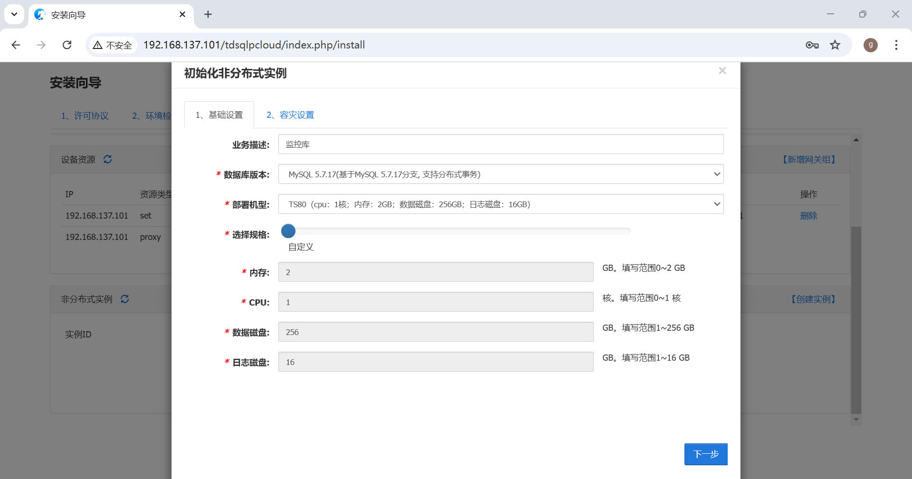

# 单机部署 TDSQL 测试环境

安装 `KylinV10SP2 x86_64` 虚拟机（IP 地址：192.168.137.101）用以安装 TDSQL 测试验证环境，按照常规：

- 关闭防火墙；
- 关闭 SELinux。

使用迅雷，到 [https://tdsql1031730-1300276124.cos.ap-beijing.myqcloud.com/tdsql_10.3.17.3.0.zip](https://tdsql1031730-1300276124.cos.ap-beijing.myqcloud.com/tdsql_10.3.17.3.0.zip) 下载安装部署介质 `tdsql_10.3.17.3.0.zip` 文件，上传到服务器并解压，如 `/root/tdsql_10.3.17.3.0/`。

> 本文以 `/root/tdsql_10.3.17.3.0/` 为 TDSQL 的安装目录。

## 1 安装 TDSQL

安装 TDSQL 的过程中，会从互联网上下载大量的依赖包（rpm），请保持你的虚拟机能够正常访问互联网。

### 1.1 修改主机地址

```bash
# 将该文件中所有的服务器配置缩小到 1 台机器上，并删除多余的机器配置
vi tdsql_install/tdsql_hosts
=======================================================
# 填入所有机器的地址（包括主控机）
# 用于环境检测和初始化配置
# 同一个标签组内的ip地址不要重复，一个ip一行
# 序号从1递增，比如只有2台机器，那么序号保留tdsql_mac1 tdsql_mac2
# 后续如果有扩容，新扩容的机器也需要在这里补上
[tdsql_allmacforcheck]
tdsql_mac1 ansible_ssh_host=192.168.137.101
# zookeeper机器ip地址
# 数量只能是1、3、5， 正式环境建议3台或者5台
# 如果是使用自己已有的zk集群，这里同样要填写正确的zk地址
[tdsql_zk]
tdsql_zk1 ansible_ssh_host=192.168.137.101
# scheduler机器的ip地址，正式环境建议2个
[tdsql_scheduler]
tdsql_scheduler1 ansible_ssh_host=192.168.137.101
# oss机器的ip地址， 正式环境建议2个
[tdsql_oss]
tdsql_oss1 ansible_ssh_host=192.168.137.101
# 赤兔机器的ip地址， 正式环境建议2个
[tdsql_chitu]
tdsql_chitu1 ansible_ssh_host=192.168.137.101
# 监控采集模块的IP地址，正式环境建议2个
[tdsql_monitor]
tdsql_monitor1 ansible_ssh_host=192.168.137.101
# db机器地址
# 有多少台就填多少个ip地址
# 注意tdsql_db序号逐个递增，不要跳跃
[tdsql_db]
tdsql_db1 ansible_ssh_host=192.168.137.101
# proxy机器地址
[tdsql_proxy]
tdsql_proxy1 ansible_ssh_host=192.168.137.101
# hdfs机器地址
# 机器数量只能是1台或者3台
# 如果单节点部署，则只保留tdsql_hdfs1，其他删除
# 正式环境建议高可用部署，初始安装数量只能3台
[tdsql_hdfs]
tdsql_hdfs1 ansible_ssh_host=192.168.137.101
# lvs机器地址，数量固定2台
[tdsql_lvs]
tdsql_lvs1 ansible_ssh_host=192.168.137.101
# kafka机器地址，数量固定3台
[tdsql_kafka]
tdsql_kafka1 ansible_ssh_host=192.168.137.101
# 多源同步消费者服务ip地址，数量固定1台
[tdsql_consumer]
tdsql_consumer1 ansible_ssh_host=192.168.137.101
# es机器地址
[tdsql_es]
tdsql_es1 ansible_ssh_host=192.168.137.101
[tdsql_mc]
tdsql_mc1 ansible_ssh_host=192.168.137.101
[tdsql_newdb]
tdsql_newdb1 ansible_ssh_host=192.168.137.101
[tdsql_ansible_test]
tdsql_ansible_test1 ansible_ssh_host=192.168.137.101
=======================================================
```

### 1.2 免密登录设置

编辑 `tdsql_install/scripts/ip_passwd_list` 文件，只留 1 行：

```bash
vi tdsql_install/scripts/ip_passwd_list
=======================================================
192.168.137.101      xxxyou@yyyPassword
=======================================================
```

然后执行 nokey.sh 文件，设置免密登录：

```bash
sh tdsql_install/scripts/nokey.sh
```


### 1.3 修改 group_vars/all

修改文件中的内容，主要是网卡名称和数据库密码，KylinV10SP2 只有 1 个网卡的情况下，网卡名称通常是 `enp0s3`，可通过 `ifconfig` 命令查看。

```bash
vi tdsql_install/group_vars/all
=======================================================
---
# scheduler,oss机器网卡
tdsql_sche_netif: enp0s3
# 操作系统账号tdsql的明文密码
# 如果有规划要部署两个集群做DCN同步, 则这两个集群的tdsql密码要一致
tdsql_os_pass: 123456
# tdsql在zk上的根路径, 保持默认不允许修改
tdsql_zk_rootdir: /tdsqlzk
# zk机器的域名配置, 会写入各配置文件, 并将域名配置到/etc/hosts中
# 正式环境必须用机房或者地区的关键字, 有意义的关键字来命名
# 如果部署多套TDSQL集群, 则名字需要唯一
# 例如: 深圳机房zk的域名可以定义为tdsql_sz_zk
tdsql_zk_domain_name: tdsql_test_zk
# zk端口配置, 保持默认不要改,如果是自建的zk, 则和已有zk端口保持一致
tdsql_zk_clientport: 2118
tdsql_zk_serverport1: 2338
tdsql_zk_serverport2: 2558
# 赤兔监控库配置, 赤兔初始化完成后需要将监控库信息在这里更新
tdsql_metadb_ip: 192.168.137.101
tdsql_metadb_port: 15001
tdsql_metadb_ip_bak: 192.168.137.101
tdsql_metadb_port_bak: 15001
tdsql_metadb_user: hanlon
tdsql_metadb_password: 123456
# hdfs机器的ssh端口
tdsql_hdfs_ssh: 22
# hdfs数据目录, 正式环境要求mount挂载比较大的数据盘
tdsql_hdfs_datadir: /data2/hdfs,/data3/hdfs,/data4/hdfs
# kafka日志目录，正式环境要求mount挂载比较大的数据盘
tdsql_kafka_logdir: /data2/kafka,/data3/kafka,/data4/kafka
# 多源同步消费服务的机器网卡
tdsql_consumer_netif: enp0s3
# es7配置
tdsql_es7_mem: 4
tdsql_es7_base_path: /data1/es
tdsql_helper_cluster_name: tdsql
# 一致性读MC机器的网卡, 需要安装MC时配置
tdsql_mc_netif: enp0s3
update_tdsqlinstall_packet: mysqlagent
=======================================================
```

如果，文件中有多个机器（实例）的配置，请删除，只留 1 台机器的配置。

### 1.4 安装 ansible

在虚拟机能访问互联网的情况下，安装 ansible：

```bash
sh tdsql_install/scripts/install_ansible.sh
```


安装过程中，会下载大量的内容，并且要在本机编译，网络畅通的情况下，花费时间大概 15 分钟。

安装完成后，执行 ansible --version 命令，查看版本信息：


### 1.5 取消内存限制

修改 TDSQL 安装配置文件，取消 5G 内存限制：

```bash
vi tdsql_install/roles/tdsql_env_check/files/checkenv/docheck.sh
# 查找 5000000 然后删除第 39~43 行
```


> 当然，你也可以去掉 32~36 行，以支持在 1 个 CPU 核上的安装。

### 1.6 安装数据库

执行如下命令，使用之前的配置，安装 TDSQL 数据库：

```bash
cd tdsql_install/
ansible-playbook -i tdsql_hosts playbooks/tdsql_part1_site.yml
```


安装过程大约 10 分钟，然后检查安装结果，必须保证其中所有的 `failed=0` 才说明是成功的。


> 其中的 tdsql_oss1 行的 skipped=1 是正常且正确的输出。

## 2 配置数据库

通过浏览器访问“TDSQL-赤兔管理台” [http://192.168.137.101/tdsqlpcloud/](http://192.168.137.101/tdsqlpcloud/)，完成数据库的安装配置：


添加 OSS 服务列表信息，并测试服务连接：


集群初始化，添加“机型”，后续用来创建数据库实例：


上报网关资源：



上报DB设备资源：


新增网关组：


> 当前只在 1 台机器上安装，所以是“从 1 个 IDC 中，取 1 台机器”。

初始化非分布式实例：



容灾设置：


开始创建：


实例创建完成后，选择“初始化”：


> 注意按照实际情况选择字符编码和表面大小写是否敏感，如：utf8mb4。

为系统配置数据库：


> 密码为前面配置文件中设置的“123456”。

最后的“软件授权管理”可以使用“跳过此步骤”，不影响 TDSQL 集群正常使用或运行：


> 虽然本版本并未限制授权缺失、失效、过期的情况下正常使用TDSQL集群，但如果您未上传授权文件，您可能无法获得软件补丁或其他服务。
>

完成后，使用 [http://192.168.137.101/tdsqlpcloud/](http://192.168.137.101/tdsqlpcloud/) 登录“赤兔管理台”，用户名 `admin`，密码：`123456`（默认密码）。


> 登录成功会强制修改赤兔网站密码来满足密码复杂度要求，按提示设置完成即可。（部分版本）若没有提示，请至【系统管理】手动修改管理员密码至更高强度。

## 3 客户端连接

使用 Navicat 连接到 TDSQL，完成后续测试验证工作。


创建的数据库实例连接信息：

- 端口：4001
- 用户：tdsqlpcloud
- 密码：123456

在 TDSQL 服务器上，使用命令行连接：

```bash
mysql -h192.168.137.101 -P15001 -utdsqlpcloud -p123456 -c
use ruoyi-vue-pro;
select count(*) from system_menu;
```

使用 MySQL 导入导出数据，做数据迁移：

```bash
# 直接bash中导入数据
mysql -ugcb9_dev -pRisk@2024 < ./ddl/gcb9_account_dev.sql
mysql -ugcb9_dev -pRisk@2024 < ./data/gcb9_account_dev.sql
# 在MySQL命令行
source ./ddl/gcb9_account_dev.sql;
source ./data/gcb9_account_dev.sql;
# 导出数据
mysqldump -ugcb9_dev -pRisk@2024 --no-data --databases gcb9_account_dev > ./ddl/gcb9_account_dev.sql
mysqldump -ugcb9_dev -pRisk@2024 --no-create-info --databases gcb9_account_dev > ./data/gcb9_account_dev.sql
```

> TDSQL 实例在使用 MySQL 5.7 时，默认字符集是“utf8mb4”，排序“utf8mb4_general_ci”，如果数据库设计时存放的值，如“VouchType1”和“VOUCHTYPE1”，就会出现“ERROR 1062 (23000) at line xx: Duplicate entry...”错误。所以，没有特殊要求时使用字符集“utf8mb4”，排序“utf8mb4_bin”是一个较好的选择。

## 4 服务器启停

TDSQL 在服务器（虚拟机）重启后会自动启动。

官方文档[组件启停操作说明](https://cloud.tencent.com/privatecloud/document/66088861826052096)提供了一些运维操作指导。

### 4.1 启停数据库

数据库服务的启停命令如下：

```bash
su - tdsql
cd /data/tdsql_run/4001/percona-5.7.17/install
# 启动
./startmysql_cgroup.sh 4001
# 停止
./stopmysql.sh 4001
# 重启
./restartmysql_cgroup.sh 4001
```

### 4.2 启停赤兔平台

赤兔平台是用 php 开发的，启停命令如下：

```bash
# 启动
su - tdsql
sudo /usr/local/nginx/sbin/nginx -c /usr/local/nginx/conf/nginx.conf
/usr/local/php/sbin/php-fpm -y /usr/local/php/etc/php-fpm.conf -c /usr/local/php/lib/php.ini
# 停止
sudo pkill nginx
sudo pkill php-fpm
```

> 有些版本需要注释crontab里面的/server/scripts/check_supervisor_alive.sh命令，先杀掉supervisor进程，再执行停操作。不然kill完进程之后，php和nginx会自动重启。

Kevin@Chengdu#20241209

