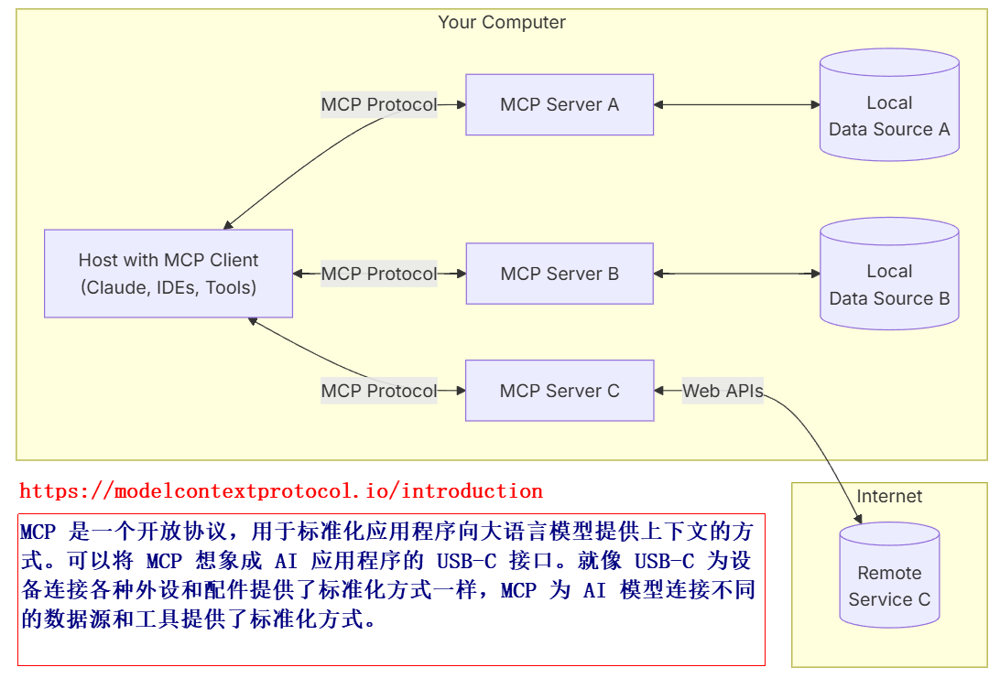
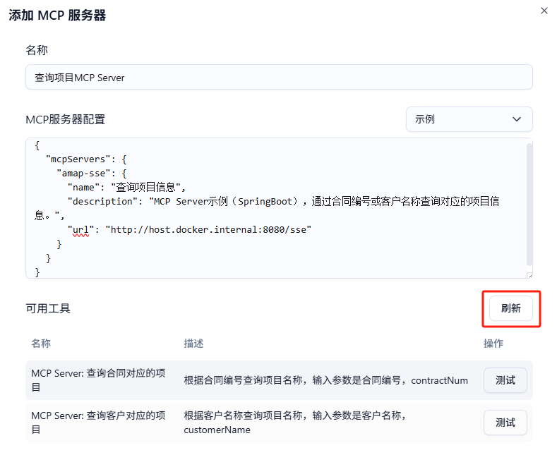
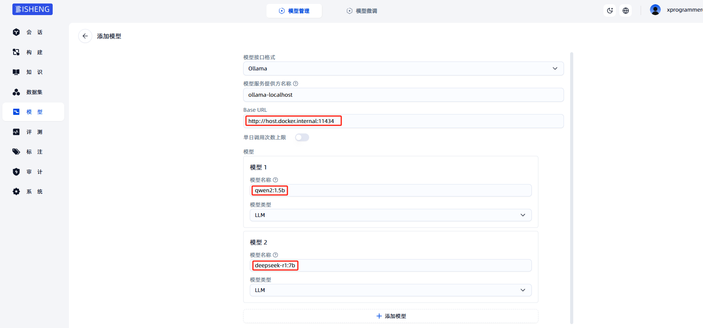
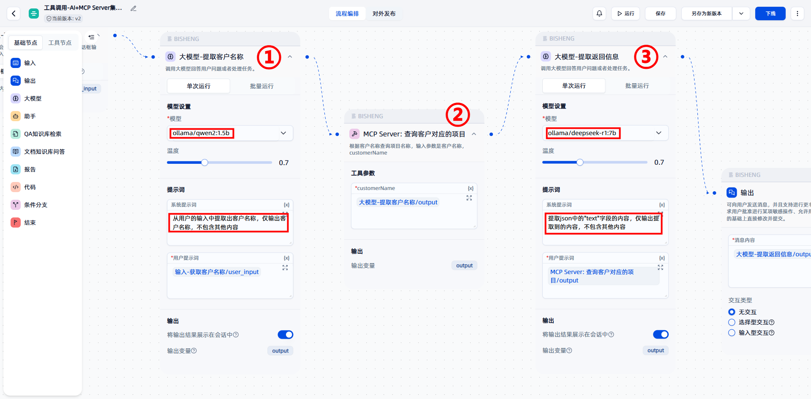
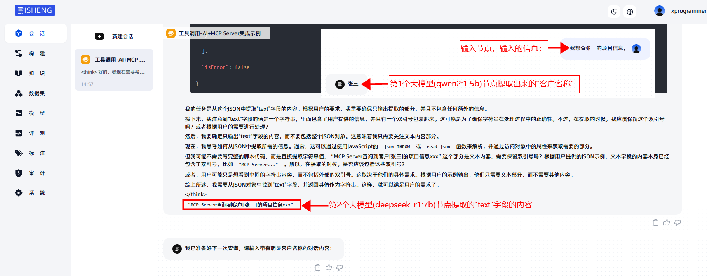

# 手把手教程：在毕昇中使用MCP工具，集成企业级应用服务能力

模型上下文协议（Model Context Protocol，MCP）​​ 是由 Anthropic 公司于 2024 年 11 月推出的开源协议，旨在为大型语言模型（LLM）与外部数据源、工具之间建立标准化、安全的双向连接。其设计理念类似于“AI 界的 USB-C 接口”，通过统一的通信协议、数据格式和规则，解决传统集成方案中存在的碎片化、高成本和安全风险问题。



本文从零开始开发 Spring Boot 示例企业级应用并封装暴露其 MCP Server Tool 方法，然后使用本机通过 ollama 提供的 LLM 服务，在毕昇中编排工作流使用大模型、调用 MCP Server Tool 等节点的方式开发一个技术层面拉通测试验证的智能体。

## 1. LLM服务

为了开发测试方便，本机通过 ollama 提供 LLM 模型服务。

> ollama 是一款常用的开源大型语言模型服务工具，在开发阶段能大大简化开源模型的本地部署与管理流程。

到 [https://github.com/ollama/ollama/releases/download/v0.6.8/OllamaSetup.exe](https://github.com/ollama/ollama/releases/download/v0.6.8/OllamaSetup.exe) 下载 `OllamaSetup.exe`，安装后在命令行窗口运行 `ollama run qwen2:1.5b` 命令，在联网的情况下会自动下载模型（首次）并运行。

需要更多的模型请到 [https://www.ollama.com/library](https://www.ollama.com/library) 查询下载。

## 2. 部署毕昇

到 [https://github.com/dataelement/bisheng.git](https://github.com/dataelement/bisheng.git) 下载最新版本的毕昇项目。在项目的 docker 目录下编辑 docker-compose.yml，将其中的毕昇前后端镜像版本号 v1.1.1 修改成 v1.2.0.dev1，然后使用 `docker compose up -d` 命令启动毕昇环境。

> 如果遇到无法下载镜像的问题，请配置镜像站，并到 https://1ms.run/ 查询对应的镜像下载信息。
>
> 使用 Docker Desktop 部署的容器，要访问宿主机上的服务，使用 host.docker.internal 主机名访问即可。

毕昇从 v1.2.0.dev1 版本开始提供了 MCP 工具的功能。

## 3. 开发MCP Server

开发 Spring Boot 应用，引入 spring-ai-starter-mcp-server-webmvc 依赖：

```xml
<dependency>
    <groupId>org.springframework.ai</groupId>
    <artifactId>spring-ai-starter-mcp-server-webmvc</artifactId>
</dependency>
```

新建类 McpServerSampleService，提供 MCP Server 的工具方法：

```java
@Service
public class McpServerSampleService {
    @Tool(name = "MCP Server: 查询客户对应的项目", description = "根据客户名称查询项目名称，输入参数是客户名称，customerName")
    public String getProjectInfoByCustomerName(String customerName) {
        return "MCP Server查询到客户[" + customerName + "]的项目信息xxx";
    }

    @Tool(name = "MCP Server: 查询合同对应的项目", description = "根据合同编号查询项目名称，输入参数是合同编号，contractNum")
    public String getProjectInfoByContractNum(String contractNum) {
        return "MCP Server查询到合同[" + contractNum + "]的项目信息yyy";
    }

}
```

在 @SpringBootApplication 注解的启动类中，将包含 @Tool 注解的工具方法注册到 MCP（Model Context Protocol）协议体系中，供后续的 Agent 工作流编排调用。

```java
@Bean
public ToolCallbackProvider mcpSampleTools(McpServerSampleService sampleService) {
    return MethodToolCallbackProvider.builder().toolObjects(sampleService).build();
}
```

## 4. 配置MCP Server

在毕昇中，通过菜单导航，“构建>MCP工具>工具>添加MCP服务器”，添加上面开发并运行的 MCP Server，配置了服务器 json 串后，单击刷新按钮，可刷新出来该 MCP Server 提供的所有的工具（用 @Tool 注解的方法）：



参考的 MCP 服务器配置信息如下：

```json
{
  "mcpServers": {
    "amap-sse": {
      "name": "查询项目信息",
      "description": "MCP Server示例（SpringBoot），通过合同编号或客户名称查询对应的项目信息。",
      "url": "http://host.docker.internal:8080/sse"
    }
  }
}
```

后续，在构建应用的时候就可以选择 MCP 服务器下的工具了。

## 5. 添加模型

本机通过 ollama 运行了 qwen2:1.5b 和 deepseek-r1:7b 后，需要将其添加到毕昇中，以供后续开发 Agent 时使用。



## 6. 构建工作流

在毕昇中新建工作流，在输入节点后：

1. 添加大模型节点（①选择qwen2:1.5b模型）从输入中提取“客户名称”；

2. 然后输入下一个MCP Server 工具节点（②接收客户名称，调用本文前面开发的Spring Boot应用中的方法）；

3. 接下来把调用结果输入大模型节点（③选择deepseek-r1:7b模型），提取返回 json 中的“text”字段值；
4. 最后通过输出节点将内容输出给用户的对话界面。



测试验证，并上线工作流。



Kevin@Beijing#20250509
